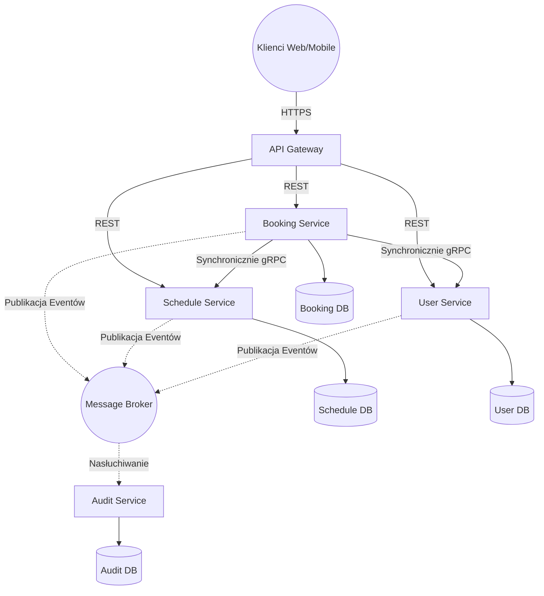

# 1. Analiza Domen i Encji

### Analiza Domen (Bounded Contexts) i Encji Domenowych:

Na podstawie dostarczonych wymagań biznesowych dotyczących Systemu Rezerwacji Wizyt, można zidentyfikować następujące główne domeny i encje:

1. **Booking Management (Zarządzanie Rezerwacjami)**
   - **Odpowiedzialność:** Obsługa całego procesu rezerwacji wizyt, anulowania, kontrola limitów (maksymalnie 3 aktywne rezerwacje) i śledzenie statusów wizyt.
   - **Encje:**
     - `Booking` / `Appointment` (rezerwacja - powiązana z użytkownikiem i terminem; status: AVAILABLE, BOOKED, CANCELLED, COMPLETED, BLOCKED)
     - `BookingPolicy` (reguły biznesowe, np. okno anulowania 24h przed wizytą, ograniczenia limitu rezerwacji)

2. **Schedule Management (Zarządzanie Grafikiem)**
   - **Odpowiedzialność:** Zarządzanie slotami czasowymi specjalistów, dodawanie/usuwanie wolnych terminów, udostępnianie widoku wolnych terminów, wykrywanie konfliktów czasowych (nakładanie się wizyt).
   - **Encje:**
     - `TimeSlot` (konkretny przedział czasowy w kalendarzu przypisany do specjalisty)
     - `SpecialistSchedule` (grafik przypisany do konkretnego specjalisty)

3. **User & Access Management (Zarządzanie Użytkownikami i Tożsamością)**
   - **Odpowiedzialność:** Przechowywanie danych o rolach, uprawnieniach, zapewnienie autoryzacji do odpowiednich zasobów (np. użytkownik widzi tylko swoje, admin widzi wszystko).
   - **Encje:**
     - `User` (klient rezerwujący wizyty)
     - `Specialist` (pracownik, do którego można się umówić)
     - `Admin` (użytkownik zarządzający z uprawnieniami nadrzędnymi)

4. **Audit & Logging (Audyt i Historia)**
   - **Odpowiedzialność:** Zapis historii wszystkich operacji w systemie, błędów i ewentualnych konfliktów.
   - **Encje:**
     - `AuditLog` / `EventLog` (kto, co, kiedy, z jakim wynikiem)

---

# 2. Zaproponowana Architektura

### 1. Wybór wzorców architektonicznych:
**Wzorzec główny:** Architektura Mikroserwisów (Microservices Architecture) w połączeniu z Event-Driven Architecture (EDA).
**Uzasadnienie:** Wymaganie NFR5 wyraźnie mówi o tym, że "System powinien obsługiwać rosnącą liczbę użytkowników i specjalistów bez znaczącej degradacji wydajności". Mikroserwisy pozwolą na niezależne skalowanie np. Serwisu Rezerwacji w godzinach szczytu. Wykorzystanie zdarzeń (EDA) pozwoli na asynchroniczne realizowanie wymogów pobocznych (np. zapisywanie audytu), co zredukuje czas odpowiedzi systemu poniżej 1 sekundy (NFR2). Ponadto zastosujemy wzorzec **API Gateway**, który rozwiąże problem autoryzacji (NFR3) w jednym, centralnym punkcie systemu.

### 2. Proponowane komponenty i ich odpowiedzialności:
- **API Gateway:** Punkt wejściowy do systemu. Sprawdza autoryzację i role użytkownika (NFR3), a następnie przekierowuje zapytania do odpowiednich usług.
- **Booking Service:** Główny serwis dla klientów. Zajmuje się walidacją rezerwacji oraz anulowaniami. Komunikuje się synchronicznie z *Schedule Service* aby potwierdzić, że dany slot jest wolny i dokonać "zaklepania".
- **Schedule Service:** Serwis zarządzający kalendarzami specjalistów. Odpowiada za zwracanie listy dostępnych terminów i blokowanie poszczególnych okien czasowych, dbając o integralność nakładających się rezerwacji.
- **User Service:** Usługa odpowiedzialna za identyfikację ról (User, Specialist, Admin) oraz profili użytkowników.
- **Audit Service:** Samodzielna usługa, która nasłuchuje na zdarzenia z Message Brokera i zapisuje pełną historię operacji do dedykowanej hurtowni danych, w celu późniejszego raportowania (NFR4).

**Sposób komunikacji:**
- *Synchronicznie (REST/gRPC):* Kiedy użytkownik dokonuje rezerwacji, `Booking Service` w czasie rzeczywistym wysyła zapytanie do `Schedule Service`, by upewnić się, że slot jest nadal wolny, by zapobiec podwójnej rezerwacji (FR4).
- *Asynchronicznie (Message Broker np. RabbitMQ/Kafka):* Po każdej zakończonej lub anulowanej rezerwacji emitowane jest zdarzenie (np. `BookingCreatedEvent`), które odbiera `Audit Service`.

### 3. Mapowanie wymagań na komponenty:
- **Booking Service:**
  - FR2 (Rezerwacja), FR5 (Anulowanie < 24h), FR8 (Status wizyty).
  - FR3 (Limit 3 rezerwacji) - serwis trzyma licznik aktywnych wizyt danego użytkownika (chyba że User = Admin nadpisze regułę).
  - NFR2 (Wydajność < 1 sek).
- **Schedule Service:**
  - FR1 (Przeglądanie terminów).
  - FR6, FR11 (Zwalnianie terminu, oznaczanie jako BLOCKED).
  - FR7 (Zarządzanie grafikiem specjalisty).
  - FR10 (Wykrywanie nakładających się czasów).
  - FR4, NFR1 (Brak double booking - spójność) - na poziomie zarządzania statusem slota w swojej bazie.
- **User Service & API Gateway:**
  - FR9 (Dostęp do danych uwarunkowany rolą).
  - NFR3 (Bezpieczeństwo i uwierzytelnianie).
- **Audit Service:**
  - FR12 (Historia operacji), NFR4 (Audyt z czasem).

### 4. Diagram Architektury:

---

# 3. API i Modele Danych

Aby spełnić NFR2 (odpowiedź w czasie krótszym niż 1 sekunda), decydujemy się na wzorzec **Database per Service**. Gwarantuje to niezależne pulowanie połączeń i brak współbieżnych blokad na tych samych tabelach.
Aby rozwiązać wymóg "Brak podwójnej rezerwacji" (FR4) w środowisku rozproszonym i zachować spójność (NFR1), zastosujemy **Optimistic Locking (Blokowanie Optymistyczne)** na poziomie bazy *Schedule DB*.

### Kluczowe Endpointy API (RESTful)

**Booking Service API:**
- `POST /api/v1/bookings`
  - Typowy Payload: `{ "slotId": "UUID" }` (userId pobierane z tokena).
  - Realizuje FR2. W tle serwis sprawdza, czy użytkownik nie przekroczył limitu (FR3).
- `DELETE /api/v1/bookings/{bookingId}`
  - Realizuje FR5. Serwis sprawdza regułę 24h przed statusem CANCELLED.
- `GET /api/v1/bookings/me` (FR9)

**Schedule Service API:**
- `GET /api/v1/slots?specialistId=X&startDate=Y` (FR1 - wyszukiwanie terminów).
- `POST /api/v1/slots` (FR7 - dla specjalistów do otwierania kalendarza).
- `PATCH /api/v1/slots/{slotId}/status` (FR11 - ustawianie BLOCKED).

**Audit Service API:**
- `GET /api/v1/audit?entityId=X` (Dla Admina).

### Struktury Baz Danych dla najważniejszych serwisów

**1. Booking DB (PostgreSQL / Relacyjna)**
*Tabela: Bookings*
- `id` (UUID, Primary Key)
- `user_id` (UUID, Indexed dla sprawdzania limitu 3 aktywnych rezerwacji)
- `slot_id` (UUID)
- `status` (VARCHAR: BOOKED, CANCELLED, COMPLETED)
- `created_at` (TIMESTAMP)

**2. Schedule DB (PostgreSQL / Relacyjna)**
Aby uniknąć podwójnych rezerwacji na poziomie pojedynczych milisekund, używamy pola wersji.
*Tabela: Slots*
- `id` (UUID, Primary Key)
- `specialist_id` (UUID, Indexed)
- `start_time` (TIMESTAMP)
- `end_time` (TIMESTAMP)
- `status` (VARCHAR: AVAILABLE, BOOKED, BLOCKED)
- **`version` (INTEGER)** - pole kluczowe. Kiedy *Booking Service* chce zająć slot, *Schedule Service* wykonuje: `UPDATE Slots SET status='BOOKED', version=version+1 WHERE id=? AND version=? AND status='AVAILABLE'`. Jeśli zaktualizowano 0 wierszy, oznacza to konflikt (podwójna rezerwacja) i system w locie odrzuca drugiego użytkownika, zachowując całkowitą spójność (NFR1).

**3. Audit DB (NoSQL np. MongoDB lub ElasticSearch)**
*Kolekcja: AuditLogs*
- `id` (ObjectId)
- `event_type` (String np. "BOOKING_CREATED")
- `user_id` (String)
- `timestamp` (ISODate)
- `details` (JSON) - zdenormalizowany payload pozwalający na bardzo szybkie zapisywanie ogromnych ilości logów bez obciążania baz relacyjnych, spełniając przy tym wymóg wydajności zapisu (NFR4).
