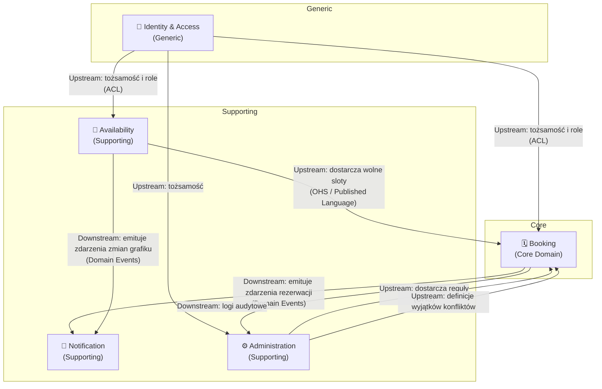
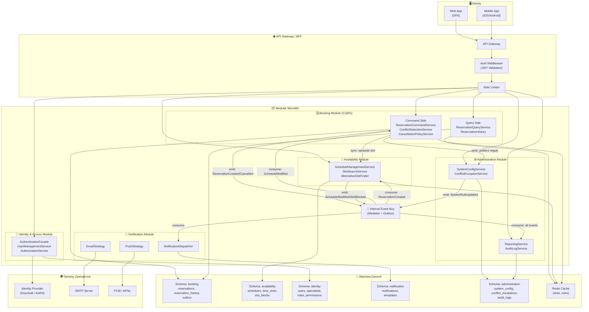
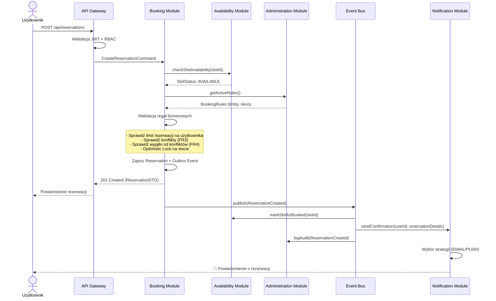
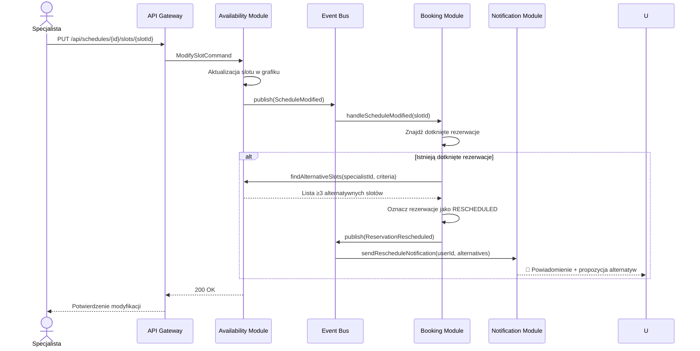

# 1. Analiza Domen i Encji

# Analiza Domenowa — System Rezerwacji Wizyt u Specjalistów

## 1. Zidentyfikowane Bounded Contexts

Na podstawie wymagań biznesowych wyodrębniam **5 głównych Bounded Contexts**:

| # | Bounded Context | Odpowiedzialność | Kluczowe FR |
|---|----------------|-------------------|-------------|
| 1 | **Booking** (Zarządzanie Rezerwacjami) | Cykl życia rezerwacji: tworzenie, anulowanie, modyfikacja, historia, wykrywanie i rozwiązywanie konfliktów | FR2, FR3, FR4, FR5, FR7, FR10 |
| 2 | **Availability** (Zarządzanie Dostępnością) | Grafik specjalisty, sloty czasowe, blokady terminów, wyszukiwanie i filtrowanie wolnych terminów | FR1, FR6 |
| 3 | **Identity & Access** (Zarządzanie Tożsamością i Dostępem) | Konta użytkowników, role, uprawnienia, uwierzytelnianie, autoryzacja | FR8, (AC13) |
| 4 | **Notification** (Powiadomienia) | E-mail, push, dostarczanie powiadomień o zdarzeniach rezerwacyjnych i zmianach grafiku | FR9 |
| 5 | **Administration** (Administracja i Konfiguracja) | Globalne reguły systemu, wyjątki od konfliktów, limity, raporty i audyt | FR4, FR11, FR12 |

---

## 2. Encje Domenowe per Bounded Context

### 2.1 Booking (Core Domain)

> [!IMPORTANT]
> To jest **core domain** systemu — tu znajduje się najważniejsza logika biznesowa.

| Encja / Value Object | Typ | Opis | Kluczowe atrybuty |
|---------------------|-----|------|-------------------|
| **Reservation** (Aggregate Root) | Entity | Pojedyncza rezerwacja wizyty | `id`, `userId`, `specialistId`, `timeSlotId`, `status`, `createdAt`, `cancellationReason` |
| **ReservationStatus** | Value Object | Status rezerwacji | `PENDING`, `CONFIRMED`, `CANCELLED_BY_USER`, `CANCELLED_BY_SPECIALIST`, `RESCHEDULED`, `COMPLETED` |
| **CancellationPolicy** | Value Object | Reguły dozwolonego okna anulowania | `minHoursBeforeAppointment`, `allowedForRole` |
| **ConflictException** | Entity | Wyjątek od reguły zapobiegania konfliktom (np. wizyty grupowe) | `id`, `type`, `description`, `maxOverlappingSlots` |
| **ReservationHistory** | Entity | Wpis audytowy zmiany rezerwacji | `id`, `reservationId`, `action`, `performedBy`, `timestamp`, `details` |

#### Reguły biznesowe (Invariants):
- Rezerwacja tego samego slotu u tego samego specjalisty jest zabroniona (FR3), chyba że istnieje aktywny `ConflictException` (FR4)
- Anulowanie przez użytkownika jest możliwe tylko w dozwolonym oknie czasowym (FR5)
- Specjalista może anulować rezerwację z obowiązkowym podaniem przyczyny (US10)

---

### 2.2 Availability (Supporting Domain)

| Encja / Value Object | Typ | Opis | Kluczowe atrybuty |
|---------------------|-----|------|-------------------|
| **Schedule** (Aggregate Root) | Entity | Grafik dostępności specjalisty | `id`, `specialistId`, `validFrom`, `validTo` |
| **TimeSlot** | Entity | Pojedynczy termin w grafiku | `id`, `scheduleId`, `startTime`, `endTime`, `status`, `slotType` |
| **SlotStatus** | Value Object | Status slotu | `AVAILABLE`, `BOOKED`, `BLOCKED`, `CANCELLED` |
| **SlotBlock** | Entity | Blokada terminu przez specjalistę | `id`, `timeSlotId`, `reason`, `blockedBy` |
| **Specialization** | Value Object | Specjalizacja (do filtrowania) | `code`, `name` |

#### Reguły biznesowe:
- Specjalista może modyfikować grafik nawet z istniejącymi rezerwacjami (FR6)
- Modyfikacja wpływająca na rezerwacje → zdarzenie domenowe → propozycja alternatyw (FR7)
- Zablokowany slot jest niedostępny dla rezerwacji (US8)

---

### 2.3 Identity & Access (Generic Subdomain)

| Encja / Value Object | Typ | Opis | Kluczowe atrybuty |
|---------------------|-----|------|-------------------|
| **User** (Aggregate Root) | Entity | Konto użytkownika systemu | `id`, `email`, `name`, `status`, `createdAt` |
| **Role** | Value Object | Rola w systemie | `USER`, `SPECIALIST`, `ADMINISTRATOR` |
| **Permission** | Value Object | Pojedyncze uprawnienie | `code`, `description` |
| **Specialist** | Entity | Rozszerzenie profilu użytkownika o dane specjalisty | `id`, `userId`, `specializations`, `bio` |

---

### 2.4 Notification (Supporting Domain)

| Encja / Value Object | Typ | Opis | Kluczowe atrybuty |
|---------------------|-----|------|-------------------|
| **Notification** (Aggregate Root) | Entity | Wiadomość do dostarczenia | `id`, `recipientId`, `channel`, `type`, `payload`, `status`, `sentAt` |
| **NotificationChannel** | Value Object | Kanał dostarczenia | `EMAIL`, `PUSH` |
| **NotificationTemplate** | Entity | Szablon wiadomości | `id`, `type`, `channelTemplates` |
| **AlternativeSlotSuggestion** | Value Object | Propozycja alternatywnego terminu (FR7) | `originalReservationId`, `suggestedSlots[]` |

---

### 2.5 Administration (Supporting Domain)

| Encja / Value Object | Typ | Opis | Kluczowe atrybuty |
|---------------------|-----|------|-------------------|
| **SystemConfiguration** (Aggregate Root) | Entity | Globalne reguły systemu | `id`, `key`, `value`, `updatedBy`, `updatedAt` |
| **BookingRule** | Value Object | Reguła rezerwacyjna | `maxAdvanceBookingDays`, `minCancellationHours`, `maxReservationsPerUser` |
| **AuditLog** | Entity | Log audytowy (NFR9) | `id`, `action`, `performedBy`, `entityType`, `entityId`, `timestamp`, `details` |
| **Report** | Value Object | Raport systemowy | `type`, `dateRange`, `generatedBy`, `data` |

---

## 3. Context Map — Relacje między Bounded Contexts



### Legenda relacji:
- **OHS** (Open Host Service) — kontekst upstream udostępnia publiczny interfejs
- **ACL** (Anti-Corruption Layer) — kontekst downstream tłumaczy model upstream na swój język
- **Domain Events** — komunikacja asynchroniczna przez zdarzenia

---

## 4. Kluczowe Zdarzenia Domenowe (Domain Events)

| Zdarzenie | Emitent | Konsumenci | Trigger |
|-----------|---------|------------|---------|
| `ReservationCreated` | Booking | Notification, Availability | Użytkownik tworzy rezerwację (FR2) |
| `ReservationCancelled` | Booking | Notification, Availability | Użytkownik/Specjalista anuluje (FR5, US10) |
| `ReservationRescheduled` | Booking | Notification | Specjalista zmienia termin (US11) |
| `ScheduleModified` | Availability | Booking, Notification | Specjalista modyfikuje grafik (FR6) |
| `SlotBlocked` | Availability | Booking | Specjalista blokuje termin (US8) |
| `ConflictDetected` | Booking | Administration | System wykrywa nakładanie się (FR3) |
| `SystemRuleUpdated` | Administration | Booking | Admin zmienia konfigurację (FR11) |

---

## 5. Mapowanie Wymagań Funkcyjnych → Bounded Contexts

| FR | Opis (skrót) | Booking | Availability | Identity | Notification | Administration |
|----|-------------|---------|-------------|----------|-------------|---------------|
| FR1 | Przeglądanie terminów z filtrami | | ✅ | | | |
| FR2 | Dokonywanie rezerwacji | ✅ | ✅ | | | |
| FR3 | Zapobieganie konfliktom | ✅ | | | | |
| FR4 | Wyjątki od konfliktów | ✅ | | | | ✅ |
| FR5 | Anulowanie w oknie czasowym | ✅ | | | | ✅ |
| FR6 | Modyfikacja grafiku | | ✅ | | | |
| FR7 | Powiadomienie + alternatywy | ✅ | ✅ | | ✅ | |
| FR8 | Role i uprawnienia | | | ✅ | | |
| FR9 | Powiadomienia e-mail/push | | | | ✅ | |
| FR10 | Historia rezerwacji | ✅ | | | | |
| FR11 | Konfiguracja reguł globalnych | | | | | ✅ |
| FR12 | Skalowalność | ✅ | ✅ | ✅ | ✅ | ✅ |

---

## 6. Podsumowanie Strategii Podziału

> [!TIP]
> **Booking** to jedyny **Core Domain** — tu koncentruje się najważniejsza logika biznesowa i tu powinno iść najwięcej wysiłku projektowego.

- **Availability** i **Notification** to **Supporting Domains** — wspierają core, ale mogą być realizowane prostszymi wzorcami.
- **Identity & Access** to **Generic Subdomain** — idealny kandydat do wykorzystania gotowego rozwiązania (np. Keycloak, Auth0).
- **Administration** łączy konfigurację reguł (wpływających na core) z raportowaniem i audytem.

Podział ten zapewnia:
1. **Niski coupling** — konteksty komunikują się przez zdarzenia domenowe i dobrze zdefiniowane API
2. **Wysoką kohezję** — każdy kontekst ma jedną, jasno zdefiniowaną odpowiedzialność
3. **Niezależną ewolucję** — konteksty mogą być rozwijane, skalowane i wdrażane niezależnie (NFR5, NFR12)

---

# 2. Zaproponowana Architektura

# Propozycja Architektury — System Rezerwacji Wizyt u Specjalistów

## 1. Wybór Wzorców Architektonicznych

### 1.1 Architektura nadrzędna: **Modular Monolith z gotowością na ekstrakcję do Microservices**

| Kryterium | Uzasadnienie |
|-----------|-------------|
| **Etap projektu** | System startuje jako nowy produkt — Modular Monolith minimalizuje overhead operacyjny (brak potrzeby orkiestracji kontenerów, distributed tracing, service mesh) przy zachowaniu czystych granic modułów |
| **Granice modułów = Bounded Contexts** | 5 zidentyfikowanych BC mapuje się 1:1 na moduły wewnętrzne. Każdy moduł ma własny pakiet, model domenowy i publiczne API (interfejsy). Komunikacja międzymodułowa odbywa się wyłącznie przez zdefiniowane kontrakty |
| **Ścieżka ewolucji** | Jeśli NFR1 (10 000 jednoczesnych użytkowników) lub NFR5 (skalowanie horyzontalne) wymuszą rozdzielenie — moduły można wyekstrahować do niezależnych serwisów bez przebudowy logiki biznesowej |
| **Koszt operacyjny** | Jedno wdrożenie, jedna baza danych (z logiczną separacją schematów), prostszy monitoring — idealne na MVP i wczesny wzrost |

> [!IMPORTANT]
> Kluczowa zasada: **moduły NIE współdzielą tabel bazodanowych ani modeli domenowych**. Każdy moduł ma własny schemat (schema-per-module), a komunikacja odbywa się przez in-process eventy lub publiczne fasady.

### 1.2 Wzorce wewnętrzne per moduł

| Moduł | Wzorzec | Uzasadnienie |
|-------|---------|-------------|
| **Booking** | **CQRS + Domain Events** | Core domain z najbardziej złożoną logiką (konflikty, polityki anulowania, wyjątki). CQRS rozdziela model zapisu (transakcyjny, z invariantami) od modelu odczytu (historia, listy rezerwacji — FR10). Domain Events decouplują reakcje (powiadomienia, audyt) |
| **Availability** | **CRUD + Domain Events** | Logika jest prostsza (zarządzanie slotami), ale modyfikacje grafiku muszą emitować zdarzenia wpływające na Booking i Notification (FR6, FR7) |
| **Identity & Access** | **Delegacja do zewnętrznego IdP** (Keycloak / Auth0) + **lokalna fasada ACL** | Generic subdomain — nie ma sensu pisać od zera. Fasada ACL tłumaczy tokeny JWT na wewnętrzny model ról i uprawnień (FR8) |
| **Notification** | **Event-Driven + Strategy Pattern** | Konsumuje zdarzenia z Booking i Availability. Strategy Pattern dla kanałów dostarczenia (EMAIL vs PUSH — FR9). Asynchroniczne przetwarzanie z kolejką wewnętrzną |
| **Administration** | **CRUD + Read Model** | Proste operacje konfiguracyjne (FR11) + dedykowany read model dla raportów i audytu (US16, NFR9) |

### 1.3 Wzorce przekrojowe (Cross-cutting)

| Wzorzec | Zastosowanie | Uzasadnienie |
|---------|-------------|-------------|
| **Optimistic Locking** | Booking — rezerwacja slotu | NFR7 wymaga eliminacji race conditions przy jednoczesnych próbach rezerwacji tego samego terminu. Wersjonowanie encji `Reservation` i `TimeSlot` |
| **Outbox Pattern** | Emisja Domain Events | Gwarantuje at-least-once delivery zdarzeń nawet przy awarii — zdarzenia są zapisywane w tej samej transakcji co zmiana stanu, potem asynchronicznie publikowane |
| **API Gateway / BFF** | Punkt wejścia dla klientów | Routing, rate limiting, uwierzytelnianie, agregacja odpowiedzi z wielu modułów (np. widok dostępnych terminów + dane specjalisty) |
| **Circuit Breaker** | Komunikacja z zewnętrznym IdP i serwisem e-mail | Odporność na awarie zewnętrznych zależności (NFR2 — 99.9% availability) |

---

## 2. Komponenty / Serwisy — Odpowiedzialności i Komunikacja

### 2.1 Mapa komponentów

```
┌─────────────────────────────────────────────────────────────────┐
│                        API Gateway / BFF                        │
│  (routing, auth, rate limiting, request aggregation)            │
└──────────┬──────────┬──────────┬──────────┬──────────┬──────────┘
           │          │          │          │          │
    ┌──────▼───┐ ┌────▼─────┐ ┌─▼────────┐│   ┌──────▼──────┐
    │ Booking  │ │Availabil.│ │ Identity ││   │Administration│
    │ Module   │ │ Module   │ │ Module   ││   │   Module     │
    └──────────┘ └──────────┘ └──────────┘│   └─────────────┘
           │          │                    │
           └──────┬───┘                    │
                  ▼                        │
         ┌────────────────┐                │
         │  Notification  │◄───────────────┘
         │    Module      │
         └────────────────┘
```

### 2.2 Szczegóły komponentów

#### 📦 Booking Module (Core)

| Aspekt | Opis |
|--------|------|
| **Odpowiedzialność** | Tworzenie, potwierdzanie, anulowanie, modyfikacja rezerwacji. Walidacja reguł biznesowych (konflikty, polityki anulowania, limity). Historia rezerwacji |
| **Wzorzec wewnętrzny** | CQRS — Command Side (ReservationCommandService) + Query Side (ReservationQueryService) |
| **Kluczowe serwisy** | `ReservationCommandService`, `ReservationQueryService`, `ConflictDetectionService`, `CancellationPolicyService` |
| **Emitowane zdarzenia** | `ReservationCreated`, `ReservationCancelled`, `ReservationRescheduled`, `ConflictDetected` |
| **Konsumowane zdarzenia** | `ScheduleModified`, `SlotBlocked`, `SystemRuleUpdated` |
| **Zależności** | Availability (synchronicznie — sprawdzenie dostępności slotu), Administration (synchronicznie — pobranie aktywnych reguł) |

#### 📅 Availability Module

| Aspekt | Opis |
|--------|------|
| **Odpowiedzialność** | Zarządzanie grafikami specjalistów, slotami czasowymi, blokadami. Wyszukiwanie i filtrowanie wolnych terminów. Propozycja alternatywnych terminów |
| **Wzorzec wewnętrzny** | CRUD + Domain Events |
| **Kluczowe serwisy** | `ScheduleManagementService`, `SlotSearchService`, `AlternativeSlotFinder` |
| **Emitowane zdarzenia** | `ScheduleModified`, `SlotBlocked`, `SlotReleased` |
| **Konsumowane zdarzenia** | `ReservationCreated` (oznaczenie slotu jako BOOKED), `ReservationCancelled` (zwolnienie slotu) |
| **Zależności** | Brak bezpośrednich — upstream dla Booking |

#### 🔐 Identity & Access Module

| Aspekt | Opis |
|--------|------|
| **Odpowiedzialność** | Zarządzanie kontami, rolami, uprawnieniami. Uwierzytelnianie (delegacja do IdP). Autoryzacja na poziomie API |
| **Wzorzec wewnętrzny** | Fasada ACL + zewnętrzny IdP |
| **Kluczowe serwisy** | `AuthenticationFacade`, `UserManagementService`, `AuthorizationService` |
| **Emitowane zdarzenia** | `UserCreated`, `UserDeactivated`, `RoleChanged` |
| **Konsumowane zdarzenia** | Brak — jest upstream dla wszystkich modułów |
| **Zależności** | Zewnętrzny Identity Provider (Keycloak / Auth0) |

#### 📧 Notification Module

| Aspekt | Opis |
|--------|------|
| **Odpowiedzialność** | Dostarczanie powiadomień e-mail i push. Zarządzanie szablonami. Śledzenie statusu dostarczenia. Generowanie propozycji alternatywnych terminów |
| **Wzorzec wewnętrzny** | Event-Driven + Strategy Pattern |
| **Kluczowe serwisy** | `NotificationDispatcher`, `EmailStrategy`, `PushStrategy`, `TemplateEngine` |
| **Emitowane zdarzenia** | `NotificationSent`, `NotificationFailed` |
| **Konsumowane zdarzenia** | `ReservationCreated`, `ReservationCancelled`, `ReservationRescheduled`, `ScheduleModified` |
| **Zależności** | Zewnętrzne serwisy SMTP / FCM / APNs |

#### ⚙️ Administration Module

| Aspekt | Opis |
|--------|------|
| **Odpowiedzialność** | Konfiguracja reguł globalnych (okno anulowania, limity rezerwacji, czas wyprzedzenia). Definiowanie wyjątków od konfliktów. Generowanie raportów. Przechowywanie logów audytowych |
| **Wzorzec wewnętrzny** | CRUD + Read Model (dla raportów) |
| **Kluczowe serwisy** | `SystemConfigService`, `ConflictExceptionService`, `ReportingService`, `AuditLogService` |
| **Emitowane zdarzenia** | `SystemRuleUpdated`, `ConflictExceptionCreated` |
| **Konsumowane zdarzenia** | `ConflictDetected`, wszystkie zdarzenia audytowe |
| **Zależności** | Brak — jest upstream dla Booking |

### 2.3 Sposób komunikacji

| Typ komunikacji | Mechanizm | Użycie | Uzasadnienie |
|----------------|-----------|--------|-------------|
| **Synchroniczna (Command)** | In-process interface call (fasady modułów) | Booking → Availability (sprawdzenie slotu), Booking → Administration (pobranie reguł) | Operacje wymagające natychmiastowej odpowiedzi w ramach transakcji użytkownika |
| **Asynchroniczna (Event)** | In-process Event Bus (Mediator) z Outbox Pattern | Booking → Notification (powiadomienie o rezerwacji), Availability → Booking (zmiana grafiku) | Decoupling modułów, eventual consistency, odporność na awarie konsumenta |
| **Request/Response (Query)** | In-process interface call | API Gateway → dowolny moduł (odczyt danych) | Proste zapytania odczytowe bez side-effects |

> [!TIP]
> **Outbox Pattern** jest kluczowy — zdarzenia domenowe są zapisywane w tabeli `outbox` w ramach tej samej transakcji bazodanowej co zmiana stanu. Osobny poller/scheduler publikuje je na Event Bus. Gwarantuje to **at-least-once delivery** bez konieczności distributed transactions.

---

## 3. Mapowanie Wymagań na Komponenty

### 3.1 Wymagania Funkcyjne

| FR | Opis | Komponent główny | Komponenty wspierające | Sposób realizacji |
|----|------|-------------------|----------------------|-------------------|
| **FR1** | Przeglądanie terminów z filtrami | **Availability** (`SlotSearchService`) | Identity (autoryzacja) | Query endpoint z filtrami: specjalizacja, data, godzina. Indeks na `(specialization, startTime, status)` |
| **FR2** | Dokonywanie rezerwacji | **Booking** (`ReservationCommandService`) | Availability (blokada slotu), Notification (potwierdzenie) | Command: `CreateReservation` → walidacja slotu → optimistic lock → emit `ReservationCreated` |
| **FR3** | Zapobieganie konfliktom | **Booking** (`ConflictDetectionService`) | Administration (wyjątki) | Unique constraint na `(specialistId, timeSlotId)` + sprawdzenie `ConflictException` przed zapisem |
| **FR4** | Wyjątki od konfliktów | **Administration** (`ConflictExceptionService`) | Booking (konsumuje wyjątki) | Admin definiuje wyjątek → Booking odpytuje Administration przed walidacją konfliktu |
| **FR5** | Anulowanie w oknie czasowym | **Booking** (`CancellationPolicyService`) | Administration (konfiguracja okna) | `CancellationPolicyService` pobiera `minCancellationHours` z Administration i porównuje z `now()` vs `slot.startTime` |
| **FR6** | Modyfikacja grafiku specjalisty | **Availability** (`ScheduleManagementService`) | Booking (wpływ na rezerwacje), Notification (powiadomienia) | Specjalista modyfikuje → emit `ScheduleModified` → Booking reaguje na dotknięte rezerwacje |
| **FR7** | Powiadomienie + alternatywy | **Availability** (`AlternativeSlotFinder`) | Notification (wysyłka), Booking (aktualizacja rezerwacji) | `AlternativeSlotFinder` generuje ≥3 propozycje → Notification wysyła do użytkownika |
| **FR8** | Role i uprawnienia | **Identity & Access** (`AuthorizationService`) | API Gateway (enforcement) | JWT z claims ról → middleware autoryzacyjny → per-endpoint RBAC |
| **FR9** | Powiadomienia e-mail/push | **Notification** (`NotificationDispatcher`) | — | Event-driven: konsumuje zdarzenia → wybiera strategię kanału → wysyła → loguje status |
| **FR10** | Historia rezerwacji | **Booking** (`ReservationQueryService`) | — | Dedykowany read model `ReservationHistory` z projekcją zdarzeń. Endpoint z paginacją i filtrami |
| **FR11** | Konfiguracja reguł globalnych | **Administration** (`SystemConfigService`) | Booking (konsumuje reguły) | CRUD na `SystemConfiguration` → emit `SystemRuleUpdated` → Booking odświeża cache reguł |
| **FR12** | Skalowalność | **Wszystkie** | Infrastruktura | Modular Monolith z separacją schematów → gotowość na ekstrakcję hot-path modułów (Booking, Availability) do osobnych serwisów |

### 3.2 Wymagania Niefunkcyjne — Realizacja architektoniczna

| NFR | Opis | Decyzja architektoniczna |
|-----|------|--------------------------|
| **NFR1** | 10 000 jednoczesnych użytkowników, <2s odpowiedź | Read repliki dla query side (CQRS), cache terminów (Redis), connection pooling |
| **NFR2** | 99.9% availability | Health checks, graceful degradation, circuit breaker na zależności zewnętrzne |
| **NFR3** | RODO, AES-256, TLS 1.2+ | Szyfrowanie at-rest na poziomie bazy, TLS termination na API Gateway, audyt dostępu do danych osobowych |
| **NFR4** | Rezerwacja/anulowanie <3s | Optimistic locking (brak długich blokad), asynchroniczne side-effects (powiadomienia po transakcji) |
| **NFR5** | Skalowanie horyzontalne | Stateless API (JWT), schema-per-module (gotowość na database-per-service), Event Bus abstrahowany za interfejsem |
| **NFR7** | Eliminacja race conditions | Optimistic Locking z wersjonowaniem + unique constraint na `(specialistId, timeSlotId)` w tabeli `reservations` |
| **NFR8** | Powiadomienia <60s | Asynchroniczny Event Bus z niskim latency, dedykowany worker pool dla Notification module |
| **NFR9** | Logi audytowe 12 miesięcy | `AuditLog` tabela z partycjonowaniem po dacie, automatyczna archiwizacja po 12 miesiącach |
| **NFR10** | RTO <4h, RPO <1h | Automatyczne backupy co godzinę, blue-green deployment, disaster recovery runbook |
| **NFR11** | OWASP Top 10 | Input validation (API Gateway), parametrized queries (ORM), CSRF tokens, CSP headers, rate limiting |
| **NFR12** | Modularność | Schema-per-module, interfejsy publiczne modułów, Event Bus — żaden moduł nie zna implementacji innego |

---

## 4. Diagram Architektury

### 4.1 Diagram wysokopoziomowy — Komponenty i przepływ



### 4.2 Diagram sekwencji — Proces rezerwacji (FR2 + FR3 + FR5)



### 4.3 Diagram sekwencji — Modyfikacja grafiku z wpływem na rezerwacje (FR6 + FR7)



---

## 5. Podsumowanie Decyzji Architektonicznych

| Decyzja | Alternatywa | Dlaczego odrzucona |
|---------|------------|-------------------|
| **Modular Monolith** | Microservices | Zbyt wysoki koszt operacyjny na start (DevOps, observability, distributed transactions). 5 BC to za mało na pełne microservices |
| **CQRS w Booking** | Prosty CRUD | Core domain z invariantami konfliktu i polityk anulowania wymaga rozdzielenia modelu zapisu od odczytu. Historia rezerwacji (FR10) naturalnie pasuje do read modelu |
| **CRUD w Availability** | Pełny CQRS | Logika jest prostsza — CRUD z Domain Events wystarczy. Dodanie CQRS byłoby over-engineering |
| **Zewnętrzny IdP** | Własne auth | Generic subdomain — Keycloak/Auth0 dają OAuth2/OIDC, MFA, social login out-of-the-box. Pisanie własnego auth to ryzyko bezpieczeństwa (NFR11) |
| **Outbox Pattern** | Bezpośrednia publikacja eventów | Gwarantuje atomowość: zmiana stanu + emisja zdarzenia w jednej transakcji. Bez Outbox — ryzyko lost events |
| **Optimistic Locking** | Pesymistyczne blokady | Niższy contention, lepszy throughput przy 10 000 użytkowników (NFR1). Pesymistyczne blokady skalują się gorzej |
| **Schema-per-module** | Wspólna baza | Logiczna separacja danych per BC. Ułatwia przyszłą ekstrakcję do osobnych baz (database-per-service) bez migracji schematów |
| **Redis Cache** | Brak cache | NFR1 wymaga <2s odpowiedzi. Cache wolnych terminów i reguł systemowych drastycznie redukuje obciążenie bazy |

> [!NOTE]
> Architektura jest zaprojektowana jako **ewolucyjna**. Jeśli moduł Booking lub Availability stanie się wąskim gardłem, można go wyekstrahować do osobnego serwisu, zamieniając in-process Event Bus na brokera wiadomości (np. RabbitMQ/Kafka) i in-process calls na REST/gRPC — bez zmiany logiki biznesowej.

---

# 3. API i Modele Danych

## 1. Kluczowe Endpointy API (RESTful)

> [!NOTE]
> Wszystkie endpointy wymagają nagłówka `Authorization: Bearer <JWT>`. Role wymagane do dostępu oznaczono w kolumnie **Autoryzacja**. Rate limiting: 100 req/s per użytkownik (NFR1).

### 1.1 Booking Module — `/api/v1/reservations`

| Metoda | Endpoint | Opis | Autoryzacja | FR |
|--------|----------|------|-------------|-----|
| `POST` | `/api/v1/reservations` | Utworzenie nowej rezerwacji | USER | FR2, FR3 |
| `GET` | `/api/v1/reservations?status=&page=&size=` | Lista rezerwacji zalogowanego użytkownika (paginacja) | USER | FR10 |
| `GET` | `/api/v1/reservations/{id}` | Szczegóły pojedynczej rezerwacji | USER, SPECIALIST | FR10 |
| `DELETE` | `/api/v1/reservations/{id}` | Anulowanie rezerwacji przez użytkownika | USER | FR5 |
| `PATCH` | `/api/v1/reservations/{id}/cancel` | Anulowanie rezerwacji przez specjalistę (z `reason`) | SPECIALIST | US10 |
| `PATCH` | `/api/v1/reservations/{id}/reschedule` | Zmiana terminu rezerwacji | SPECIALIST | US11 |
| `GET` | `/api/v1/reservations/{id}/history` | Historia zmian rezerwacji | USER, SPECIALIST | FR10 |
| `GET` | `/api/v1/specialists/{id}/reservations?from=&to=` | Lista rezerwacji specjalisty | SPECIALIST | US9 |
| `GET` | `/api/v1/admin/reservations?specialist=&status=&from=&to=` | Wszystkie rezerwacje (admin) | ADMIN | US15 |
| `PATCH` | `/api/v1/admin/reservations/{id}/resolve` | Ręczne rozwiązanie konfliktu | ADMIN | US15 |

#### Przykład — `POST /api/v1/reservations`

```json
// Request
{
  "specialistId": "uuid",
  "timeSlotId": "uuid",
  "notes": "Pierwsza wizyta"
}

// Response 201 Created
{
  "id": "uuid",
  "userId": "uuid",
  "specialistId": "uuid",
  "timeSlotId": "uuid",
  "status": "CONFIRMED",
  "startTime": "2026-06-01T10:00:00Z",
  "endTime": "2026-06-01T10:30:00Z",
  "specialistName": "dr Jan Kowalski",
  "createdAt": "2026-05-19T21:00:00Z"
}

// Response 409 Conflict (FR3)
{
  "error": "SLOT_ALREADY_BOOKED",
  "message": "Wybrany termin jest już zarezerwowany",
  "suggestedAlternatives": [...]
}
```

### 1.2 Availability Module — `/api/v1/availability`

| Metoda | Endpoint | Opis | Autoryzacja | FR |
|--------|----------|------|-------------|-----|
| `GET` | `/api/v1/availability/slots?specialization=&dateFrom=&dateTo=&timeFrom=&timeTo=&page=&size=` | Wyszukiwanie wolnych terminów z filtrami | USER | FR1 |
| `GET` | `/api/v1/availability/specialists/{id}/slots?from=&to=` | Wolne terminy konkretnego specjalisty | USER | FR1 |
| `GET` | `/api/v1/schedules` | Grafik zalogowanego specjalisty | SPECIALIST | US7 |
| `POST` | `/api/v1/schedules/slots` | Dodanie nowego terminu/slotu | SPECIALIST | FR6 |
| `PUT` | `/api/v1/schedules/slots/{slotId}` | Modyfikacja istniejącego slotu | SPECIALIST | FR6 |
| `DELETE` | `/api/v1/schedules/slots/{slotId}` | Usunięcie slotu | SPECIALIST | FR6 |
| `POST` | `/api/v1/schedules/slots/{slotId}/block` | Zablokowanie terminu | SPECIALIST | US8 |
| `DELETE` | `/api/v1/schedules/slots/{slotId}/block` | Odblokowanie terminu | SPECIALIST | US8 |

#### Przykład — `GET /api/v1/availability/slots`

```json
// GET /api/v1/availability/slots?specialization=cardiology&dateFrom=2026-06-01&dateTo=2026-06-07&page=0&size=20

// Response 200 OK
{
  "content": [
    {
      "slotId": "uuid",
      "specialistId": "uuid",
      "specialistName": "dr Jan Kowalski",
      "specialization": "cardiology",
      "startTime": "2026-06-02T09:00:00Z",
      "endTime": "2026-06-02T09:30:00Z",
      "status": "AVAILABLE"
    }
  ],
  "page": 0,
  "size": 20,
  "totalElements": 47,
  "totalPages": 3
}
```

### 1.3 Identity & Access Module — `/api/v1/users`

| Metoda | Endpoint | Opis | Autoryzacja | FR |
|--------|----------|------|-------------|-----|
| `POST` | `/api/v1/auth/login` | Logowanie (delegacja do IdP) | PUBLIC | FR8 |
| `POST` | `/api/v1/auth/refresh` | Odświeżenie tokenu JWT | AUTH | FR8 |
| `GET` | `/api/v1/users/me` | Profil zalogowanego użytkownika | AUTH | — |
| `GET` | `/api/v1/admin/users?role=&status=&page=&size=` | Lista użytkowników | ADMIN | US12 |
| `POST` | `/api/v1/admin/users` | Utworzenie konta | ADMIN | US12 |
| `PUT` | `/api/v1/admin/users/{id}` | Edycja konta | ADMIN | US12 |
| `PATCH` | `/api/v1/admin/users/{id}/deactivate` | Dezaktywacja konta | ADMIN | US12 |
| `PUT` | `/api/v1/admin/users/{id}/roles` | Zmiana ról użytkownika | ADMIN | US12 |

### 1.4 Notification Module — `/api/v1/notifications`

| Metoda | Endpoint | Opis | Autoryzacja | FR |
|--------|----------|------|-------------|-----|
| `GET` | `/api/v1/notifications?read=&page=&size=` | Lista powiadomień użytkownika | AUTH | FR9 |
| `PATCH` | `/api/v1/notifications/{id}/read` | Oznaczenie jako przeczytane | AUTH | FR9 |
| `PUT` | `/api/v1/notifications/preferences` | Preferencje kanałów (email/push) | AUTH | FR9 |

> [!TIP]
> Notification Module jest głównie **event-driven** — większość powiadomień powstaje reaktywnie na zdarzenia z Booking i Availability, a nie przez API. Endpointy powyżej służą do zarządzania odebranymi powiadomieniami.

### 1.5 Administration Module — `/api/v1/admin`

| Metoda | Endpoint | Opis | Autoryzacja | FR |
|--------|----------|------|-------------|-----|
| `GET` | `/api/v1/admin/config` | Pobranie aktualnych reguł systemu | ADMIN | FR11 |
| `PUT` | `/api/v1/admin/config` | Aktualizacja reguł systemu | ADMIN | FR11 |
| `GET` | `/api/v1/admin/conflict-exceptions` | Lista wyjątków od konfliktów | ADMIN | FR4 |
| `POST` | `/api/v1/admin/conflict-exceptions` | Dodanie wyjątku | ADMIN | FR4 |
| `DELETE` | `/api/v1/admin/conflict-exceptions/{id}` | Usunięcie wyjątku | ADMIN | FR4 |
| `GET` | `/api/v1/admin/reports?type=&from=&to=` | Generowanie raportu | ADMIN | US16 |
| `GET` | `/api/v1/admin/audit-logs?entity=&action=&from=&to=&page=&size=` | Logi audytowe | ADMIN | NFR9 |

#### Przykład — `PUT /api/v1/admin/config`

```json
// Request
{
  "minCancellationHours": 24,
  "maxAdvanceBookingDays": 90,
  "maxReservationsPerUser": 3
}

// Response 200 OK
{
  "minCancellationHours": 24,
  "maxAdvanceBookingDays": 90,
  "maxReservationsPerUser": 3,
  "updatedBy": "admin-uuid",
  "updatedAt": "2026-05-19T21:00:00Z"
}
```

---

## 2. Struktury Baz Danych (Schema-per-Module)

> [!IMPORTANT]
> Baza: **PostgreSQL** (ACID, partycjonowanie, JSONB, dojrzałe wsparcie optimistic locking). Każdy moduł ma osobny schemat. Kolumna `version` w tabelach transakcyjnych realizuje **Optimistic Locking** (NFR7).

### 2.1 Schema `booking`

```sql
-- Główna tabela rezerwacji (Aggregate Root)
CREATE TABLE booking.reservations (
    id              UUID PRIMARY KEY DEFAULT gen_random_uuid(),
    user_id         UUID NOT NULL,
    specialist_id   UUID NOT NULL,
    time_slot_id    UUID NOT NULL,
    status          VARCHAR(30) NOT NULL DEFAULT 'CONFIRMED',
        -- PENDING | CONFIRMED | CANCELLED_BY_USER | CANCELLED_BY_SPECIALIST | RESCHEDULED | COMPLETED
    notes           TEXT,
    cancellation_reason TEXT,
    cancelled_by    UUID,
    version         INTEGER NOT NULL DEFAULT 1,   -- Optimistic Locking (NFR7)
    created_at      TIMESTAMPTZ NOT NULL DEFAULT now(),
    updated_at      TIMESTAMPTZ NOT NULL DEFAULT now(),

    CONSTRAINT uq_specialist_slot UNIQUE (specialist_id, time_slot_id)
        -- Zapobieganie podwójnej rezerwacji (FR3)
);

-- Indeksy wydajnościowe (NFR1, NFR4)
CREATE INDEX idx_reservations_user_status ON booking.reservations (user_id, status);
CREATE INDEX idx_reservations_specialist_time ON booking.reservations (specialist_id, created_at DESC);
CREATE INDEX idx_reservations_slot ON booking.reservations (time_slot_id);

-- Historia zmian rezerwacji (FR10, Read Model CQRS)
CREATE TABLE booking.reservation_history (
    id              UUID PRIMARY KEY DEFAULT gen_random_uuid(),
    reservation_id  UUID NOT NULL REFERENCES booking.reservations(id),
    action          VARCHAR(30) NOT NULL,
        -- CREATED | CONFIRMED | CANCELLED | RESCHEDULED | COMPLETED | CONFLICT_RESOLVED
    performed_by    UUID NOT NULL,
    performed_role  VARCHAR(20) NOT NULL,
    details         JSONB,
    created_at      TIMESTAMPTZ NOT NULL DEFAULT now()
);

CREATE INDEX idx_history_reservation ON booking.reservation_history (reservation_id, created_at DESC);

-- Outbox Pattern — gwarancja dostarczenia zdarzeń (at-least-once)
CREATE TABLE booking.outbox (
    id              UUID PRIMARY KEY DEFAULT gen_random_uuid(),
    event_type      VARCHAR(60) NOT NULL,
    aggregate_id    UUID NOT NULL,
    payload         JSONB NOT NULL,
    status          VARCHAR(15) NOT NULL DEFAULT 'PENDING',  -- PENDING | PUBLISHED
    created_at      TIMESTAMPTZ NOT NULL DEFAULT now(),
    published_at    TIMESTAMPTZ
);

CREATE INDEX idx_outbox_pending ON booking.outbox (status) WHERE status = 'PENDING';
```

### 2.2 Schema `availability`

```sql
-- Grafik specjalisty (Aggregate Root)
CREATE TABLE availability.schedules (
    id              UUID PRIMARY KEY DEFAULT gen_random_uuid(),
    specialist_id   UUID NOT NULL,
    valid_from      DATE NOT NULL,
    valid_to        DATE,
    is_active       BOOLEAN NOT NULL DEFAULT TRUE,
    created_at      TIMESTAMPTZ NOT NULL DEFAULT now(),
    updated_at      TIMESTAMPTZ NOT NULL DEFAULT now()
);

CREATE UNIQUE INDEX idx_schedule_specialist_active
    ON availability.schedules (specialist_id) WHERE is_active = TRUE;

-- Sloty czasowe (pojedyncze terminy)
CREATE TABLE availability.time_slots (
    id              UUID PRIMARY KEY DEFAULT gen_random_uuid(),
    schedule_id     UUID NOT NULL REFERENCES availability.schedules(id),
    specialist_id   UUID NOT NULL,
    start_time      TIMESTAMPTZ NOT NULL,
    end_time        TIMESTAMPTZ NOT NULL,
    status          VARCHAR(15) NOT NULL DEFAULT 'AVAILABLE',
        -- AVAILABLE | BOOKED | BLOCKED | CANCELLED
    slot_type       VARCHAR(20) NOT NULL DEFAULT 'STANDARD',
        -- STANDARD | GROUP | EMERGENCY
    version         INTEGER NOT NULL DEFAULT 1,   -- Optimistic Locking
    created_at      TIMESTAMPTZ NOT NULL DEFAULT now(),
    updated_at      TIMESTAMPTZ NOT NULL DEFAULT now(),

    CONSTRAINT chk_time_range CHECK (end_time > start_time)
);

-- Kluczowy indeks dla wyszukiwania wolnych terminów (FR1, NFR1)
CREATE INDEX idx_slots_search
    ON availability.time_slots (specialist_id, start_time, status)
    WHERE status = 'AVAILABLE';

CREATE INDEX idx_slots_specialist_date
    ON availability.time_slots (specialist_id, start_time DESC);

-- Blokady terminów (US8)
CREATE TABLE availability.slot_blocks (
    id              UUID PRIMARY KEY DEFAULT gen_random_uuid(),
    time_slot_id    UUID NOT NULL REFERENCES availability.time_slots(id),
    reason          TEXT NOT NULL,
    blocked_by      UUID NOT NULL,
    created_at      TIMESTAMPTZ NOT NULL DEFAULT now()
);

-- Specjalizacje (filtrowanie — FR1)
CREATE TABLE availability.specializations (
    code            VARCHAR(50) PRIMARY KEY,
    name            VARCHAR(100) NOT NULL
);

CREATE TABLE availability.specialist_specializations (
    specialist_id   UUID NOT NULL,
    specialization  VARCHAR(50) NOT NULL REFERENCES availability.specializations(code),
    PRIMARY KEY (specialist_id, specialization)
);
```

### 2.3 Schema `identity`

```sql
-- Użytkownicy systemu
CREATE TABLE identity.users (
    id              UUID PRIMARY KEY DEFAULT gen_random_uuid(),
    external_idp_id VARCHAR(255) UNIQUE,  -- ID z Keycloak/Auth0
    email           VARCHAR(255) NOT NULL UNIQUE,
    name            VARCHAR(200) NOT NULL,
    phone           VARCHAR(20),
    status          VARCHAR(15) NOT NULL DEFAULT 'ACTIVE',
        -- ACTIVE | INACTIVE | SUSPENDED
    created_at      TIMESTAMPTZ NOT NULL DEFAULT now(),
    updated_at      TIMESTAMPTZ NOT NULL DEFAULT now()
);

-- Rozszerzenie profilu specjalisty
CREATE TABLE identity.specialists (
    id              UUID PRIMARY KEY DEFAULT gen_random_uuid(),
    user_id         UUID NOT NULL UNIQUE REFERENCES identity.users(id),
    bio             TEXT,
    office_location VARCHAR(255),
    created_at      TIMESTAMPTZ NOT NULL DEFAULT now()
);

-- Role i uprawnienia (RBAC)
CREATE TABLE identity.roles (
    id              UUID PRIMARY KEY DEFAULT gen_random_uuid(),
    name            VARCHAR(30) NOT NULL UNIQUE  -- USER | SPECIALIST | ADMINISTRATOR
);

CREATE TABLE identity.user_roles (
    user_id         UUID NOT NULL REFERENCES identity.users(id),
    role_id         UUID NOT NULL REFERENCES identity.roles(id),
    assigned_at     TIMESTAMPTZ NOT NULL DEFAULT now(),
    assigned_by     UUID,
    PRIMARY KEY (user_id, role_id)
);

CREATE TABLE identity.permissions (
    id              UUID PRIMARY KEY DEFAULT gen_random_uuid(),
    code            VARCHAR(60) NOT NULL UNIQUE,
    description     TEXT
);

CREATE TABLE identity.role_permissions (
    role_id         UUID NOT NULL REFERENCES identity.roles(id),
    permission_id   UUID NOT NULL REFERENCES identity.permissions(id),
    PRIMARY KEY (role_id, permission_id)
);
```

### 2.4 Schema `notification`

```sql
CREATE TABLE notification.notifications (
    id              UUID PRIMARY KEY DEFAULT gen_random_uuid(),
    recipient_id    UUID NOT NULL,
    channel         VARCHAR(10) NOT NULL,  -- EMAIL | PUSH
    type            VARCHAR(40) NOT NULL,
        -- RESERVATION_CONFIRMED | RESERVATION_CANCELLED | RESERVATION_RESCHEDULED
        -- | SCHEDULE_CHANGED | ALTERNATIVES_SUGGESTED
    payload         JSONB NOT NULL,
    status          VARCHAR(15) NOT NULL DEFAULT 'PENDING',
        -- PENDING | SENT | FAILED | DELIVERED
    retry_count     INTEGER NOT NULL DEFAULT 0,
    sent_at         TIMESTAMPTZ,
    created_at      TIMESTAMPTZ NOT NULL DEFAULT now()
);

CREATE INDEX idx_notifications_recipient ON notification.notifications (recipient_id, created_at DESC);
CREATE INDEX idx_notifications_pending ON notification.notifications (status) WHERE status = 'PENDING';

CREATE TABLE notification.templates (
    id              UUID PRIMARY KEY DEFAULT gen_random_uuid(),
    type            VARCHAR(40) NOT NULL,
    channel         VARCHAR(10) NOT NULL,
    subject         VARCHAR(255),
    body_template   TEXT NOT NULL,
    UNIQUE (type, channel)
);

CREATE TABLE notification.user_preferences (
    user_id         UUID PRIMARY KEY,
    email_enabled   BOOLEAN NOT NULL DEFAULT TRUE,
    push_enabled    BOOLEAN NOT NULL DEFAULT TRUE,
    updated_at      TIMESTAMPTZ NOT NULL DEFAULT now()
);
```

### 2.5 Schema `administration`

```sql
-- Konfiguracja globalna systemu (FR11)
CREATE TABLE administration.system_config (
    key             VARCHAR(60) PRIMARY KEY,
    value           JSONB NOT NULL,
    description     TEXT,
    updated_by      UUID NOT NULL,
    updated_at      TIMESTAMPTZ NOT NULL DEFAULT now()
);

-- Wyjątki od reguły zapobiegania konfliktom (FR4)
CREATE TABLE administration.conflict_exceptions (
    id              UUID PRIMARY KEY DEFAULT gen_random_uuid(),
    type            VARCHAR(30) NOT NULL,  -- GROUP_VISIT | EMERGENCY | CUSTOM
    description     TEXT NOT NULL,
    max_overlapping INTEGER NOT NULL DEFAULT 2,
    is_active       BOOLEAN NOT NULL DEFAULT TRUE,
    created_by      UUID NOT NULL,
    created_at      TIMESTAMPTZ NOT NULL DEFAULT now()
);

-- Logi audytowe (NFR9) — partycjonowanie po miesiącach
CREATE TABLE administration.audit_logs (
    id              UUID NOT NULL DEFAULT gen_random_uuid(),
    action          VARCHAR(40) NOT NULL,
    performed_by    UUID NOT NULL,
    performed_role  VARCHAR(20),
    entity_type     VARCHAR(40) NOT NULL,
    entity_id       UUID,
    details         JSONB,
    ip_address      INET,
    created_at      TIMESTAMPTZ NOT NULL DEFAULT now()
) PARTITION BY RANGE (created_at);

-- Partycje miesięczne — automatyczna archiwizacja po 12 miesiącach (NFR9)
CREATE TABLE administration.audit_logs_2026_05
    PARTITION OF administration.audit_logs
    FOR VALUES FROM ('2026-05-01') TO ('2026-06-01');

CREATE INDEX idx_audit_entity ON administration.audit_logs (entity_type, entity_id, created_at DESC);
CREATE INDEX idx_audit_user ON administration.audit_logs (performed_by, created_at DESC);
```

---

## 3. Aspekty Wydajnościowe (NFR)

### 3.1 Strategia Cache (Redis)

| Klucz cache | Moduł | TTL | Invalidacja | Uzasadnienie |
|-------------|-------|-----|-------------|-------------|
| `slots:{specialistId}:{date}` | Availability | 5 min | Event: `ReservationCreated`, `SlotBlocked` | FR1/NFR1: odciążenie bazy przy wyszukiwaniu terminów |
| `rules:booking` | Administration | 15 min | Event: `SystemRuleUpdated` | FR5/FR11: reguły anulowania i limity zmieniane rzadko |
| `user:reservations:count:{userId}` | Booking | 10 min | Event: `ReservationCreated`, `ReservationCancelled` | FR11: szybkie sprawdzenie limitu rezerwacji (np. max 3) |

### 3.2 Connection Pooling i Replikacja

```
┌─────────────┐     ┌──────────────────┐     ┌─────────────┐
│ Command Side │────▶│ PostgreSQL       │────▶│ Read Replica │
│ (Write)      │     │ Primary (RW)     │     │ (RO)         │
└─────────────┘     └──────────────────┘     └──────┬──────┘
                                                     │
                                              ┌──────▼──────┐
                                              │ Query Side   │
                                              │ (Read)       │
                                              └─────────────┘
```

- **Primary**: operacje zapisu (rezerwacja, anulowanie) — connection pool: 20-50 połączeń
- **Read Replica**: operacje odczytu (wyszukiwanie slotów, historia) — connection pool: 50-100 połączeń
- **Redis**: cache warstwy odczytu — NFR1 (<2s odpowiedź)

### 3.3 Podsumowanie mapowania NFR → rozwiązania bazodanowe

| NFR | Rozwiązanie |
|-----|-------------|
| **NFR1** (<2s, 10k users) | Partial indexes na `status='AVAILABLE'`, Redis cache, Read Replica, Keyset Pagination |
| **NFR4** (<3s rezerwacja) | Optimistic Locking (`version`), Unique Constraint zamiast `SELECT FOR UPDATE`, asynchroniczny outbox |
| **NFR7** (race conditions) | `UNIQUE (specialist_id, time_slot_id)` + `version` column + retry na `OptimisticLockException` |
| **NFR9** (audyt 12 mies.) | Partycjonowanie `audit_logs` per miesiąc, automatyczny `DROP PARTITION` po 12 miesiącach |
| **NFR10** (RPO <1h) | WAL archiving + Point-in-Time Recovery, pg_basebackup co godzinę |
| **NFR3** (RODO, AES-256) | `pgcrypto` dla kolumn PII (`email`, `phone`), TDE na poziomie storage, row-level security per rola |
