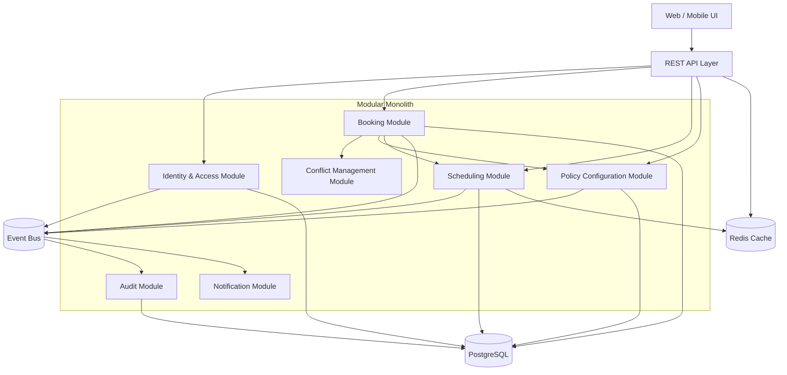
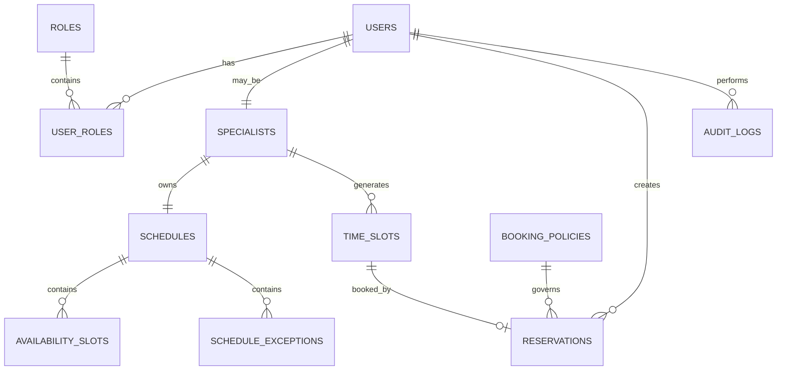
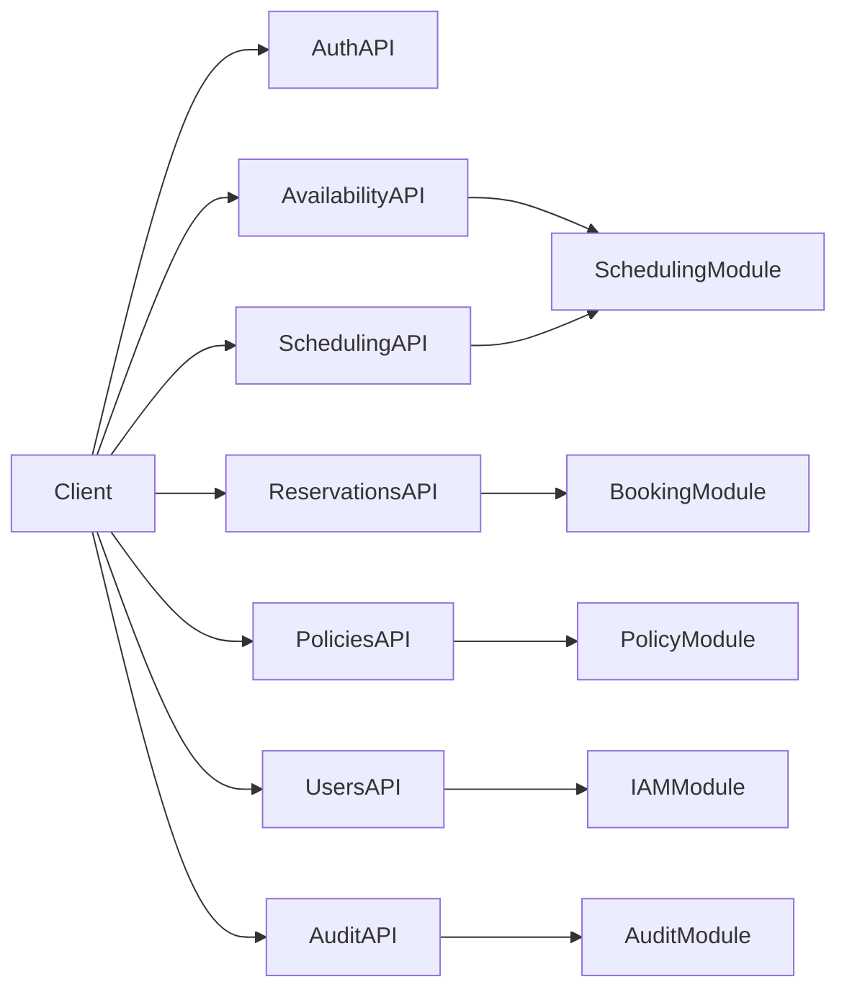

# 1. Analiza Domen i Encji

# Analiza Domenowa (DDD) — System Rezerwacji Wizyt u Specjalistów

## Cel systemu

System umożliwia użytkownikom przeglądanie dostępnych terminów, rezerwowanie i anulowanie wizyt u specjalistów. Specjaliści zarządzają własnym grafikiem, a administratorzy konfigurują reguły biznesowe, role i wyjątki od standardowych zasad.

---

# Zidentyfikowane Bounded Contexts

## 1. Rezerwacje (Booking Context)

### Odpowiedzialność
Obsługa procesu rezerwacji i anulowania wizyt.

### Kluczowe przypadki użycia
- Utworzenie rezerwacji
- Anulowanie rezerwacji
- Potwierdzenie rezerwacji
- Sprawdzenie statusu rezerwacji

### Główne encje
- **Reservation**
- **ReservationStatus**
- **Cancellation**

### Agregat główny
**Reservation**

### Inwarianty
- Jeden termin może mieć tylko jedną aktywną rezerwację.
- Rezerwacja może być anulowana wyłącznie zgodnie z obowiązującą polityką.
- Anulowanie zwalnia termin.

---

## 2. Kalendarz i Dostępność (Scheduling Context)

### Odpowiedzialność
Zarządzanie grafikiem specjalistów i generowanie dostępnych terminów.

### Kluczowe przypadki użycia
- Dodanie przedziału dostępności
- Usunięcie przedziału dostępności
- Modyfikacja grafiku
- Wyliczanie wolnych terminów

### Główne encje
- **Schedule**
- **AvailabilitySlot**
- **TimeSlot**
- **ScheduleChange**

### Agregat główny
**Schedule**

### Inwarianty
- Przedziały dostępności nie mogą się nakładać.
- Modyfikacja grafiku może wpływać na istniejące rezerwacje.
- Wolne terminy są wyliczane na podstawie grafiku minus aktywne rezerwacje.

---

## 3. Zarządzanie Konfliktami (Conflict Management Context)

### Odpowiedzialność
Wykrywanie konfliktów rezerwacji i stosowanie wyjątków.

### Kluczowe przypadki użycia
- Walidacja konfliktu
- Zastosowanie wyjątku biznesowego
- Rejestrowanie decyzji

### Główne encje
- **ConflictRule**
- **ConflictException**
- **ConflictDecision**

### Agregat główny
**ConflictRule**

### Inwarianty
- Rezerwacja konfliktowa jest odrzucana, jeśli nie istnieje ważny wyjątek.
- Wyjątek musi mieć jasno określony zakres obowiązywania.

---

## 4. Zarządzanie Użytkownikami i Uprawnieniami (Identity & Access Context)

### Odpowiedzialność
Obsługa użytkowników, ról i uprawnień.

### Kluczowe przypadki użycia
- Rejestracja użytkownika
- Przypisanie roli
- Autoryzacja operacji

### Główne encje
- **User**
- **Role**
- **Permission**

### Agregat główny
**User**

### Inwarianty
- Użytkownik może mieć jedną lub wiele ról.
- Uprawnienia wynikają z przypisanych ról.

---

## 5. Polityki Biznesowe (Policy Configuration Context)

### Odpowiedzialność
Konfiguracja reguł anulowania, rezerwacji i wyjątków.

### Kluczowe przypadki użycia
- Ustawienie limitu czasu anulowania
- Konfiguracja zasad rezerwacji
- Publikacja nowych polityk

### Główne encje
- **BookingPolicy**
- **CancellationPolicy**
- **PolicyVersion**

### Agregat główny
**BookingPolicy**

### Inwarianty
- Tylko jedna wersja polityki może być aktywna w danym czasie.
- Nowe polityki obowiązują dla przyszłych operacji.

---

## 6. Audyt i Historia Zdarzeń (Audit Context)

### Odpowiedzialność
Rejestrowanie zmian i zdarzeń systemowych.

### Kluczowe przypadki użycia
- Rejestracja utworzenia rezerwacji
- Rejestracja anulowania
- Rejestracja zmian grafiku
- Rejestracja zmian polityk

### Główne encje
- **AuditLog**
- **DomainEvent**
- **ActorReference**

### Agregat główny
**AuditLog**

---

# Najważniejsze Encje Domenowe

| Encja | Opis |
|------|------|
| Reservation | Rezerwacja konkretnego terminu przez użytkownika |
| Schedule | Grafik specjalisty |
| AvailabilitySlot | Przedział dostępności |
| TimeSlot | Konkretny termin wizyty |
| User | Konto systemowe |
| Specialist | Użytkownik pełniący rolę specjalisty |
| Role | Rola użytkownika |
| Permission | Uprawnienie wynikające z roli |
| BookingPolicy | Zasady rezerwacji |
| CancellationPolicy | Zasady anulowania |
| ConflictRule | Reguły wykrywania konfliktów |
| ConflictException | Wyjątki od reguł konfliktów |
| AuditLog | Rejestr zdarzeń audytowych |

---

# Value Objects

- **DateRange**
- **TimeRange**
- **Money** (opcjonalnie przy opłatach)
- **ReservationId**
- **ScheduleId**
- **PolicyParameters**
- **CancellationDeadline**

---

# Domain Events

- ReservationCreated
- ReservationCancelled
- ReservationRejected
- ScheduleUpdated
- ConflictDetected
- ConflictExceptionApplied
- PolicyChanged
- RoleAssigned

---

# Relacje Między Kontekstami

## Booking Context
Korzysta z:
- Scheduling Context (sprawdzenie dostępności)
- Conflict Management Context (walidacja konfliktów)
- Policy Configuration Context (reguły anulowania)
- Identity & Access Context (autoryzacja)

## Scheduling Context
Publikuje:
- ScheduleUpdated

## Conflict Management Context
Korzysta z:
- BookingPolicy
- ConflictException

## Audit Context
Subskrybuje zdarzenia ze wszystkich kontekstów.

---

# Context Map (uproszczony)

```text
Identity & Access
        |
        v
Booking <------ Scheduling
   |               |
   v               v
Policy Configuration
   |
   v
Conflict Management
   |
   v
Audit
```

---

# Priorytet Implementacyjny

## Etap 1 (Core Domain)
1. Booking Context
2. Scheduling Context
3. Conflict Management Context

## Etap 2 (Supporting Subdomains)
4. Policy Configuration Context
5. Identity & Access Context

## Etap 3 (Generic Subdomains)
6. Audit Context

---

# Core Domain

Największą wartość biznesową dostarczają:

- **Booking Context**
- **Scheduling Context**
- **Conflict Management Context**

To właśnie te konteksty realizują kluczowe wymagania biznesowe: rezerwację terminów, unikanie konfliktów i zarządzanie dostępnością specjalistów.

---

# Propozycja Struktury Modułów

```text
src/
 ├── booking/
 ├── scheduling/
 ├── conflict-management/
 ├── identity-access/
 ├── policy-configuration/
 └── audit/
```

---

# Podsumowanie

Na podstawie analizy wymagań zidentyfikowano **6 głównych Bounded Contexts**:

1. Rezerwacje (Booking)
2. Kalendarz i Dostępność (Scheduling)
3. Zarządzanie Konfliktami (Conflict Management)
4. Użytkownicy i Uprawnienia (Identity & Access)
5. Polityki Biznesowe (Policy Configuration)
6. Audyt i Historia Zdarzeń (Audit)

Centralnym agregatem domenowym jest **Reservation**, wspierany przez agregaty **Schedule**, **ConflictRule**, **User** i **BookingPolicy**.


# 2. Zaproponowana Architektura

# Proponowana Architektura Systemu Rezerwacji Wizyt

## 1. Cel architektoniczny

Celem architektury jest zapewnienie:

- spójności danych przy równoczesnych rezerwacjach,
- łatwej implementacji reguł biznesowych,
- modularności i łatwego rozwoju,
- możliwości późniejszej migracji do mikroserwisów,
- wysokiej dostępności i skalowalności.

---

# 2. Rekomendowany styl architektoniczny

## Modular Monolith + DDD + Clean Architecture + CQRS

### Wybrane wzorce

| Wzorzec | Zastosowanie |
|------|------|
| Modular Monolith | Główna struktura systemu |
| Domain-Driven Design (DDD) | Modelowanie domen i bounded contexts |
| Clean Architecture | Separacja logiki biznesowej od infrastruktury |
| CQRS | Oddzielenie operacji odczytu i zapisu |
| Event-Driven Architecture | Publikacja zdarzeń domenowych |
| REST API | Komunikacja z klientem |
| Optimistic Locking | Ochrona przed równoczesnymi rezerwacjami |

---

# 3. Uzasadnienie wyboru

## Dlaczego Modular Monolith?

System ma:
- średnią złożoność biznesową,
- wiele jasno wydzielonych domen,
- wysokie wymagania dotyczące spójności danych,
- niewielką liczbę niezależnie skalowanych obszarów.

### Zalety
- prostszy deployment,
- jedna baza danych,
- łatwiejsze transakcje ACID,
- mniejsze koszty utrzymania,
- naturalne granice pod przyszłe mikroserwisy.

## Dlaczego nie Microservices?

Na tym etapie mikroserwisy wprowadziłyby:
- złożoność DevOps,
- problemy z transakcjami rozproszonymi,
- większe koszty operacyjne.

---

# 4. Styl wewnętrzny modułów

Każdy moduł implementuje Clean Architecture:

```text
API
Application
Domain
Infrastructure
```

---

# 5. CQRS

## Commands
- CreateReservation
- CancelReservation
- UpdateSchedule
- AssignRole
- UpdateBookingPolicy

## Queries
- GetAvailableSlots
- GetReservationDetails
- GetUserReservations
- GetAuditLog

---

# 6. Proponowane Moduły

## Booking Module

### Odpowiedzialność
- tworzenie rezerwacji,
- anulowanie rezerwacji,
- kontrola limitów użytkownika,
- publikacja zdarzeń.

### Wymagania
- FR2
- FR3
- FR4
- FR7

---

## Scheduling Module

### Odpowiedzialność
- zarządzanie grafikiem specjalistów,
- generowanie dostępnych terminów.

### Wymagania
- FR1
- FR5
- FR6

---

## Conflict Management Module

### Odpowiedzialność
- wykrywanie konfliktów,
- stosowanie wyjątków.

### Wymagania
- FR7
- FR8

---

## Policy Configuration Module

### Odpowiedzialność
- konfiguracja zasad rezerwacji i anulowania.

### Wymagania
- FR4
- FR8
- FR10
- NFR9

---

## Identity & Access Module

### Odpowiedzialność
- użytkownicy,
- role,
- autoryzacja.

### Wymagania
- FR9
- NFR5

---

## Audit Module

### Odpowiedzialność
- historia zmian,
- rejestr zdarzeń.

### Wymagania
- NFR6

---

## Notification Module (opcjonalny)

### Odpowiedzialność
- wysyłka e-mail/SMS z potwierdzeniami.

---

# 7. Komunikacja między modułami

## Synchroniczna (in-process)
- Wywołania interfejsów aplikacyjnych.

## Asynchroniczna
- Domain Events.

### Przykłady
- ReservationCreated
- ReservationCancelled
- ScheduleUpdated
- PolicyChanged

---

# 8. Baza danych

## Relacyjna baza danych (np. PostgreSQL)

### Uzasadnienie
- silna spójność danych,
- transakcje ACID,
- optimistic locking,
- indeksowanie po datach.

---

# 9. Mechanizmy spójności

## Optimistic Locking
Zapobiega równoczesnej rezerwacji tego samego terminu.

## Unique Constraint
```
UNIQUE (slot_id, status='ACTIVE')
```

## Transaction Boundaries
Operacja rezerwacji wykonywana w jednej transakcji.

---

# 10. Skalowalność

## Poziom aplikacji
- stateless API,
- wiele instancji.

## Poziom danych
- read replicas,
- cache.

## CQRS
Oddzielenie odczytów od zapisów.

---

# 11. Mapowanie wymagań na komponenty

| Wymaganie | Komponent |
|------|------|
| Przeglądanie dostępnych terminów | Scheduling Query Service |
| Rezerwacja terminu | Booking Command Service |
| Anulowanie rezerwacji | Booking Command Service |
| Ograniczenia czasowe anulowania | Policy Configuration + Booking |
| Zapobieganie konfliktom | Conflict Management |
| Wyjątki od konfliktów | Conflict Management |
| Zarządzanie grafikiem | Scheduling Module |
| Role i uprawnienia | Identity & Access |
| Audyt zmian | Audit Module |
| Skalowalność | API + CQRS + PostgreSQL |

---

# 12. Mapowanie kryteriów akceptacji

| AC | Realizacja |
|------|------|
| AC1–AC2 | Scheduling Query Service |
| AC3–AC4 | Booking Module |
| AC5–AC7 | Booking + Policy Configuration |
| AC8–AC9 | Scheduling Module |
| AC10 | Conflict Management |
| AC11 | Conflict Management |
| AC12 | Identity & Access |
| AC13 | Policy Configuration |

---

# 13. Przykład reguły biznesowej: limit 3 aktywnych rezerwacji

Jeśli organizacja wprowadzi ograniczenie liczby aktywnych rezerwacji:

### Odpowiedzialny komponent
**Booking Module**

### Implementacja
Metoda domenowa:

```text
UserReservationPolicy.canCreateReservation(userId)
```

### Konfiguracja limitu
**Policy Configuration Module**

---

# 14. Diagram Architektury (Mermaid)



---

# 15. Struktura katalogów

```text
src/
├── shared/
├── booking/
│   ├── api/
│   ├── application/
│   ├── domain/
│   └── infrastructure/
├── scheduling/
├── conflict-management/
├── policy-configuration/
├── identity-access/
├── audit/
└── notification/
```

---

# 16. Technologie rekomendowane

| Warstwa | Technologie |
|------|------|
| Backend | Java + Spring Boot lub .NET |
| Baza danych | PostgreSQL |
| Cache | Redis |
| Event Bus | RabbitMQ / Kafka |
| Auth | JWT / OAuth2 |
| Monitoring | Prometheus + Grafana |
| Logi | ELK Stack |

---

# 17. Strategia ewolucji

## Faza 1
Modular Monolith.

## Faza 2
Wydzielenie:
- Notification Module,
- Audit Module.

## Faza 3
Ewentualne wydzielenie Booking i Scheduling jako mikroserwisy.

---

# 18. Uzasadnienie końcowe

Rekomendowana architektura to:

> **Modular Monolith oparty o DDD, Clean Architecture, CQRS i Event-Driven Communication.**

### Powody wyboru
- Najlepszy kompromis między prostotą a skalowalnością.
- Łatwe zachowanie spójności transakcyjnej.
- Wyraźne granice domenowe.
- Możliwość bezpiecznej ewolucji do mikroserwisów.
- Niskie koszty operacyjne.

---

# 19. Podsumowanie

Architektura:
- 6 głównych modułów domenowych,
- REST API,
- PostgreSQL,
- Redis,
- Event Bus,
- CQRS,
- Clean Architecture,
- DDD.

Centralny przepływ biznesowy:
1. Użytkownik wybiera termin.
2. Booking sprawdza polityki.
3. Conflict Management waliduje konflikt.
4. Rezerwacja zapisywana w transakcji.
5. Publikowane jest zdarzenie.
6. Audit i Notification reagują asynchronicznie.


# 3. API i Modele Danych

# API i Model Danych — System Rezerwacji Wizyt

## 1. Cel dokumentu

Dokument przedstawia:
- kluczowe endpointy REST API,
- przykładowe payloady,
- ogólne struktury tabel bazodanowych,
- indeksy i mechanizmy wspierające wydajność,
- mapowanie API do modułów architektonicznych.

Założenia są zgodne z wcześniej zaprojektowaną architekturą:
**Modular Monolith + DDD + Clean Architecture + CQRS + PostgreSQL + Redis**.

---

# 2. Założenia projektowe API

## Standard REST
- JSON over HTTPS
- JWT Bearer Authentication
- Wersjonowanie: `/api/v1`
- Idempotency-Key dla operacji POST
- Pagination dla list
- ETag dla cache GET

## Standard odpowiedzi błędów

```json
{
  "code": "SLOT_ALREADY_BOOKED",
  "message": "Wybrany termin nie jest już dostępny.",
  "details": {}
}
```

---

# 3. Endpointy API

## 3.1 Authentication API

### POST /api/v1/auth/login
Logowanie użytkownika.

### GET /api/v1/auth/me
Dane zalogowanego użytkownika.

---

## 3.2 Specialists API

### GET /api/v1/specialists
Lista specjalistów.

### GET /api/v1/specialists/{specialistId}
Szczegóły specjalisty.

---

## 3.3 Availability API

### GET /api/v1/availability

Parametry:
- `specialistId`
- `from`
- `to`
- `page`
- `size`

Przykład:
```http
GET /api/v1/availability?specialistId=123&from=2026-06-01&to=2026-06-30
```

---

## 3.4 Reservations API

### POST /api/v1/reservations

Tworzenie rezerwacji.

```json
{
  "slotId": "slot-123",
  "notes": "Konsultacja kontrolna"
}
```

### GET /api/v1/reservations/{reservationId}

### GET /api/v1/users/me/reservations

### DELETE /api/v1/reservations/{reservationId}

Anulowanie rezerwacji.

### POST /api/v1/reservations/{reservationId}/confirm
Opcjonalne potwierdzenie.

---

## 3.5 Scheduling API

### GET /api/v1/schedules/me

### PUT /api/v1/schedules/me

```json
{
  "availabilitySlots": [
    {
      "dayOfWeek": 1,
      "startTime": "09:00",
      "endTime": "17:00"
    }
  ]
}
```

### POST /api/v1/schedules/me/exceptions

Dodanie wyjątku do grafiku.

---

## 3.6 Policies API

### GET /api/v1/policies

### PUT /api/v1/policies/booking

```json
{
  "maxActiveReservations": 3,
  "cancellationWindowHours": 24
}
```

---

## 3.7 Conflict Exceptions API

### GET /api/v1/conflict-exceptions

### POST /api/v1/conflict-exceptions

### DELETE /api/v1/conflict-exceptions/{id}

---

## 3.8 Users & Roles API

### GET /api/v1/users

### GET /api/v1/users/{userId}

### PUT /api/v1/users/{userId}/roles

```json
{
  "roles": ["SPECIALIST"]
}
```

---

## 3.9 Audit API

### GET /api/v1/audit-logs

Filtry:
- actorId
- entityType
- entityId
- from
- to

---

# 4. Mapowanie API na Moduły

| Endpoint | Moduł |
|------|------|
| /availability | Scheduling |
| /reservations | Booking |
| /schedules | Scheduling |
| /policies | Policy Configuration |
| /conflict-exceptions | Conflict Management |
| /users | Identity & Access |
| /audit-logs | Audit |

---

# 5. Model Danych

## 5.1 users

| Kolumna | Typ |
|------|------|
| id | UUID PK |
| email | VARCHAR UNIQUE |
| password_hash | VARCHAR |
| first_name | VARCHAR |
| last_name | VARCHAR |
| status | VARCHAR |
| created_at | TIMESTAMP |

---

## 5.2 roles

| Kolumna | Typ |
|------|------|
| id | UUID PK |
| name | VARCHAR UNIQUE |

---

## 5.3 user_roles

| Kolumna | Typ |
|------|------|
| user_id | UUID FK |
| role_id | UUID FK |

---

## 5.4 specialists

| Kolumna | Typ |
|------|------|
| id | UUID PK |
| user_id | UUID FK |
| specialization | VARCHAR |
| active | BOOLEAN |

---

## 5.5 schedules

| Kolumna | Typ |
|------|------|
| id | UUID PK |
| specialist_id | UUID FK |
| version | BIGINT |
| updated_at | TIMESTAMP |

---

## 5.6 availability_slots

| Kolumna | Typ |
|------|------|
| id | UUID PK |
| schedule_id | UUID FK |
| day_of_week | SMALLINT |
| start_time | TIME |
| end_time | TIME |

---

## 5.7 schedule_exceptions

| Kolumna | Typ |
|------|------|
| id | UUID PK |
| schedule_id | UUID FK |
| date | DATE |
| start_time | TIME |
| end_time | TIME |
| type | VARCHAR |

---

## 5.8 time_slots

| Kolumna | Typ |
|------|------|
| id | UUID PK |
| specialist_id | UUID FK |
| start_at | TIMESTAMP |
| end_at | TIMESTAMP |
| status | VARCHAR |
| version | BIGINT |

---

## 5.9 reservations

| Kolumna | Typ |
|------|------|
| id | UUID PK |
| user_id | UUID FK |
| specialist_id | UUID FK |
| slot_id | UUID FK |
| status | VARCHAR |
| notes | TEXT |
| created_at | TIMESTAMP |
| cancelled_at | TIMESTAMP |
| version | BIGINT |

### Unique Constraint

```sql
CREATE UNIQUE INDEX ux_active_slot_reservation
ON reservations(slot_id)
WHERE status IN ('CREATED', 'CONFIRMED');
```

---

## 5.10 booking_policies

| Kolumna | Typ |
|------|------|
| id | UUID PK |
| max_active_reservations | INT |
| cancellation_window_hours | INT |
| active_from | TIMESTAMP |
| active_to | TIMESTAMP |

---

## 5.11 conflict_exceptions

| Kolumna | Typ |
|------|------|
| id | UUID PK |
| specialist_id | UUID NULL |
| slot_id | UUID NULL |
| reason | TEXT |
| active_from | TIMESTAMP |
| active_to | TIMESTAMP |

---

## 5.12 audit_logs

| Kolumna | Typ |
|------|------|
| id | UUID PK |
| actor_id | UUID |
| event_type | VARCHAR |
| entity_type | VARCHAR |
| entity_id | UUID |
| payload | JSONB |
| created_at | TIMESTAMP |

---

# 6. Indeksy Wydajnościowe

## reservations
- `(user_id, status)`
- `(slot_id)`
- `(created_at)`

## time_slots
- `(specialist_id, start_at)`
- `(status, start_at)`

## audit_logs
- `(entity_type, entity_id)`
- `(created_at)`

## availability
- `(specialist_id, start_at)`

---

# 7. Redis Cache

## Cache klucze

### Availability
```text
availability:{specialistId}:{from}:{to}
```

### Specialist
```text
specialist:{id}
```

### Active Policy
```text
policy:active
```

TTL:
- Availability: 1–5 minut
- Policies: 30 minut

---

# 8. NFR dotyczące wydajności

## NFR4 – akceptowalny czas odpowiedzi

### Docelowe SLA
| Operacja | Cel |
|------|------|
| GET availability | < 300 ms |
| POST reservation | < 500 ms |
| DELETE reservation | < 300 ms |
| GET specialists | < 200 ms |

## Mechanizmy
- Redis cache
- indeksy
- pagination
- read replicas
- CQRS

---

# 9. Współbieżność

## Optimistic Locking
Kolumna `version`.

## Partial Unique Index
Uniemożliwia podwójną rezerwację.

## Transaction Isolation
`READ COMMITTED` lub `REPEATABLE READ`.

---

# 10. Partycjonowanie

Dla dużej skali:
- `reservations` partycjonowana po miesiącu.
- `audit_logs` partycjonowana po dacie.

---

# 11. Query Model (CQRS)

## availability_read_model

Preagregowana tabela:
- specialist_id
- date
- available_slots_count
- slots_json

Pozwala na bardzo szybkie odczyty kalendarza.

---

# 12. Przykładowy przepływ POST /reservations

1. Walidacja JWT.
2. Odczyt aktywnej polityki.
3. Sprawdzenie limitu aktywnych rezerwacji.
4. Walidacja konfliktów.
5. Próba zapisu w transakcji.
6. Unique index chroni przed race condition.
7. Publikacja ReservationCreated.
8. Inwalidacja cache availability.

---

# 13. Diagram ERD (Mermaid)



---

# 14. Diagram API (Mermaid)



---

# 15. Podsumowanie

Projekt API i model danych został zoptymalizowany pod kątem:
- spójności danych,
- wysokiej wydajności,
- obsługi współbieżności,
- modularności,
- łatwej ewolucji architektury.

Kluczowe elementy zapewniające wydajność:
- PostgreSQL z odpowiednimi indeksami,
- Redis cache,
- CQRS,
- optimistic locking,
- partial unique indexes,
- preagregowane read models.

