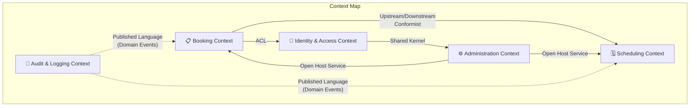
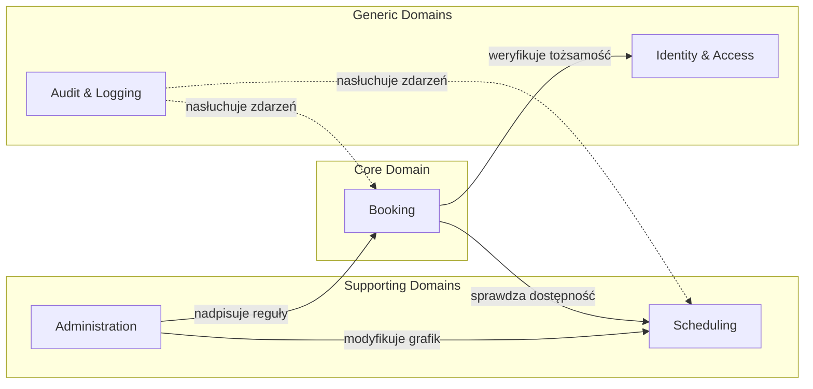
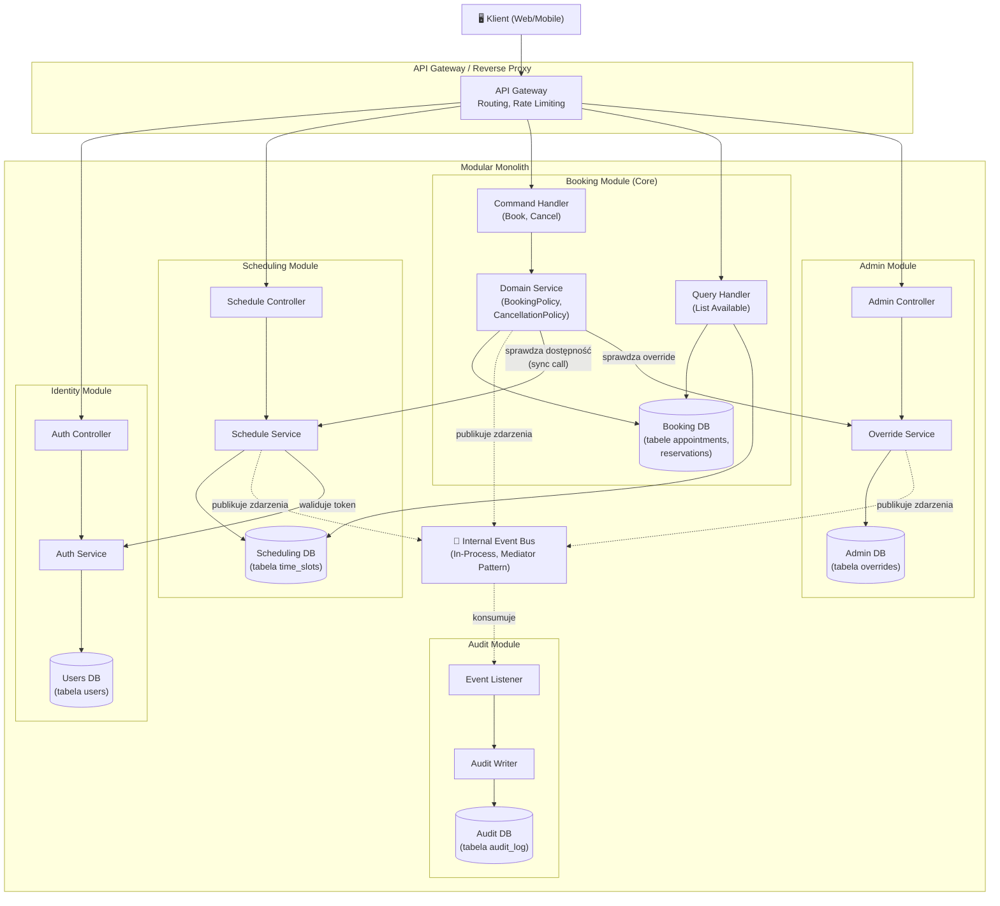
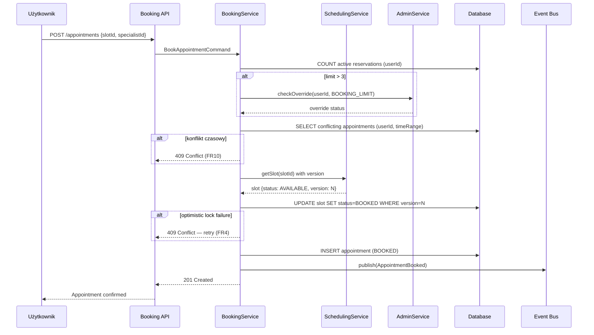
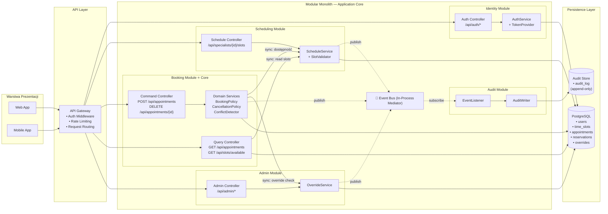
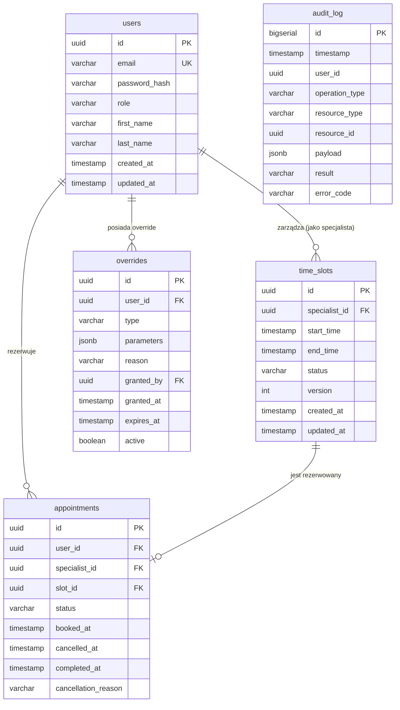

# 1. Analiza Domen i Encji

# Analiza Domen — Appointment Booking System

## 1. Zidentyfikowane Bounded Contexts



---

## 2. Bounded Contexts — szczegóły

### 2.1 🗓️ Scheduling Context (Zarządzanie grafikiem)

**Odpowiedzialność:** Cykl życia slotów czasowych specjalisty — tworzenie, usuwanie, blokowanie i zwalnianie terminów.

| Element | Typ | Opis |
|---------|-----|------|
| `TimeSlot` | **Aggregate Root** | Reprezentuje 30-minutowy blok czasu u specjalisty. Posiada status (`AVAILABLE`, `BLOCKED`). Zapewnia niezmiennik: nie można usunąć slotu, który jest zarezerwowany (FR7). |
| `SpecialistSchedule` | **Entity** | Grafik specjalisty — kolekcja slotów pogrupowanych po dacie. Odpowiada za walidację przy dodawaniu/usuwaniu slotów. |
| `SlotStatus` | **Value Object** | Enum: `AVAILABLE`, `BLOCKED` |
| `TimeRange` | **Value Object** | Para `(startTime, endTime)`, zawsze 30 min, bez stref czasowych |
| `SpecialistId` | **Value Object** | Identyfikator specjalisty (referencja do Identity Context) |

**Zdarzenia domenowe:**
- `SlotCreated` — nowy slot dodany do grafiku
- `SlotRemoved` — slot usunięty z grafiku
- `SlotBlocked` — slot oznaczony jako niedostępny (FR11)
- `SlotReleased` — slot przywrócony do `AVAILABLE` po anulowaniu (FR6)

**Powiązane wymagania:** FR7, FR11, FR6 (częściowo)

---

### 2.2 📋 Booking Context (Rezerwacje)

**Odpowiedzialność:** Proces rezerwacji i anulowania wizyt. Centralny kontekst zawierający główną logikę biznesową systemu.

| Element | Typ | Opis |
|---------|-----|------|
| `Appointment` | **Aggregate Root** | Wizyta — łączy użytkownika ze slotem specjalisty. Zarządza maszyną stanów (`AVAILABLE` → `BOOKED` → `CANCELLED`/`COMPLETED`). Wymusza reguły anulowania (24h, FR5). |
| `Reservation` | **Entity** | Akt rezerwacji — zawiera referencje do użytkownika, slotu i specjalisty. |
| `AppointmentStatus` | **Value Object** | Enum: `AVAILABLE`, `BOOKED`, `CANCELLED`, `COMPLETED`, `BLOCKED` (FR8) |
| `CancellationPolicy` | **Value Object** | Reguły anulowania — próg 24h, wymóg dodatkowej autoryzacji poniżej progu |
| `UserId` | **Value Object** | Identyfikator użytkownika |
| `BookingLimit` | **Value Object** | Domyślnie 3 aktywne rezerwacje na użytkownika (FR3) |

**Niezmienniki (Invariants):**
- Użytkownik ≤ 3 aktywnych rezerwacji (chyba że Admin nadpisze — FR3)
- Brak podwójnej rezerwacji tego samego slotu (FR4)
- Brak nakładających się rezerwacji dla jednego użytkownika (FR10)
- Anulowanie ≥ 24h przed wizytą (FR5)

**Zdarzenia domenowe:**
- `AppointmentBooked` — wizyta zarezerwowana
- `AppointmentCancelled` — wizyta anulowana
- `AppointmentCompleted` — wizyta zakończona
- `BookingRejected` — rezerwacja odrzucona (limit, konflikt, double booking)

**Powiązane wymagania:** FR1, FR2, FR3, FR4, FR5, FR6, FR8, FR10, FR13

---

### 2.3 🔐 Identity & Access Context (Tożsamość i dostęp)

**Odpowiedzialność:** Uwierzytelnianie, autoryzacja i zarządzanie rolami. Egzekwowanie reguł widoczności danych (FR9).

| Element | Typ | Opis |
|---------|-----|------|
| `User` | **Aggregate Root** | Konto użytkownika z danymi uwierzytelniającymi i przypisaną rolą. |
| `Role` | **Value Object** | Enum: `USER`, `SPECIALIST`, `ADMIN` |
| `AccessPolicy` | **Domain Service** | Określa zakres widocznych danych na podstawie roli (FR9) |
| `Credentials` | **Value Object** | Dane logowania |

**Powiązane wymagania:** FR9, NFR3

---

### 2.4 ⚙️ Administration Context (Administracja)

**Odpowiedzialność:** Nadpisywanie reguł biznesowych, zarządzanie użytkownikami i ograniczeniami systemowymi.

| Element | Typ | Opis |
|---------|-----|------|
| `SystemOverride` | **Aggregate Root** | Decyzja administracyjna o nadpisaniu ograniczenia (np. limit rezerwacji, dopuszczenie overbookingu). |
| `OverrideType` | **Value Object** | Typ nadpisania: `BOOKING_LIMIT`, `OVERBOOKING`, `TIME_CONFLICT`, `LATE_CANCELLATION` |
| `AdminAction` | **Entity** | Operacja admina — zmiana limitu, modyfikacja użytkownika, wymuszenie zmiany statusu slotu |

**Zdarzenia domenowe:**
- `OverrideGranted` — admin nadpisał ograniczenie
- `UserModified` — admin zmodyfikował konto

**Powiązane wymagania:** FR3 (wyjątki), FR7 (wyjątkowe modyfikacje), FR5 (dodatkowa autoryzacja)

---

### 2.5 📝 Audit & Logging Context (Audyt i logi)

**Odpowiedzialność:** Rejestrowanie operacji z timestamp — rezerwacje, anulowania, błędy (FR12, NFR4).

| Element | Typ | Opis |
|---------|-----|------|
| `AuditEntry` | **Aggregate Root** | Wpis audytowy — kto, co, kiedy, wynik operacji |
| `OperationType` | **Value Object** | Typ operacji: `BOOKING`, `CANCELLATION`, `SLOT_CREATION`, `OVERRIDE`, `ERROR` |
| `Timestamp` | **Value Object** | Znacznik czasu operacji |

> [!NOTE]
> Ten kontekst jest **czysto reaktywny** — konsumuje zdarzenia domenowe z pozostałych kontekstów. Nie wymusza żadnych reguł biznesowych, jedynie zapisuje dane do celów audytowych.

**Powiązane wymagania:** FR12, NFR4

---

## 3. Mapa wymagań → Bounded Contexts

| Wymaganie | Scheduling | Booking | Identity | Admin | Audit |
|-----------|:----------:|:-------:|:--------:|:-----:|:-----:|
| FR1 – Przeglądanie terminów | ✅ | ✅ | | | |
| FR2 – Rezerwacja wizyty | | ✅ | | | |
| FR3 – Limit rezerwacji | | ✅ | | ✅ | |
| FR4 – Brak double booking | | ✅ | | | |
| FR5 – Anulowanie wizyty | | ✅ | | ✅ | |
| FR6 – Zwolnienie terminu | ✅ | ✅ | | | |
| FR7 – Grafik specjalisty | ✅ | | | ✅ | |
| FR8 – Status wizyty | | ✅ | | | |
| FR9 – Dostęp do danych | | | ✅ | | |
| FR10 – Konflikty czasowe | | ✅ | | ✅ | |
| FR11 – Blokady i dostępność | ✅ | | | | |
| FR12 – Historia operacji | | | | | ✅ |
| FR13 – Równoczesne operacje | | ✅ | | | |
| NFR1 – Spójność | | ✅ | | | |
| NFR2 – Wydajność | | ✅ | | | |
| NFR3 – Bezpieczeństwo | | | ✅ | | |
| NFR4 – Audyt | | | | | ✅ |
| NFR5 – Skalowalność | ✅ | ✅ | ✅ | | |

---

## 4. Kluczowe obserwacje architektoniczne

> [!IMPORTANT]
> **Booking Context** jest dominującym kontekstem — realizuje większość reguł biznesowych i niezmienników. Jest naturalnym kandydatem na **Core Domain** w terminologii DDD.

### Relacje między kontekstami



### Problemy do rozstrzygnięcia (wynikające z niejednoznaczności wymagań)

| # | Problem | Dotyczy wymagania |
|---|---------|-------------------|
| 1 | Dokładne przejścia w maszynie stanów `AppointmentStatus` nie są w pełni zdefiniowane | FR8 |
| 2 | Zachowanie przy anulowaniu dokładnie na granicy 24h jest niejednoznaczne | FR5, AC5 |
| 3 | Strategia współbieżności (optimistic locking, pessimistic locking, saga?) nie jest określona | FR13, NFR1 |
| 4 | Zakres danych audytowych — co dokładnie logować? | FR12, NFR4 |
| 5 | Warunki, w których anulowany slot wraca do `AVAILABLE` vs pozostaje `BLOCKED` | FR6, FR11 |

---

# 2. Zaproponowana Architektura

# Zaproponowana Architektura — Appointment Booking System

## 1. Wybór wzorców architektonicznych

### Wzorzec główny: Modular Monolith

**Decyzja:** System zostanie zbudowany jako **Modular Monolith** z wyraźnymi granicami modułów odpowiadającymi zidentyfikowanym Bounded Contexts.

**Uzasadnienie:**
- **Skala systemu nie wymaga mikroserwisów.** System obsługuje rezerwacje u specjalistów — to domena o umiarkowanej złożoności z jasno zdefiniowanymi granicami. Mikroserwisy wprowadzają nadmiarową złożoność operacyjną (service discovery, distributed tracing, orchestracja deploymentów) bez proporcjonalnych korzyści.
- **Silne sprzężenie transakcyjne między Booking a Scheduling.** Rezerwacja wizyty wymaga atomowej operacji: sprawdzenie dostępności slotu + zmiana statusu slotu + utworzenie rezerwacji. W architekturze mikroserwisowej wymagałoby to sagi lub 2PC — nieproporcjonalnie skomplikowane dla tego przypadku użycia.
- **NFR5 (skalowalność)** jest adresowalne przez skalowanie horyzontalne monolitu za load balancerem, bez potrzeby niezależnego skalowania poszczególnych kontekstów.
- **Modularność** zapewnia, że w przyszłości, jeśli obciążenie istotnie wzrośnie, poszczególne moduły można wyekstrahować do osobnych serwisów z minimalnym refaktoringiem.

### Wzorce uzupełniające

| Wzorzec | Zastosowanie | Uzasadnienie |
|---------|-------------|--------------|
| **CQRS** (Command Query Responsibility Segregation) | Booking Module | Oddzielenie ścieżki zapisu (rezerwacja, anulowanie) od ścieżki odczytu (przeglądanie terminów FR1). Write-side wymusza niezmienniki, read-side zoptymalizowany pod wydajność (NFR2 <1s). |
| **Domain Events** (wewnętrzne) | Komunikacja między modułami | Moduły komunikują się przez zdarzenia domenowe publikowane na wewnętrznym event busie (in-process). Eliminuje bezpośrednie zależności między modułami i umożliwia reaktywny Audit Module. |
| **Optimistic Locking** | Booking Module — współbieżność | Rozwiązanie problemu double-booking (FR4, FR13, NFR1). Każdy `TimeSlot` posiada `version` — przy próbie rezerwacji system sprawdza wersję i odrzuca operację, jeśli slot został zmodyfikowany w międzyczasie. Retry po stronie klienta. |
| **Layered Architecture** (per moduł) | Wewnętrzna struktura każdego modułu | Każdy moduł posiada warstwy: API (controllers) → Application (use cases/commands/queries) → Domain (encje, reguły) → Infrastructure (persistence, events). |

---

## 2. Komponenty / Moduły systemu

### Diagram wysokopoziomowy



### Szczegóły modułów

#### 2.1 Identity Module (`identity`)

| Aspekt | Opis |
|--------|------|
| **Odpowiedzialność** | Uwierzytelnianie (login/token), autoryzacja (role-based access), zarządzanie kontami użytkowników |
| **Interfejs publiczny** | `AuthService.authenticate(credentials)`, `AuthService.authorize(token, requiredRole)` |
| **Komunikacja** | Synchroniczna — inne moduły wywołują `AuthService` bezpośrednio przez wewnętrzny interfejs modułu |
| **Wzorce** | Middleware uwierzytelniający na poziomie API Gateway filtruje żądania przed dotarciem do kontrolerów |

#### 2.2 Scheduling Module (`scheduling`)

| Aspekt | Opis |
|--------|------|
| **Odpowiedzialność** | CRUD slotów czasowych, blokowanie/odblokowywanie, walidacja grafiku specjalisty |
| **Interfejs publiczny** | `ScheduleService.getAvailableSlots(specialistId, date)`, `ScheduleService.createSlot(...)`, `ScheduleService.blockSlot(slotId)`, `ScheduleService.releaseSlot(slotId)` |
| **Komunikacja** | Synchroniczna — Booking Module odpytuje o dostępność; publikuje zdarzenia na Event Bus (`SlotCreated`, `SlotBlocked`, `SlotReleased`) |
| **Kluczowa reguła** | Slot zarezerwowany nie może być usunięty (FR7). Moduł deleguje sprawdzenie statusu rezerwacji do Booking Module. |

#### 2.3 Booking Module (`booking`) — Core Domain

| Aspekt | Opis |
|--------|------|
| **Odpowiedzialność** | Rezerwacja i anulowanie wizyt, egzekwowanie wszystkich niezmienników biznesowych |
| **Command Side** | `BookAppointmentCommand` → walidacja limitu (FR3) → walidacja konfliktu czasowego (FR10) → sprawdzenie dostępności slotu (FR4) → optimistic lock na slocie → zapis |
| **Query Side** | `GetUserAppointmentsQuery`, `GetAvailableSlotsQuery` (łączy dane z Scheduling) — zoptymalizowane pod NFR2 |
| **Komunikacja** | Synchronicznie woła Scheduling (dostępność) i Admin (override'y); publikuje zdarzenia (`AppointmentBooked`, `AppointmentCancelled`) |
| **Mechanizm współbieżności** | Optimistic Locking z wersjonowanym `TimeSlot`. Przy konflikcie — `ConflictException` + retry po stronie klienta (FR4, FR13, NFR1) |

**Przepływ rezerwacji (happy path):**



#### 2.4 Admin Module (`admin`)

| Aspekt | Opis |
|--------|------|
| **Odpowiedzialność** | Zarządzanie override'ami reguł, zarządzanie kontami, nadzór systemowy |
| **Interfejs publiczny** | `OverrideService.grantOverride(userId, type)`, `OverrideService.checkOverride(userId, type)` |
| **Komunikacja** | Synchroniczna — Booking Module odpytuje o aktywne override'y; publikuje zdarzenia (`OverrideGranted`) |
| **Kluczowa reguła** | Override jest zawsze powiązany z konkretnym użytkownikiem i typem ograniczenia, posiada czas ważności |

#### 2.5 Audit Module (`audit`)

| Aspekt | Opis |
|--------|------|
| **Odpowiedzialność** | Zapis historii operacji do trwałego logu (append-only) |
| **Interfejs publiczny** | Brak — moduł jest czysto reaktywny, nasłuchuje zdarzeń z Event Bus |
| **Komunikacja** | Asynchroniczna (event-driven) — subskrybuje wszystkie zdarzenia domenowe |
| **Kluczowa reguła** | Zapis audytowy jest niemodyfikowalny (append-only). Każdy wpis zawiera: timestamp, userId, operationType, payload, result |

---

## 3. Mapowanie wymagań na komponenty

| Wymaganie | Komponent realizujący | Mechanizm |
|-----------|----------------------|-----------|
| **FR1** – Przeglądanie terminów | Booking Module (Query Side) + Scheduling Module | Query handler łączy dane o slotach (Scheduling) z danymi o rezerwacjach (Booking) |
| **FR2** – Rezerwacja wizyty | Booking Module (Command Side) | `BookAppointmentCommand` → walidacja → zapis |
| **FR3** – Limit 3 rezerwacji | Booking Module + Admin Module | BookingPolicy sprawdza COUNT aktywnych; jeśli >3 → odpytuje AdminService o override |
| **FR4** – Brak double booking | Booking Module + Scheduling Module | Optimistic lock na `TimeSlot.version` przy UPDATE statusu |
| **FR5** – Anulowanie wizyty | Booking Module (Command Side) | `CancelAppointmentCommand` → CancellationPolicy sprawdza próg 24h |
| **FR6** – Zwolnienie terminu | Scheduling Module (triggered by event) | Nasłuchuje `AppointmentCancelled` → `releaseSlot()` jeśli slot nie jest BLOCKED |
| **FR7** – Grafik specjalisty | Scheduling Module | CRUD slotów z walidacją — nie pozwala usunąć zarezerwowanego slotu |
| **FR8** – Status wizyty | Booking Module (Domain) | Maszyna stanów w `Appointment` aggregate |
| **FR9** – Dostęp do danych | Identity Module (middleware) | AccessPolicy filtruje dane na poziomie query handlerów w zależności od roli |
| **FR10** – Konflikty czasowe | Booking Module (Command Side) | Przed rezerwacją: `SELECT * FROM appointments WHERE userId=? AND timeRange OVERLAPS ?` |
| **FR11** – Blokady | Scheduling Module | `blockSlot(slotId)` zmienia status na BLOCKED; release sprawdza czy nie ma blokady specjalisty |
| **FR12** – Historia operacji | Audit Module | Event Listener konsumuje zdarzenia → AuditWriter zapisuje do audit_log |
| **FR13** – Równoczesne operacje | Booking Module | Optimistic Locking + transakcje bazodanowe |
| **NFR1** – Spójność | Booking Module | Optimistic Locking + transakcyjna atomowość zapisu |
| **NFR2** – Wydajność (<1s) | Booking Module (Query Side) | Zdenormalizowany read model (CQRS), indeksy na `(specialistId, date, status)` |
| **NFR3** – Bezpieczeństwo | Identity Module | JWT token → middleware → role-based authorization |
| **NFR4** – Audyt | Audit Module | Append-only log z timestampami |
| **NFR5** – Skalowalność | Infrastruktura | Horizontal scaling monolitu za load balancerem; read replicas dla Query Side |

---

## 4. Diagram architektury — widok komponentowy



---

## 5. Uzasadnienie decyzji — podsumowanie

| Decyzja | Alternatywa | Dlaczego odrzucono |
|---------|-------------|-------------------|
| Modular Monolith | Microservices | Zbyt duża złożoność operacyjna dla tego rozmiaru systemu; transakcje cross-service (rezerwacja + slot) wymagałyby sag |
| CQRS w Booking | Prosty CRUD | Wymagania FR1 (przeglądanie) + NFR2 (<1s) wymagają zoptymalizowanego read modelu oddzielonego od zapisu |
| Optimistic Locking | Pessimistic Locking | Pessimistic locking zmniejsza throughput przy wielu równoczesnych rezerwacjach; optimistic lepiej pasuje do scenariusza, gdzie konflikty są rzadkie |
| In-Process Event Bus | Message Broker (Kafka/RabbitMQ) | W ramach jednego procesu wystarczy mediator; broker wprowadza zbędną infrastrukturę. Można go dodać przy ewolucji ku mikroserwciom |
| Osobna baza Audit | Wspólna baza | Audit log jest append-only i może rosnąć szybko; separacja umożliwia niezależne skalowanie i retencję |
| JWT + Middleware | Session-based auth | Stateless auth lepiej skaluje się horyzontalnie (NFR5); pasuje do API-first architecture |

---

# 3. API i Modele Danych

# API i Modele Danych — Appointment Booking System

## 1. Konwencje API

- **Styl:** RESTful, JSON
- **Wersjonowanie:** URL path (`/api/v1/...`)
- **Autentykacja:** Bearer Token (JWT) w nagłówku `Authorization`
- **Kody odpowiedzi:** Standardowe HTTP — `200 OK`, `201 Created`, `204 No Content`, `400 Bad Request`, `401 Unauthorized`, `403 Forbidden`, `404 Not Found`, `409 Conflict`, `422 Unprocessable Entity`
- **Paginacja:** Query params `?page=1&size=20` z odpowiedzią zawierającą `totalElements`, `totalPages`
- **Filtrowanie dat:** ISO 8601 bez stref czasowych (`2026-05-20T10:00:00`)

---

## 2. Endpointy API

### 2.1 Identity Module — `/api/v1/auth`

| Metoda | Endpoint | Opis | Role | Wymaganie |
|--------|----------|------|------|-----------|
| `POST` | `/api/v1/auth/register` | Rejestracja nowego konta | Public | NFR3 |
| `POST` | `/api/v1/auth/login` | Logowanie → zwraca JWT | Public | NFR3 |
| `POST` | `/api/v1/auth/refresh` | Odświeżenie tokenu | Authenticated | NFR3 |
| `GET` | `/api/v1/auth/me` | Dane zalogowanego użytkownika | Authenticated | FR9 |

**Przykład — Login:**
```
POST /api/v1/auth/login
Content-Type: application/json

Request:
{
  "email": "jan@example.com",
  "password": "securePass123"
}

Response: 200 OK
{
  "accessToken": "eyJhbGciOiJIUzI1NiIs...",
  "refreshToken": "dGhpcyBpcyBhIHJlZnJl...",
  "expiresIn": 3600,
  "user": {
    "id": "usr_abc123",
    "email": "jan@example.com",
    "role": "USER"
  }
}
```

---

### 2.2 Scheduling Module — `/api/v1/specialists/{specialistId}/slots`

| Metoda | Endpoint | Opis | Role | Wymaganie |
|--------|----------|------|------|-----------|
| `GET` | `/api/v1/specialists/{specialistId}/slots?date=2026-05-20` | Lista slotów specjalisty na daną datę | USER, SPECIALIST, ADMIN | FR1 |
| `POST` | `/api/v1/specialists/{specialistId}/slots` | Dodanie nowego slotu | SPECIALIST (own), ADMIN | FR7 |
| `DELETE` | `/api/v1/specialists/{specialistId}/slots/{slotId}` | Usunięcie slotu (jeśli nie zarezerwowany) | SPECIALIST (own), ADMIN | FR7 |
| `PATCH` | `/api/v1/specialists/{specialistId}/slots/{slotId}/block` | Zablokowanie slotu (BLOCKED) | SPECIALIST (own), ADMIN | FR11 |
| `PATCH` | `/api/v1/specialists/{specialistId}/slots/{slotId}/release` | Odblokowanie slotu (AVAILABLE) | SPECIALIST (own), ADMIN | FR11 |

**Przykład — Dodanie slotu:**
```
POST /api/v1/specialists/spec_xyz/slots
Authorization: Bearer <jwt>
Content-Type: application/json

Request:
{
  "startTime": "2026-05-20T10:00:00",
  "endTime": "2026-05-20T10:30:00"
}

Response: 201 Created
{
  "id": "slot_001",
  "specialistId": "spec_xyz",
  "startTime": "2026-05-20T10:00:00",
  "endTime": "2026-05-20T10:30:00",
  "status": "AVAILABLE",
  "version": 1
}
```

**Przykład — Lista slotów (FR1):**
```
GET /api/v1/specialists/spec_xyz/slots?date=2026-05-20&status=AVAILABLE
Authorization: Bearer <jwt>

Response: 200 OK
{
  "specialistId": "spec_xyz",
  "date": "2026-05-20",
  "slots": [
    {
      "id": "slot_001",
      "startTime": "2026-05-20T10:00:00",
      "endTime": "2026-05-20T10:30:00",
      "status": "AVAILABLE"
    },
    {
      "id": "slot_002",
      "startTime": "2026-05-20T11:00:00",
      "endTime": "2026-05-20T11:30:00",
      "status": "AVAILABLE"
    }
  ],
  "totalSlots": 2
}
```

---

### 2.3 Booking Module — `/api/v1/appointments`

#### Command Side (Write)

| Metoda | Endpoint | Opis | Role | Wymaganie |
|--------|----------|------|------|-----------|
| `POST` | `/api/v1/appointments` | Rezerwacja wizyty | USER | FR2, FR3, FR4, FR10 |
| `DELETE` | `/api/v1/appointments/{appointmentId}` | Anulowanie wizyty | USER (own), ADMIN | FR5 |
| `PATCH` | `/api/v1/appointments/{appointmentId}/complete` | Oznaczenie jako zakończona | SPECIALIST, ADMIN | FR8 |

#### Query Side (Read)

| Metoda | Endpoint | Opis | Role | Wymaganie |
|--------|----------|------|------|-----------|
| `GET` | `/api/v1/appointments` | Moje rezerwacje (USER) lub wizyty specjalisty (SPECIALIST) | USER, SPECIALIST | FR9 |
| `GET` | `/api/v1/appointments/{appointmentId}` | Szczegóły wizyty | USER (own), SPECIALIST (own), ADMIN | FR9 |
| `GET` | `/api/v1/slots/available?specialistId=X&date=Y` | Dostępne terminy (CQRS read model) | USER, SPECIALIST, ADMIN | FR1, NFR2 |

**Przykład — Rezerwacja wizyty (FR2):**
```
POST /api/v1/appointments
Authorization: Bearer <jwt>
Content-Type: application/json

Request:
{
  "slotId": "slot_001",
  "specialistId": "spec_xyz"
}

Response: 201 Created
{
  "id": "apt_789",
  "userId": "usr_abc123",
  "specialistId": "spec_xyz",
  "slotId": "slot_001",
  "startTime": "2026-05-20T10:00:00",
  "endTime": "2026-05-20T10:30:00",
  "status": "BOOKED",
  "createdAt": "2026-05-19T23:15:00"
}
```

**Przykład — Błąd: limit rezerwacji (FR3):**
```
POST /api/v1/appointments

Response: 422 Unprocessable Entity
{
  "error": "BOOKING_LIMIT_EXCEEDED",
  "message": "Osiągnięto maksymalną liczbę aktywnych rezerwacji (3).",
  "currentCount": 3,
  "maxAllowed": 3
}
```

**Przykład — Błąd: double booking (FR4):**
```
POST /api/v1/appointments

Response: 409 Conflict
{
  "error": "SLOT_ALREADY_BOOKED",
  "message": "Wybrany termin został już zarezerwowany przez innego użytkownika.",
  "slotId": "slot_001"
}
```

**Przykład — Błąd: konflikt czasowy (FR10):**
```
POST /api/v1/appointments

Response: 409 Conflict
{
  "error": "TIME_CONFLICT",
  "message": "Posiadasz już rezerwację nakładającą się na wybrany termin.",
  "conflictingAppointmentId": "apt_456",
  "conflictingTimeRange": {
    "startTime": "2026-05-20T10:00:00",
    "endTime": "2026-05-20T10:30:00"
  }
}
```

**Przykład — Anulowanie (FR5):**
```
DELETE /api/v1/appointments/apt_789
Authorization: Bearer <jwt>

Response (sukces, >24h): 204 No Content

Response (błąd, <24h): 422 Unprocessable Entity
{
  "error": "CANCELLATION_TOO_LATE",
  "message": "Anulowanie możliwe do 24 godzin przed wizytą.",
  "appointmentTime": "2026-05-20T10:00:00",
  "cancellationDeadline": "2026-05-19T10:00:00"
}
```

---

### 2.4 Admin Module — `/api/v1/admin`

| Metoda | Endpoint | Opis | Role | Wymaganie |
|--------|----------|------|------|-----------|
| `GET` | `/api/v1/admin/appointments` | Wszystkie rezerwacje (z filtrowaniem) | ADMIN | FR9 |
| `GET` | `/api/v1/admin/users` | Lista użytkowników | ADMIN | FR9 |
| `PATCH` | `/api/v1/admin/users/{userId}/role` | Zmiana roli użytkownika | ADMIN | — |
| `POST` | `/api/v1/admin/overrides` | Nadpisanie ograniczenia | ADMIN | FR3, FR5, FR10 |
| `GET` | `/api/v1/admin/overrides` | Lista aktywnych override'ów | ADMIN | — |
| `DELETE` | `/api/v1/admin/overrides/{overrideId}` | Cofnięcie override'a | ADMIN | — |

**Przykład — Nadpisanie limitu rezerwacji (FR3 wyjątek):**
```
POST /api/v1/admin/overrides
Authorization: Bearer <admin-jwt>
Content-Type: application/json

Request:
{
  "userId": "usr_abc123",
  "type": "BOOKING_LIMIT",
  "newLimit": 5,
  "reason": "Pacjent wymaga intensywnego leczenia",
  "expiresAt": "2026-06-01T00:00:00"
}

Response: 201 Created
{
  "id": "ovr_101",
  "userId": "usr_abc123",
  "type": "BOOKING_LIMIT",
  "newLimit": 5,
  "reason": "Pacjent wymaga intensywnego leczenia",
  "grantedBy": "admin_001",
  "grantedAt": "2026-05-19T23:16:00",
  "expiresAt": "2026-06-01T00:00:00"
}
```

---

### 2.5 Audit Module — `/api/v1/admin/audit`

| Metoda | Endpoint | Opis | Role | Wymaganie |
|--------|----------|------|------|-----------|
| `GET` | `/api/v1/admin/audit?from=...&to=...&type=...` | Przeglądanie logów audytowych | ADMIN | FR12, NFR4 |

**Przykład:**
```
GET /api/v1/admin/audit?from=2026-05-19T00:00:00&to=2026-05-20T00:00:00&type=BOOKING
Authorization: Bearer <admin-jwt>

Response: 200 OK
{
  "entries": [
    {
      "id": "aud_001",
      "timestamp": "2026-05-19T14:23:11",
      "userId": "usr_abc123",
      "operationType": "BOOKING",
      "resourceId": "apt_789",
      "payload": { "slotId": "slot_001", "specialistId": "spec_xyz" },
      "result": "SUCCESS"
    },
    {
      "id": "aud_002",
      "timestamp": "2026-05-19T14:25:03",
      "userId": "usr_def456",
      "operationType": "BOOKING",
      "resourceId": null,
      "payload": { "slotId": "slot_001", "specialistId": "spec_xyz" },
      "result": "REJECTED",
      "errorCode": "SLOT_ALREADY_BOOKED"
    }
  ],
  "page": 1,
  "size": 20,
  "totalElements": 2
}
```

---

## 3. Struktury baz danych (PostgreSQL)

### 3.1 Diagram ERD



### 3.2 Definicje tabel

#### `users` — Identity Module

```sql
CREATE TABLE users (
    id              UUID PRIMARY KEY DEFAULT gen_random_uuid(),
    email           VARCHAR(255) NOT NULL UNIQUE,
    password_hash   VARCHAR(255) NOT NULL,
    role            VARCHAR(20) NOT NULL CHECK (role IN ('USER', 'SPECIALIST', 'ADMIN')),
    first_name      VARCHAR(100) NOT NULL,
    last_name       VARCHAR(100) NOT NULL,
    created_at      TIMESTAMP NOT NULL DEFAULT NOW(),
    updated_at      TIMESTAMP NOT NULL DEFAULT NOW()
);

-- Indeks na email (login lookup) — NFR2
CREATE INDEX idx_users_email ON users (email);
```

#### `time_slots` — Scheduling Module

```sql
CREATE TABLE time_slots (
    id              UUID PRIMARY KEY DEFAULT gen_random_uuid(),
    specialist_id   UUID NOT NULL REFERENCES users(id),
    start_time      TIMESTAMP NOT NULL,
    end_time        TIMESTAMP NOT NULL,
    status          VARCHAR(20) NOT NULL DEFAULT 'AVAILABLE' 
                    CHECK (status IN ('AVAILABLE', 'BLOCKED')),
    version         INTEGER NOT NULL DEFAULT 1,
    created_at      TIMESTAMP NOT NULL DEFAULT NOW(),
    updated_at      TIMESTAMP NOT NULL DEFAULT NOW(),

    -- Jeden specjalista nie może mieć nakładających się slotów
    CONSTRAINT uq_specialist_slot UNIQUE (specialist_id, start_time),
    -- Slot trwa zawsze 30 minut
    CONSTRAINT chk_slot_duration CHECK (end_time = start_time + INTERVAL '30 minutes')
);

-- Główny indeks zapytań — FR1, NFR2 (<1s)
-- Pokrywa: GET /specialists/{id}/slots?date=X&status=AVAILABLE
CREATE INDEX idx_slots_specialist_date_status 
    ON time_slots (specialist_id, start_time, status);

-- Indeks na status do filtrowania dostępnych slotów
CREATE INDEX idx_slots_available 
    ON time_slots (status, start_time) 
    WHERE status = 'AVAILABLE';
```

**Optimistic Locking (FR4, FR13, NFR1):**
```sql
-- Przy rezerwacji — atomowa zmiana statusu z wersjonowaniem:
UPDATE time_slots 
SET    status = 'BOOKED', 
       version = version + 1, 
       updated_at = NOW()
WHERE  id = :slotId 
  AND  version = :expectedVersion 
  AND  status = 'AVAILABLE';
-- Jeśli affected_rows = 0 → ConflictException (slot zmieniony przez inną transakcję)
```

#### `appointments` — Booking Module

```sql
CREATE TABLE appointments (
    id                  UUID PRIMARY KEY DEFAULT gen_random_uuid(),
    user_id             UUID NOT NULL REFERENCES users(id),
    specialist_id       UUID NOT NULL REFERENCES users(id),
    slot_id             UUID NOT NULL REFERENCES time_slots(id),
    status              VARCHAR(20) NOT NULL DEFAULT 'BOOKED'
                        CHECK (status IN ('BOOKED', 'CANCELLED', 'COMPLETED')),
    booked_at           TIMESTAMP NOT NULL DEFAULT NOW(),
    cancelled_at        TIMESTAMP,
    completed_at        TIMESTAMP,
    cancellation_reason VARCHAR(500),

    -- Jeden slot = jedna rezerwacja (FR4)
    CONSTRAINT uq_slot_booking UNIQUE (slot_id)
);

-- Indeks: "moje rezerwacje" — FR9, NFR2
CREATE INDEX idx_appointments_user_status 
    ON appointments (user_id, status);

-- Indeks: "wizyty specjalisty" — FR9, NFR2
CREATE INDEX idx_appointments_specialist_status 
    ON appointments (specialist_id, status);

-- Indeks do wykrywania konfliktów czasowych (FR10)
-- Wymaga JOINa z time_slots, ale indeks na user_id + status przyspiesza filtrowanie
CREATE INDEX idx_appointments_user_active 
    ON appointments (user_id) 
    WHERE status = 'BOOKED';
```

**Zapytanie wykrywania konfliktu czasowego (FR10):**
```sql
-- Sprawdzenie czy nowa rezerwacja nakłada się z istniejącymi
SELECT a.id 
FROM   appointments a
JOIN   time_slots ts ON a.slot_id = ts.id
WHERE  a.user_id = :userId
  AND  a.status = 'BOOKED'
  AND  ts.start_time < :newEndTime
  AND  ts.end_time > :newStartTime
LIMIT  1;
-- Jeśli zwraca wiersz → 409 Conflict (TIME_CONFLICT)
```

**Zapytanie sprawdzenia limitu (FR3):**
```sql
SELECT COUNT(*) AS active_count
FROM   appointments
WHERE  user_id = :userId 
  AND  status = 'BOOKED';
-- Jeśli active_count >= 3 → sprawdź override w tabeli overrides
```

#### `overrides` — Admin Module

```sql
CREATE TABLE overrides (
    id              UUID PRIMARY KEY DEFAULT gen_random_uuid(),
    user_id         UUID NOT NULL REFERENCES users(id),
    type            VARCHAR(30) NOT NULL 
                    CHECK (type IN ('BOOKING_LIMIT', 'OVERBOOKING', 'TIME_CONFLICT', 'LATE_CANCELLATION')),
    parameters      JSONB,           -- np. {"newLimit": 5} dla BOOKING_LIMIT
    reason          VARCHAR(500) NOT NULL,
    granted_by      UUID NOT NULL REFERENCES users(id),
    granted_at      TIMESTAMP NOT NULL DEFAULT NOW(),
    expires_at      TIMESTAMP,
    active          BOOLEAN NOT NULL DEFAULT TRUE
);

-- Szybkie sprawdzenie aktywnego override'a dla użytkownika
CREATE INDEX idx_overrides_user_type_active 
    ON overrides (user_id, type) 
    WHERE active = TRUE;
```

**Zapytanie sprawdzenia override'a:**
```sql
SELECT parameters
FROM   overrides
WHERE  user_id = :userId
  AND  type = :overrideType
  AND  active = TRUE
  AND  (expires_at IS NULL OR expires_at > NOW())
LIMIT  1;
```

#### `audit_log` — Audit Module (osobna baza / schemat)

```sql
CREATE TABLE audit_log (
    id              BIGSERIAL PRIMARY KEY,
    timestamp       TIMESTAMP NOT NULL DEFAULT NOW(),
    user_id         UUID,
    operation_type  VARCHAR(30) NOT NULL,
    resource_type   VARCHAR(30),
    resource_id     UUID,
    payload         JSONB,
    result          VARCHAR(20) NOT NULL CHECK (result IN ('SUCCESS', 'REJECTED', 'ERROR')),
    error_code      VARCHAR(50)
);

-- Indeks na czas — filtrowanie po zakresie dat (NFR4)
CREATE INDEX idx_audit_timestamp ON audit_log (timestamp DESC);

-- Indeks na typ operacji — filtrowanie audytu
CREATE INDEX idx_audit_type_timestamp 
    ON audit_log (operation_type, timestamp DESC);

-- Indeks na użytkownika — historia operacji konkretnego użytkownika
CREATE INDEX idx_audit_user ON audit_log (user_id, timestamp DESC);
```

> **Uwaga dotycząca wydajności (NFR2, NFR5):**
> Tabela `audit_log` jest append-only i rośnie najszybciej. Zalecane jest wdrożenie **partycjonowania po `timestamp`** (np. monthly partitions) dla utrzymania wydajności zapytań przy dużym wolumenie danych.

---

## 4. Optymalizacje wydajnościowe (NFR2 < 1s)

| Optymalizacja | Cel | Szczegóły |
|---------------|-----|-----------|
| **Composite Index** na `time_slots(specialist_id, start_time, status)` | FR1 — przeglądanie terminów | Pokrywa 100% zapytania `GET /slots` bez odczytu z tabeli (covering index) |
| **Partial Index** na `appointments(user_id) WHERE status='BOOKED'` | FR3, FR10 — limit i konflikty | Indeksuje tylko aktywne rezerwacje — mały rozmiar, szybkie skanowanie |
| **UNIQUE constraint** na `appointments(slot_id)` | FR4 — double booking | Baza danych jako ostatnia linia obrony przed duplikatem — nawet jeśli optimistic lock zawiedzie |
| **Optimistic Locking** z `version` | FR4, FR13 | Brak blokad pesymistycznych — wyższa przepustowość przy równoczesnych operacjach |
| **Read replicas** (przyszłość) | NFR5 — skalowalność | Query Side (CQRS) może korzystać z replik do obsługi dużego ruchu odczytu |
| **Connection pooling** | NFR2 — wydajność | Minimalizacja narzutu nawiązywania połączeń z bazą (np. PgBouncer lub HikariCP) |
| **Partycjonowanie `audit_log`** | NFR4 + NFR5 | Partycje miesięczne zapobiegają degradacji wydajności przy rosnącej tabeli audytu |