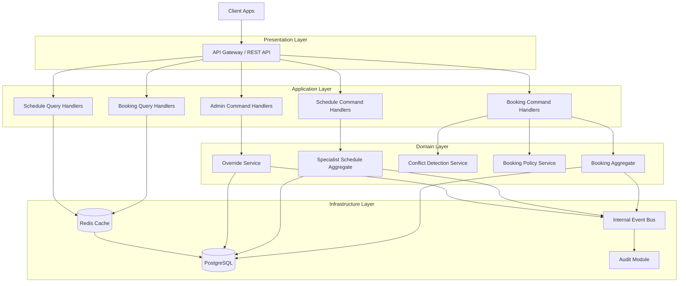
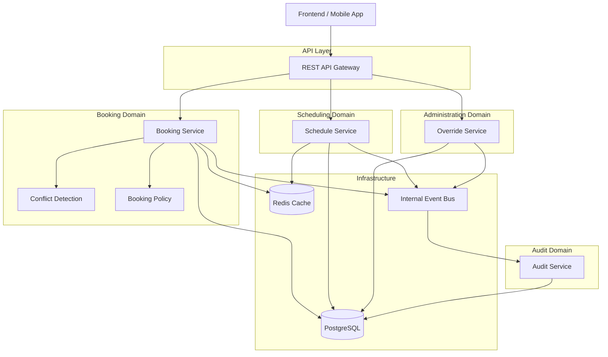

# Analiza domenowa (DDD) — Appointment Booking System

## 1. Wprowadzenie

Na podstawie dostarczonych wymagań biznesowych przeprowadzono analizę domenową systemu rezerwacji wizyt zgodnie z podejściem Domain-Driven Design (DDD).

Celem analizy jest:

- identyfikacja głównych domen i Bounded Contexts,
- identyfikacja kluczowych encji domenowych,
- wskazanie agregatów i granic odpowiedzialności,
- identyfikacja potencjalnych reguł biznesowych oraz miejsc wymagających doprecyzowania.

---

# 2. Główne domeny (Bounded Contexts)

## 2.1. Booking Context

### Odpowiedzialność
Kontekst odpowiedzialny za proces rezerwacji wizyt oraz egzekwowanie reguł biznesowych związanych z dostępnością slotów.

### Główne obowiązki
- rezerwacja wizyty,
- anulowanie wizyty,
- walidacja limitu aktywnych rezerwacji,
- wykrywanie konfliktów czasowych,
- obsługa statusów wizyt,
- zapewnienie spójności podczas operacji współbieżnych.

### Najważniejsze reguły biznesowe
- użytkownik może posiadać maksymalnie 3 aktywne rezerwacje,
- brak double booking dla tego samego slotu,
- użytkownik nie może posiadać nakładających się wizyt,
- anulowanie możliwe do 24h przed wizytą,
- po anulowaniu slot może wrócić do AVAILABLE lub pozostać BLOCKED.

### Kluczowe encje
- Appointment
- Booking
- BookingPolicy
- ReservationConflict

### Główne agregaty
#### Booking Aggregate
Root:
- Booking

Encje wewnętrzne:
- Appointment

Value Objects:
- TimeSlot
- BookingStatus
- CancellationPolicy

---

## 2.2. Scheduling Context

### Odpowiedzialność
Zarządzanie grafikiem specjalisty i dostępnością slotów.

### Główne obowiązki
- tworzenie wolnych terminów,
- usuwanie terminów,
- blokowanie slotów,
- zarządzanie kalendarzem specjalisty,
- kontrola zmian w już zarezerwowanych terminach.

### Kluczowe reguły biznesowe
- specjalista może zarządzać tylko własnym grafikiem,
- nie można usuwać zarezerwowanego slotu,
- specjalista może oznaczyć slot jako BLOCKED,
- wyjątkowe modyfikacje istniejących rezerwacji są dopuszczalne.

### Kluczowe encje
- SpecialistSchedule
- ScheduleSlot
- AvailabilityWindow

### Główne agregaty
#### SpecialistSchedule Aggregate
Root:
- SpecialistSchedule

Encje wewnętrzne:
- ScheduleSlot

Value Objects:
- TimeRange
- SlotStatus

---

## 2.3. Identity & Access Context

### Odpowiedzialność
Zarządzanie użytkownikami, rolami oraz autoryzacją dostępu.

### Główne obowiązki
- uwierzytelnianie użytkowników,
- autoryzacja operacji,
- zarządzanie rolami systemowymi,
- ograniczenie widoczności danych.

### Role domenowe
- User
- Specialist
- Admin

### Kluczowe reguły biznesowe
- użytkownik widzi wyłącznie własne rezerwacje,
- specjalista widzi tylko przypisane wizyty,
- admin posiada pełny dostęp.

### Kluczowe encje
- User
- Specialist
- Admin
- Role
- Permission

### Główne agregaty
#### User Aggregate
Root:
- User

Encje wewnętrzne:
- RoleAssignment

Value Objects:
- Credentials
- UserId

---

## 2.4. Audit & Monitoring Context

### Odpowiedzialność
Rejestrowanie zdarzeń systemowych, operacji biznesowych i błędów.

### Główne obowiązki
- logowanie operacji,
- przechowywanie historii zmian,
- rejestracja błędów,
- audyt działań administracyjnych.

### Kluczowe reguły biznesowe
- każda istotna operacja powinna zostać zapisana,
- zakres logowania nie jest jednoznacznie określony,
- logi powinny zawierać timestamp.

### Kluczowe encje
- AuditEvent
- SystemLog
- ErrorLog

### Główne agregaty
#### Audit Aggregate
Root:
- AuditEvent

Value Objects:
- EventType
- Timestamp
- Actor

---

## 2.5. Administration Context

### Odpowiedzialność
Obsługa wyjątków administracyjnych i nadpisywania ograniczeń systemowych.

### Główne obowiązki
- override limitów rezerwacji,
- override konfliktów czasowych,
- wymuszanie wyjątkowych zmian statusów,
- nadzór nad integralnością systemu.

### Kluczowe reguły biznesowe
- admin może nadpisywać standardowe ograniczenia,
- wyjątki powinny być audytowane,
- decyzje administracyjne mogą łamać standardowe reguły domenowe.

### Kluczowe encje
- SystemOverride
- AdministrativeDecision
- OverrideReason

### Główne agregaty
#### Override Aggregate
Root:
- SystemOverride

Value Objects:
- OverrideType
- Justification

---

# 3. Kluczowe encje domenowe

## 3.1. Appointment

### Opis
Reprezentuje pojedynczy termin wizyty.

### Atrybuty
- AppointmentId
- SpecialistId
- UserId (opcjonalnie)
- TimeSlot
- Status
- CreatedAt
- UpdatedAt

### Statusy
- AVAILABLE
- BOOKED
- CANCELLED
- COMPLETED
- BLOCKED

### Zachowania
- reserve()
- cancel()
- complete()
- block()
- reopen()

---

## 3.2. Booking

### Opis
Reprezentuje proces i reguły rezerwacji.

### Atrybuty
- BookingId
- AppointmentId
- UserId
- BookingStatus
- CreatedAt
- CancelledAt

### Zachowania
- validateBookingLimit()
- validateTimeConflict()
- confirm()
- cancel()

---

## 3.3. SpecialistSchedule

### Opis
Kalendarz dostępności specjalisty.

### Atrybuty
- ScheduleId
- SpecialistId
- Slots

### Zachowania
- addSlot()
- removeSlot()
- blockSlot()
- releaseSlot()

---

## 3.4. User

### Opis
Reprezentuje użytkownika systemu.

### Atrybuty
- UserId
- Role
- ActiveBookings

### Zachowania
- bookAppointment()
- cancelAppointment()
- viewBookings()

---

## 3.5. Specialist

### Opis
Reprezentuje specjalistę zarządzającego grafikiem.

### Atrybuty
- SpecialistId
- ScheduleId
- Specialization

### Zachowania
- manageSchedule()
- blockSlot()
- modifyAppointment()

---

## 3.6. Admin

### Opis
Reprezentuje administratora systemu.

### Zachowania
- overrideLimits()
- overrideConflicts()
- manageUsers()
- accessAuditLogs()

---

# 4. Value Objects

## TimeSlot
Opisuje zakres czasowy pojedynczej wizyty.

### Atrybuty
- startTime
- endTime

### Reguły
- slot trwa 30 minut,
- brak obsługi stref czasowych.

---

## BookingStatus
Enum opisujący status wizyty.

### Wartości
- AVAILABLE
- BOOKED
- CANCELLED
- COMPLETED
- BLOCKED

---

## CancellationPolicy
Opisuje zasady anulowania wizyty.

### Reguły
- anulowanie do 24h,
- przypadki graniczne nie są jednoznacznie określone.

---

# 5. Potencjalne Domain Events

## BookingCreated
Emitowany po poprawnej rezerwacji.

## BookingCancelled
Emitowany po anulowaniu wizyty.

## SlotBlocked
Emitowany po zablokowaniu slotu.

## BookingLimitExceeded
Emitowany przy przekroczeniu limitu rezerwacji.

## TimeConflictDetected
Emitowany przy wykryciu konfliktu czasowego.

## OverrideApplied
Emitowany po administracyjnym nadpisaniu reguł.

---

# 6. Relacje między kontekstami

| Context | Zależność | Opis |
|---|---|---|
| Booking Context | Scheduling Context | wykorzystuje dostępność slotów |
| Booking Context | Identity & Access | wymaga autoryzacji użytkownika |
| Booking Context | Audit & Monitoring | zapisuje operacje biznesowe |
| Administration Context | Booking Context | nadpisuje ograniczenia domenowe |
| Scheduling Context | Audit & Monitoring | loguje zmiany grafiku |

---

# 7. Obszary wymagające doprecyzowania

## 7.1. Współbieżność
Nie określono:
- optimistic locking vs pessimistic locking,
- retry policy,
- transactional boundaries,
- strategii idempotencji.

## 7.2. Graniczne przypadki anulowania
Nie określono:
- czy dokładnie 24h oznacza możliwość anulowania,
- jakie dodatkowe autoryzacje są wymagane.

## 7.3. Override administracyjne
Nie określono:
- jakie wyjątki są dopuszczalne,
- czy override ma termin ważności,
- czy override wymaga uzasadnienia.

## 7.4. Status transitions
Nie określono pełnej maszyny stanów dla Appointment.

Przykładowo nie wiadomo:
- czy BLOCKED -> BOOKED jest możliwe,
- czy CANCELLED -> BOOKED jest dozwolone,
- czy COMPLETED można cofnąć.

## 7.5. Audyt
Nie określono:
- poziomu szczegółowości logów,
- retencji danych,
- wymagań compliance.

---

# 8. Rekomendacje architektoniczne

## Architektura domenowa
Rekomendowane podejście:
- modular monolith lub microservices,
- wyraźny podział na bounded contexts,
- CQRS dla operacji odczytu i rezerwacji,
- event-driven integration między kontekstami.

## Spójność danych
Dla rezerwacji rekomendowane:
- optimistic locking,
- unique constraints na slot,
- retry mechanism,
- transactional consistency.

## Audyt
Rekomendowane:
- immutable audit log,
- event sourcing dla krytycznych operacji,
- correlation IDs dla operacji współbieżnych.

---

# 9. Podsumowanie

Najważniejszym rdzeniem domenowym systemu jest Booking Context odpowiedzialny za zarządzanie rezerwacjami i spójnością slotów.

Pozostałe konteksty wspierają:
- zarządzanie grafikiem,
- autoryzację,
- audyt,
- administracyjne wyjątki.

System zawiera wiele niejednoznaczności biznesowych celowo pozostawionych w wymaganiach, co sugeruje konieczność dalszego Event Stormingu oraz doprecyzowania invariantów domenowych przed implementacją.

# Propozycja architektury systemu — Appointment Booking System

# 1. Wprowadzenie

Na podstawie analizy domenowej systemu rezerwacji wizyt zaproponowano architekturę spełniającą wymagania funkcjonalne i niefunkcjonalne.

Projekt architektury uwzględnia:

* wysoką spójność danych,
* obsługę współbieżności,
* możliwość skalowania,
* rozdzielenie odpowiedzialności domenowych,
* łatwość rozwoju systemu,
* możliwość przyszłej migracji do architektury rozproszonej.

---

# 2. Rekomendowana architektura

# 2.1. Główny wybór: Modular Monolith

## Dlaczego Modular Monolith?

Dla analizowanego systemu najlepszym rozwiązaniem jest:

## Modular Monolith + CQRS + Event-Driven Internal Communication

System nie posiada jeszcze:

* bardzo dużej skali,
* niezależnych zespołów produktowych,
* wymagań deploymentu niezależnych komponentów,
* potrzeby niezależnego skalowania każdego modułu.

W związku z tym pełna architektura mikroserwisowa byłaby:

* zbyt kosztowna,
* nadmiernie złożona,
* trudniejsza operacyjnie,
* ryzykowna pod względem spójności danych.

Jednocześnie wymagania dotyczące:

* współbieżności,
* integralności rezerwacji,
* konfliktów czasowych,
* audytu,
* override administracyjnych,

wymagają silnego modelu domenowego oraz wyraźnych granic kontekstów.

Modular Monolith pozwala osiągnąć:

* silną separację bounded contexts,
* spójność transakcyjną,
* prostszy deployment,
* niższy koszt utrzymania,
* łatwiejszy refactoring,
* możliwość późniejszej ekstrakcji mikroserwisów.

---

# 2.2. Wzorce architektoniczne

## 1. Modular Monolith

### Uzasadnienie

* silna spójność danych,
* prostsze transakcje,
* łatwiejsze zarządzanie współbieżnością,
* niższy koszt infrastruktury,
* łatwiejsze testowanie.

---

## 2. Domain-Driven Design (DDD)

### Uzasadnienie

System posiada:

* wiele reguł biznesowych,
* wyjątki domenowe,
* złożone przejścia stanów,
* współbieżność,
* role biznesowe.

DDD pozwala:

* oddzielić domeny,
* ograniczyć coupling,
* budować model zgodny z biznesem,
* łatwiej rozwijać system.

---

## 3. CQRS (Command Query Responsibility Segregation)

### Uzasadnienie

Operacje systemu naturalnie dzielą się na:

### Commands

* book appointment,
* cancel booking,
* block slot,
* override rules.

### Queries

* browse available slots,
* view bookings,
* specialist schedule.

CQRS pozwala:

* zoptymalizować odczyty,
* uprościć model write-side,
* ograniczyć contention,
* łatwiej obsłużyć concurrency.

---

## 4. Event-Driven Architecture (wewnętrzna)

### Uzasadnienie

Wiele operacji generuje zdarzenia:

* BookingCreated,
* BookingCancelled,
* SlotBlocked,
* OverrideApplied.

Event-driven communication:

* zmniejsza coupling,
* upraszcza audyt,
* wspiera skalowalność,
* pozwala łatwo rozszerzać system.

---

## 5. Optimistic Locking

### Uzasadnienie

Wymagania wyraźnie wskazują problem:

* concurrent booking,
* concurrent cancellation,
* double booking.

Optimistic locking:

* dobrze działa przy niskim contention,
* ogranicza blokady,
* zapewnia wysoką wydajność,
* wspiera skalowalność.

---

# 3. Proponowane moduły systemu

# 3.1. API Gateway / Web Layer

## Odpowiedzialność

* REST API,
* autoryzacja requestów,
* routing,
* DTO mapping,
* rate limiting.

## Technologie

* Spring Boot Controller / ASP.NET Controllers / FastAPI.

---

# 3.2. Booking Module

## Odpowiedzialność

Najważniejszy moduł domenowy.

Obsługuje:

* rezerwacje,
* anulowania,
* walidacje,
* statusy wizyt,
* konflikty czasowe,
* limity rezerwacji.

## Kluczowe komponenty

* BookingService
* BookingAggregate
* ConflictDetectionService
* BookingPolicyService
* BookingRepository

## Realizowane wymagania

| Requirement             | Komponent                             |
| ----------------------- | ------------------------------------- |
| FR2 Rezerwacja wizyty   | BookingService                        |
| FR3 Limit 3 rezerwacji  | BookingPolicyService                  |
| FR4 Brak double booking | ConflictDetectionService              |
| FR5 Anulowanie wizyty   | BookingService                        |
| FR10 Konflikty czasowe  | ConflictDetectionService              |
| AC1                     | BookingAggregate                      |
| AC2                     | BookingPolicyService                  |
| AC3                     | BookingAggregate + optimistic locking |
| AC6                     | ConflictDetectionService              |

---

# 3.3. Scheduling Module

## Odpowiedzialność

Zarządzanie grafikiem specjalisty.

## Kluczowe komponenty

* ScheduleService
* SlotManagementService
* SpecialistScheduleAggregate
* ScheduleRepository

## Realizowane wymagania

| Requirement               | Komponent             |
| ------------------------- | --------------------- |
| FR1 Przeglądanie terminów | ScheduleQueryService  |
| FR6 Zwolnienie terminu    | SlotManagementService |
| FR7 Zarządzanie grafikiem | ScheduleService       |
| FR11 Blokady i dostępność | SlotManagementService |
| US4                       | ScheduleService       |

---

# 3.4. Identity & Access Module

## Odpowiedzialność

* uwierzytelnianie,
* autoryzacja,
* role,
* kontrola dostępu.

## Kluczowe komponenty

* AuthenticationService
* AuthorizationService
* UserRepository
* RolePolicyService

## Realizowane wymagania

| Requirement          | Komponent             |
| -------------------- | --------------------- |
| FR9 Dostęp do danych | AuthorizationService  |
| NFR3 Bezpieczeństwo  | AuthenticationService |

---

# 3.5. Administration Module

## Odpowiedzialność

Obsługa wyjątków administracyjnych.

## Kluczowe komponenty

* OverrideService
* SystemPolicyService
* AdminDecisionService

## Realizowane wymagania

| Requirement              | Komponent            |
| ------------------------ | -------------------- |
| FR3 Override limitów     | OverrideService      |
| FR10 Override konfliktów | AdminDecisionService |
| US6                      | OverrideService      |

---

# 3.6. Audit Module

## Odpowiedzialność

* logowanie operacji,
* historia zdarzeń,
* monitoring,
* compliance.

## Kluczowe komponenty

* AuditService
* EventStore
* LogRepository

## Realizowane wymagania

| Requirement            | Komponent    |
| ---------------------- | ------------ |
| FR12 Historia operacji | AuditService |
| NFR4 Audyt             | AuditService |

---

# 3.7. Concurrency & Consistency Layer

## Odpowiedzialność

Zapewnienie spójności danych.

## Mechanizmy

* optimistic locking,
* transactional boundaries,
* retry policy,
* unique constraints,
* idempotency.

## Kluczowe komponenty

* ConcurrencyManager
* TransactionManager
* RetryPolicyService

## Realizowane wymagania

| Requirement               | Komponent          |
| ------------------------- | ------------------ |
| FR4 Brak double booking   | ConcurrencyManager |
| FR13 Równoczesne operacje | TransactionManager |
| NFR1 Spójność rezerwacji  | TransactionManager |
| AC3                       | optimistic locking |

---

# 4. Warstwy architektury

# 4.1. Presentation Layer

## Odpowiedzialność

* REST API,
* DTO,
* request validation,
* auth entrypoint.

---

# 4.2. Application Layer

## Odpowiedzialność

* use cases,
* orchestration,
* transaction boundaries,
* command handlers,
* query handlers.

---

# 4.3. Domain Layer

## Odpowiedzialność

* agregaty,
* encje,
* domain services,
* domain events,
* invariants.

To najważniejsza warstwa systemu.

---

# 4.4. Infrastructure Layer

## Odpowiedzialność

* persistence,
* message bus,
* cache,
* monitoring,
* database access.

---

# 5. Komunikacja między komponentami

# 5.1. Synchroniczna komunikacja

Używana dla:

* rezerwacji,
* anulowania,
* autoryzacji,
* walidacji.

Mechanizm:

* REST + internal service calls.

---

# 5.2. Asynchroniczna komunikacja

Używana dla:

* audytu,
* eventów domenowych,
* notyfikacji,
* monitoringu.

Mechanizm:

* internal event bus.

---

# 6. Strategia spójności danych

# 6.1. Double booking prevention

## Mechanizmy

1. optimistic locking,
2. unique constraint na slot,
3. retry policy,
4. transactional update.

## Uzasadnienie

Minimalizuje:

* race conditions,
* deadlocki,
* contention.

---

# 6.2. Konflikty czasowe użytkownika

Mechanizm:

* ConflictDetectionService,
* interval overlap validation,
* walidacja przed commit.

---

# 6.3. Idempotency

Dla operacji:

* booking,
* cancellation,
* override.

Mechanizm:

* requestId,
* deduplication table.

---

# 7. Proponowana baza danych

# 7.1. Relacyjna baza danych

## Rekomendacja

PostgreSQL.

## Uzasadnienie

* silna spójność,
* ACID,
* transaction support,
* row locking,
* unique constraints,
* dobra obsługa concurrency.

---

# 7.2. Główne tabele

* users
* specialists
* schedules
* schedule_slots
* bookings
* appointments
* audit_logs
* overrides

---

# 8. Mermaid.js — Diagram architektury



---

# 9. Możliwa przyszła ewolucja do mikroserwisów

Architektura została zaprojektowana tak, aby umożliwić późniejszą migrację.

Najłatwiejsze do wydzielenia mikroserwisy:

1. Audit Service
2. Notification Service
3. Identity Service
4. Scheduling Service

Booking Context powinien pozostać centralnym modułem ze względu na:

* wysoką spójność,
* transakcyjność,
* concurrency handling.

---

# 10. Ryzyka architektoniczne

## 1. Współbieżność

Największe ryzyko systemu.

Mitigacja:

* optimistic locking,
* retry,
* unique constraints.

---

## 2. Niepełne reguły biznesowe

System zawiera wiele niejednoznaczności.

Mitigacja:

* explicit domain policies,
* configurable business rules,
* feature toggles.

---

## 3. Override administracyjne

Mogą prowadzić do niespójności.

Mitigacja:

* pełny audyt,
* immutable logs,
* approval workflows.

---

# 11. Podsumowanie

Rekomendowana architektura:

## Modular Monolith + DDD + CQRS + Event-Driven Architecture

zapewnia:

* wysoką spójność danych,
* dobrą obsługę concurrency,
* prostszy deployment,
* łatwiejsze utrzymanie,
* możliwość skalowania,
* możliwość przyszłej migracji do mikroserwisów.

Najważniejszym komponentem systemu jest Booking Module odpowiedzialny za:

* integralność rezerwacji,
* kontrolę konfliktów,
* enforceowanie reguł domenowych.

Architektura została dobrana tak, aby minimalizować ryzyko race conditions i jednocześnie zachować rozsądną złożoność operacyjną systemu.


# API oraz projekt baz danych — Appointment Booking System

# 1. Wprowadzenie

Na podstawie wcześniej zaprojektowanej architektury systemu przygotowano:

* propozycję kluczowych endpointów REST API,
* podział API według bounded contexts,
* przykładowe request/response DTO,
* projekt logiczny baz danych,
* indeksy i strategie wydajnościowe,
* mechanizmy wspierające NFR.

Projekt został zoptymalizowany pod kątem:

* spójności danych,
* wydajności rezerwacji (<1s),
* obsługi współbieżności,
* skalowalności,
* możliwości dalszego rozwoju.

---

# 2. Styl API

# 2.1. RESTful API

## Uzasadnienie

REST jest odpowiedni ponieważ:

* operacje są silnie zasobowe,
* system jest CRUD-oriented,
* łatwa integracja frontendów,
* prostsza observability,
* dobre wsparcie toolingowe.

---

# 2.2. API Versioning

## Strategia

```http
/api/v1/
```

## Uzasadnienie

* kompatybilność wsteczna,
* łatwiejsza ewolucja API,
* bezpieczne zmiany kontraktów.

---

# 2.3. Idempotency

Dla endpointów:

* booking,
* cancellation,
* override.

Wymagany nagłówek:

```http
Idempotency-Key: UUID
```

## Uzasadnienie

Chroni przed:

* duplicate booking,
* retry storms,
* problemami sieciowymi.

---

# 3. Booking API

# 3.1. Pobranie dostępnych terminów

## Endpoint

```http
GET /api/v1/appointments/available
```

## Query Params

| Param        | Type      | Required | Description        |
| ------------ | --------- | -------- | ------------------ |
| specialistId | UUID      | yes      | ID specjalisty     |
| date         | LocalDate | yes      | dzień wyszukiwania |

## Response

```json
{
  "appointments": [
    {
      "appointmentId": "uuid",
      "startTime": "2026-05-24T10:00:00",
      "endTime": "2026-05-24T10:30:00",
      "status": "AVAILABLE"
    }
  ]
}
```

## NFR considerations

* cacheable,
* read replica support,
* Redis caching.

---

# 3.2. Rezerwacja wizyty

## Endpoint

```http
POST /api/v1/bookings
```

## Request

```json
{
  "appointmentId": "uuid"
}
```

## Response

```json
{
  "bookingId": "uuid",
  "status": "BOOKED"
}
```

## Realizowane wymagania

* FR2
* FR3
* FR4
* FR10
* AC1
* AC2
* AC3
* AC6

## Walidacje

* slot AVAILABLE,
* limit 3 bookingów,
* brak konfliktów czasowych,
* optimistic locking.

## NFR considerations

* transaction boundary,
* optimistic locking,
* low latency path,
* database unique constraints.

---

# 3.3. Anulowanie wizyty

## Endpoint

```http
POST /api/v1/bookings/{bookingId}/cancel
```

## Response

```json
{
  "bookingId": "uuid",
  "status": "CANCELLED"
}
```

## Realizowane wymagania

* FR5
* FR6
* AC4
* AC5

## Walidacje

* policy 24h,
* authorization,
* appointment state.

---

# 3.4. Pobranie rezerwacji użytkownika

## Endpoint

```http
GET /api/v1/users/me/bookings
```

## Response

```json
{
  "bookings": [
    {
      "bookingId": "uuid",
      "appointmentId": "uuid",
      "status": "BOOKED"
    }
  ]
}
```

## NFR considerations

* read optimized query,
* CQRS read model,
* pagination.

---

# 4. Scheduling API

# 4.1. Dodanie slotu

## Endpoint

```http
POST /api/v1/specialists/{specialistId}/slots
```

## Request

```json
{
  "startTime": "2026-05-24T10:00:00",
  "endTime": "2026-05-24T10:30:00"
}
```

## Response

```json
{
  "slotId": "uuid",
  "status": "AVAILABLE"
}
```

## Realizowane wymagania

* FR7
* US4

---

# 4.2. Usunięcie slotu

## Endpoint

```http
DELETE /api/v1/specialists/{specialistId}/slots/{slotId}
```

## Walidacje

* slot niezarezerwowany,
* ownership validation.

---

# 4.3. Blokowanie slotu

## Endpoint

```http
POST /api/v1/specialists/{specialistId}/slots/{slotId}/block
```

## Response

```json
{
  "slotId": "uuid",
  "status": "BLOCKED"
}
```

## Realizowane wymagania

* FR11

---

# 5. Administration API

# 5.1. Override limitu rezerwacji

## Endpoint

```http
POST /api/v1/admin/overrides/booking-limit
```

## Request

```json
{
  "userId": "uuid",
  "reason": "Emergency override"
}
```

## Response

```json
{
  "overrideId": "uuid",
  "status": "APPROVED"
}
```

## Realizowane wymagania

* FR3
* US6

---

# 5.2. Override konfliktu czasowego

## Endpoint

```http
POST /api/v1/admin/overrides/time-conflict
```

## Request

```json
{
  "userId": "uuid",
  "appointmentId": "uuid",
  "reason": "Manual approval"
}
```

---

# 6. Audit API

# 6.1. Pobranie logów audytowych

## Endpoint

```http
GET /api/v1/admin/audit-events
```

## Query Params

| Param     | Description   |
| --------- | ------------- |
| from      | zakres czasu  |
| to        | zakres czasu  |
| actorId   | użytkownik    |
| eventType | typ zdarzenia |

## NFR considerations

* pagination mandatory,
* asynchronous indexing,
* archive strategy.

---

# 7. Projekt bazy danych

# 7.1. users

```sql
CREATE TABLE users (
    id UUID PRIMARY KEY,
    email VARCHAR(255) UNIQUE NOT NULL,
    password_hash VARCHAR(255) NOT NULL,
    role VARCHAR(50) NOT NULL,
    created_at TIMESTAMP NOT NULL
);
```

## Indeksy

```sql
CREATE INDEX idx_users_email ON users(email);
```

---

# 7.2. specialists

```sql
CREATE TABLE specialists (
    id UUID PRIMARY KEY,
    user_id UUID UNIQUE NOT NULL,
    specialization VARCHAR(255),
    created_at TIMESTAMP NOT NULL,

    CONSTRAINT fk_specialists_user
        FOREIGN KEY(user_id)
        REFERENCES users(id)
);
```

---

# 7.3. appointments

## Najważniejsza tabela systemu

```sql
CREATE TABLE appointments (
    id UUID PRIMARY KEY,
    specialist_id UUID NOT NULL,
    start_time TIMESTAMP NOT NULL,
    end_time TIMESTAMP NOT NULL,
    status VARCHAR(50) NOT NULL,
    version BIGINT NOT NULL,
    created_at TIMESTAMP NOT NULL,
    updated_at TIMESTAMP NOT NULL,

    CONSTRAINT fk_appointments_specialist
        FOREIGN KEY(specialist_id)
        REFERENCES specialists(id)
);
```

## Krytyczne indeksy

```sql
CREATE INDEX idx_appointments_specialist_time
ON appointments(specialist_id, start_time);

CREATE INDEX idx_appointments_status
ON appointments(status);
```

## Optimistic locking

Pole:

```sql
version BIGINT
```

wykorzystywane do:

* concurrency control,
* race condition prevention.

---

# 7.4. bookings

```sql
CREATE TABLE bookings (
    id UUID PRIMARY KEY,
    appointment_id UUID UNIQUE NOT NULL,
    user_id UUID NOT NULL,
    status VARCHAR(50) NOT NULL,
    created_at TIMESTAMP NOT NULL,
    cancelled_at TIMESTAMP,

    CONSTRAINT fk_bookings_appointment
        FOREIGN KEY(appointment_id)
        REFERENCES appointments(id),

    CONSTRAINT fk_bookings_user
        FOREIGN KEY(user_id)
        REFERENCES users(id)
);
```

## Krytyczne ograniczenie

```sql
UNIQUE(appointment_id)
```

## Uzasadnienie

Chroni przed:

* double booking,
* race conditions.

## Indeksy

```sql
CREATE INDEX idx_bookings_user
ON bookings(user_id);

CREATE INDEX idx_bookings_status
ON bookings(status);
```

---

# 7.5. overrides

```sql
CREATE TABLE overrides (
    id UUID PRIMARY KEY,
    admin_id UUID NOT NULL,
    user_id UUID NOT NULL,
    override_type VARCHAR(100) NOT NULL,
    reason TEXT NOT NULL,
    created_at TIMESTAMP NOT NULL
);
```

---

# 7.6. audit_events

```sql
CREATE TABLE audit_events (
    id UUID PRIMARY KEY,
    actor_id UUID,
    event_type VARCHAR(100) NOT NULL,
    payload JSONB,
    created_at TIMESTAMP NOT NULL
);
```

## Indeksy

```sql
CREATE INDEX idx_audit_created_at
ON audit_events(created_at);

CREATE INDEX idx_audit_event_type
ON audit_events(event_type);
```

---

# 8. Strategia wydajnościowa (NFR)

# 8.1. Rezerwacja <1s

## Mechanizmy

### 1. Krótka transakcja

* minimalizacja lock time,
* brak ciężkich joinów.

### 2. CQRS

* read model oddzielony od write model.

### 3. Redis cache

Cache dla:

* available appointments,
* specialist schedules,
* frequently accessed queries.

### 4. Optimistic locking

* ogranicza contention,
* unika pessimistic locks.

### 5. Lightweight aggregates

* małe granice agregatów,
* szybki commit.

---

# 8.2. Skalowalność

## Strategia

### Horizontal scaling

* stateless API,
* load balancer,
* replicated app nodes.

### Database scaling

* read replicas,
* partitioning audit logs,
* async event processing.

---

# 8.3. Cache strategy

## Redis

Cacheowane:

| Data                   | TTL |
| ---------------------- | --- |
| available appointments | 30s |
| specialist schedule    | 60s |
| user profile           | 5m  |

## Cache invalidation

Event-driven invalidation:

* BookingCreated,
* BookingCancelled,
* SlotBlocked.

---

# 8.4. Observability

## Monitoring

* Prometheus,
* Grafana,
* OpenTelemetry.

## Metrics

* booking latency,
* failed bookings,
* retry count,
* concurrency conflicts.

---

# 9. Bezpieczeństwo

# 9.1. Authentication

## Mechanizm

JWT access tokens.

---

# 9.2. Authorization

RBAC:

* USER,
* SPECIALIST,
* ADMIN.

---

# 9.3. Rate limiting

## Uzasadnienie

Chroni przed:

* brute force,
* retry storms,
* DDoS.

## Przykład

```http
100 requests/min per user
```

---

# 10. Mermaid.js — API & Database Architecture



---

# 11. Podsumowanie

Proponowane API i projekt baz danych zostały zaprojektowane pod kątem:

* wysokiej spójności danych,
* minimalizacji race conditions,
* szybkich operacji rezerwacji,
* skalowalności,
* prostoty utrzymania.

Kluczowe mechanizmy zapewniające realizację NFR:

* optimistic locking,
* unique constraints,
* CQRS,
* Redis caching,
* stateless API,
* event-driven invalidation,
* lightweight transactions.

Najważniejszym elementem systemu pozostaje Booking Service odpowiedzialny za:

* integralność danych,
* concurrency handling,
* enforceowanie reguł domenowych.
