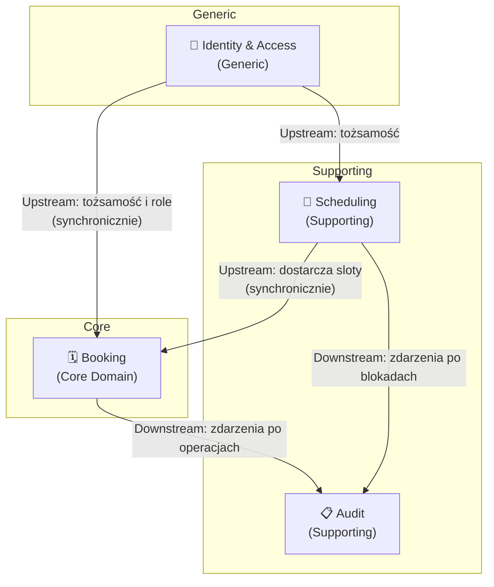
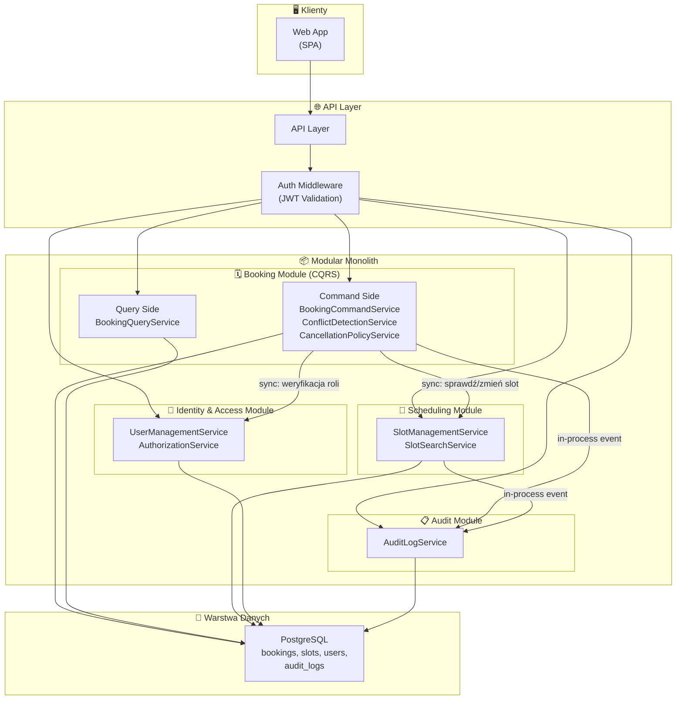
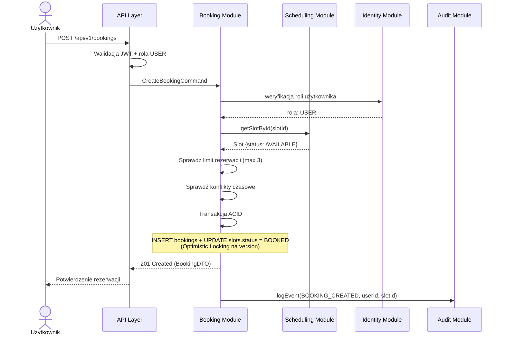
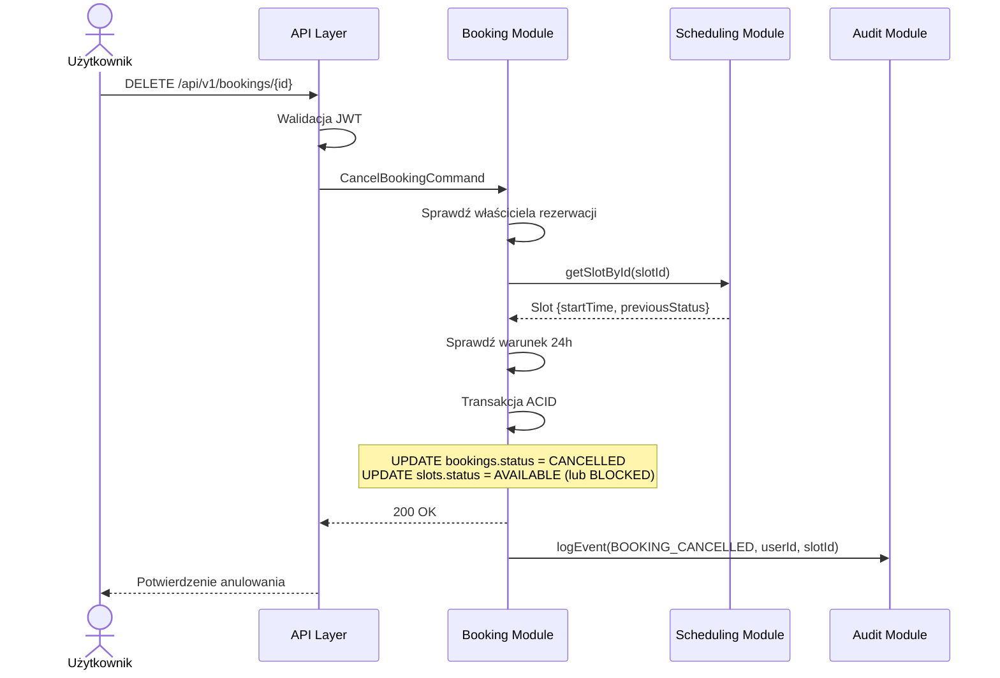

# 1. Analiza Domen i Encji

# Analiza Domenowa — System Rezerwacji Wizyt u Specjalistów

## 1. Zidentyfikowane Bounded Contexts

Na podstawie wymagań biznesowych wyodrębniam **4 główne Bounded Contexts**:

| # | Bounded Context | Odpowiedzialność | Kluczowe FR |
|---|----------------|-------------------|-------------|
| 1 | **Booking** (Zarządzanie Rezerwacjami) | Cykl życia rezerwacji: tworzenie, anulowanie, historia, wykrywanie konfliktów, limit rezerwacji | FR2, FR3, FR4, FR5, FR7, FR10 |
| 2 | **Scheduling** (Zarządzanie Grafikiem i Slotami) | Grafik specjalisty, sloty czasowe, blokady terminów, wyszukiwanie wolnych terminów | FR1, FR6 |
| 3 | **Identity & Access** (Zarządzanie Tożsamością i Dostępem) | Konta użytkowników, role, uprawnienia, uwierzytelnianie | FR8 |
| 4 | **Audit** (Audyt i Historia) | Zapis zdarzeń biznesowych, historia operacji, odrzucone rezerwacje | NFR9 |

---

## 2. Encje Domenowe per Bounded Context

### 2.1 Booking (Core Domain)

> [!IMPORTANT]
> To jest **core domain** systemu — tu znajduje się najważniejsza logika biznesowa.

| Encja / Value Object | Typ | Opis | Kluczowe atrybuty |
|---------------------|-----|------|-------------------|
| **Booking** (Aggregate Root) | Entity | Pojedyncza rezerwacja slotu | `id`, `userId`, `slotId`, `status`, `createdAt` |
| **BookingStatus** | Value Object | Status rezerwacji | `BOOKED`, `CANCELLED` |
| **CancellationPolicy** | Value Object | Reguły dozwolonego okna anulowania | `minHoursBeforeAppointment` |

#### Reguły biznesowe (Invariants):
- Rezerwacja tego samego slotu przez dwóch użytkowników jest zabroniona (Optimistic Locking + UNIQUE constraint)
- Użytkownik może mieć maksymalnie 3 aktywne rezerwacje (status BOOKED)
- Anulowanie jest możliwe tylko gdy do wizyty zostało więcej niż 24h
- Nowa wizyta nie może nakładać się czasowo na istniejące rezerwacje użytkownika
- Po anulowaniu slot wraca do AVAILABLE lub pozostaje BLOCKED (zależnie od poprzedniego stanu)

---

### 2.2 Scheduling (Supporting Domain)

| Encja / Value Object | Typ | Opis | Kluczowe atrybuty |
|---------------------|-----|------|-------------------|
| **Slot** (Aggregate Root) | Entity | Pojedynczy slot czasowy specjalisty | `id`, `specialistId`, `startTime`, `endTime`, `status`, `version` |
| **SlotStatus** | Value Object | Status slotu | `AVAILABLE`, `BOOKED`, `BLOCKED`, `COMPLETED` |

#### Reguły biznesowe:
- Zablokowany slot (BLOCKED) nie może być zarezerwowany
- Tylko specjalista lub admin może blokować i odblokowywać slot
- Można usunąć tylko slot w statusie AVAILABLE
- Scheduling Service zmienia status slotu na żądanie Booking Service

---

### 2.3 Identity & Access (Generic Subdomain)

| Encja / Value Object | Typ | Opis | Kluczowe atrybuty |
|---------------------|-----|------|-------------------|
| **User** (Aggregate Root) | Entity | Konto użytkownika systemu | `id`, `email`, `name`, `role` |
| **Role** | Value Object | Rola w systemie | `USER`, `SPECIALIST`, `ADMIN` |
| **Specialist** | Entity | Rozszerzenie profilu użytkownika-specjalisty | `id`, `userId`, `specialization` |

---

### 2.4 Audit (Supporting Domain)

| Encja / Value Object | Typ | Opis | Kluczowe atrybuty |
|---------------------|-----|------|-------------------|
| **AuditLog** (Aggregate Root) | Entity | Niemodyfikowalny log operacji | `id`, `eventType`, `userId`, `slotId`, `timestamp`, `details` |

#### Reguły biznesowe:
- Logi są append-only (konto aplikacyjne ma tylko uprawnienia INSERT)
- Logowane są zarówno udane operacje, jak i odrzucone (np. przekroczony limit)
- Każdy log zawiera: typ zdarzenia, id użytkownika, id slotu, timestamp

---

## 3. Context Map — Relacje między Bounded Contexts



---

## 4. Kluczowe Zdarzenia Domenowe (Domain Events)

| Zdarzenie | Emitent | Konsumenci | Trigger |
|-----------|---------|------------|---------| 
| `BookingCreated` | Booking | Audit | Użytkownik tworzy rezerwację |
| `BookingCancelled` | Booking | Audit | Użytkownik/Admin anuluje rezerwację |
| `BookingRejected` | Booking | Audit | Przekroczony limit lub konflikt |
| `SlotBlocked` | Scheduling | Audit | Specjalista blokuje slot |
| `SlotReleased` | Scheduling | Audit | Specjalista odblokowuje slot |

---

## 5. Mapowanie Wymagań Funkcyjnych → Bounded Contexts

| FR | Opis (skrót) | Booking | Scheduling | Identity | Audit |
|----|-------------|---------|------------|----------|-------|
| FR1 | Przeglądanie terminów | | ✅ | | |
| FR2 | Dokonywanie rezerwacji | ✅ | ✅ | | |
| FR3 | Zapobieganie double booking | ✅ | | | |
| FR4 | Wykrywanie konfliktów czasowych | ✅ | | | |
| FR5 | Anulowanie w oknie 24h | ✅ | | | |
| FR6 | Modyfikacja grafiku, blokady | | ✅ | | |
| FR7 | Limit 3 aktywnych rezerwacji | ✅ | | | |
| FR8 | Role i uprawnienia | | | ✅ | |
| FR10 | Historia rezerwacji | ✅ | | | ✅ |
| NFR9 | Logi audytowe | | | | ✅ |

---

## 6. Podsumowanie Strategii Podziału

> [!TIP]
> **Booking** to jedyny **Core Domain** — tu koncentruje się najważniejsza logika biznesowa i tu powinno iść najwięcej wysiłku projektowego.

- **Scheduling** to **Supporting Domain** — zarządza slotami, ich statusami i grafikiem specjalisty.
- **Identity & Access** to **Generic Subdomain** — prosta kontrola ról (USER/SPECIALIST/ADMIN).
- **Audit** to **Supporting Domain** — niemodyfikowalny log wszystkich operacji.

Zrezygnowano z osobnych kontekstów Administration i Notification jako nadmiernych dla tej skali systemu.

---

# 2. Zaproponowana Architektura

# Propozycja Architektury — System Rezerwacji Wizyt u Specjalistów

## 1. Wybór Wzorców Architektonicznych

### 1.1 Architektura nadrzędna: **Modular Monolith ze wspólną bazą PostgreSQL**

| Kryterium | Uzasadnienie |
|-----------|-------------|
| **Etap projektu** | System startuje jako nowy produkt — Modular Monolith minimalizuje overhead operacyjny przy zachowaniu czystych granic modułów |
| **Granice modułów = Bounded Contexts** | 4 zidentyfikowane BC mapują się 1:1 na moduły wewnętrzne |
| **Transakcyjność** | Wspólna baza PostgreSQL pozwala na transakcyjną rezerwację (INSERT booking + UPDATE slot.status w jednej transakcji ACID) bez distributed transactions |
| **Koszt operacyjny** | Jedno wdrożenie, jedna baza danych — prostszy monitoring i utrzymanie |

> [!IMPORTANT]
> Kluczowa zasada: moduły komunikują się przez publiczne fasady (in-process), nie przez HTTP. Wspólna baza umożliwia transakcje cross-module.

### 1.2 Wzorce wewnętrzne per moduł

| Moduł | Wzorzec | Uzasadnienie |
|-------|---------|-------------|
| **Booking** | **CQRS (selektywny)** | Core domain z najbardziej złożoną logiką (konflikty, limit rezerwacji, polityki anulowania). CQRS rozdziela model zapisu od modelu odczytu (historia, lista rezerwacji) |
| **Scheduling** | **CRUD** | Logika zarządzania slotami jest prosta — CRUD z in-process events do Audit |
| **Identity & Access** | **CRUD** | Zarządzanie użytkownikami i rolami nie wymaga złożonych wzorców |
| **Audit** | **Append-Only Log** | Logi są niemodyfikowalne; wyłącznie INSERT operacje |

### 1.3 Wzorce przekrojowe (Cross-cutting)

| Wzorzec | Zastosowanie | Uzasadnienie |
|---------|-------------|-------------|
| **Optimistic Locking** | Rezerwacja slotu | Pole `version` w tabeli `slots` zapobiega double booking przy równoczesnych żądaniach |
| **Unique Constraint** | Tabela `bookings.slot_id` | Druga linia obrony przed double booking na poziomie bazy |
| **JWT Authentication** | API Layer | Stateless uwierzytelnianie; rola zawarta w tokenie |

---

## 2. Komponenty / Serwisy — Odpowiedzialności i Komunikacja

### 2.1 Mapa komponentów

```
┌─────────────────────────────────────────────────────┐
│                    API Layer                        │
│  (routing, JWT validation, role check)              │
└──────────┬──────────┬──────────┬────────────────────┘
           │          │          │          
    ┌──────▼───┐ ┌────▼─────┐ ┌─▼────────┐   ┌──────────────┐
    │ Booking  │ │Scheduling│ │ Identity │   │ Audit Module │
    │ Module   │ │ Module   │ │ Module   │   │ (admin read) │
    └──────────┘ └──────────┘ └──────────┘   └──────────────┘
           │          ▲
           └──────────┘
     (sync: sprawdź slot, zmień status)
```

### 2.2 Szczegóły komponentów

#### 📦 Booking Module (Core)

| Aspekt | Opis |
|--------|------|
| **Odpowiedzialność** | Tworzenie rezerwacji (z pełną walidacją), anulowanie, kontrola limitu 3 rezerwacji, wykrywanie konfliktów czasowych, historia |
| **Wzorzec wewnętrzny** | CQRS — Command Side (BookingCommandService) + Query Side (BookingQueryService) |
| **Kluczowe serwisy** | `BookingCommandService`, `BookingQueryService`, `ConflictDetectionService`, `CancellationPolicyService` |
| **Emitowane zdarzenia** | `BookingCreated`, `BookingCancelled`, `BookingRejected` |
| **Zależności** | Scheduling (synchronicznie — sprawdzenie i zmiana statusu slotu), Identity (synchronicznie — weryfikacja roli), Audit (in-process — zapis zdarzenia) |

#### 📅 Scheduling Module

| Aspekt | Opis |
|--------|------|
| **Odpowiedzialność** | Zarządzanie slotami specjalistów, blokady (BLOCKED), wyszukiwanie wolnych terminów, zmiana statusu slotu na żądanie Booking |
| **Wzorzec wewnętrzny** | CRUD |
| **Kluczowe serwisy** | `SlotManagementService`, `SlotSearchService` |
| **Emitowane zdarzenia** | `SlotBlocked`, `SlotReleased` |
| **Zależności** | Brak bezpośrednich — upstream dla Booking |

#### 🔐 Identity & Access Module

| Aspekt | Opis |
|--------|------|
| **Odpowiedzialność** | Zarządzanie kontami, rolami (USER/SPECIALIST/ADMIN), uwierzytelnianie, autoryzacja |
| **Wzorzec wewnętrzny** | CRUD |
| **Kluczowe serwisy** | `UserManagementService`, `AuthorizationService` |
| **Zależności** | Brak — jest upstream dla wszystkich modułów |

#### 📋 Audit Module

| Aspekt | Opis |
|--------|------|
| **Odpowiedzialność** | Odbieranie zdarzeń in-process, zapis logów (append-only), udostępnianie historii dla admina |
| **Wzorzec wewnętrzny** | Append-Only Log |
| **Kluczowe serwisy** | `AuditLogService` |
| **Konsumowane zdarzenia** | `BookingCreated`, `BookingCancelled`, `BookingRejected`, `SlotBlocked`, `SlotReleased` |
| **Zależności** | Brak — jest downstream |

### 2.3 Sposób komunikacji

| Typ komunikacji | Mechanizm | Użycie | Uzasadnienie |
|----------------|-----------|--------|-------------|
| **Synchroniczna** | In-process interface call | Booking → Scheduling (sprawdzenie slotu, zmiana statusu), Booking → Identity (weryfikacja roli) | Operacje wymagające natychmiastowej odpowiedzi w ramach transakcji |
| **In-process Event** | Wywołanie in-process po zakończeniu transakcji | Booking → Audit, Scheduling → Audit | Decoupling modułów bez potrzeby zewnętrznego brokera |

---

## 3. Mapowanie Wymagań na Komponenty

### 3.1 Wymagania Funkcyjne

| FR | Opis | Komponent główny | Komponenty wspierające | Sposób realizacji |
|----|------|-------------------|-----------------------|-------------------|
| **FR1** | Przeglądanie terminów | **Scheduling** (`SlotSearchService`) | Identity (autoryzacja) | Query endpoint z filtrami: specialist_id, data. Indeks na `(specialist_id, start_time, status)` |
| **FR2** | Rezerwacja | **Booking** (`BookingCommandService`) | Scheduling (sprawdzenie + zmiana statusu), Audit | Transakcja: INSERT booking + UPDATE slot.status z Optimistic Locking |
| **FR3** | Zapobieganie double booking | **Booking** | Scheduling (Optimistic Locking) | UNIQUE na `bookings.slot_id` + Optimistic Locking na `slots.version` |
| **FR4** | Wykrywanie konfliktów czasowych | **Booking** (`ConflictDetectionService`) | Scheduling | Sprawdzenie nakładania się przedziałów czasowych przed zapisem |
| **FR5** | Anulowanie w oknie 24h | **Booking** (`CancellationPolicyService`) | | Porównanie `now()` vs `slot.startTime` — 24h minimum |
| **FR6** | Zarządzanie grafikiem, blokady | **Scheduling** (`SlotManagementService`) | Audit | CRUD na slotach; PATCH /slots/{id}/block dla BLOCKED |
| **FR7** | Limit 3 aktywnych rezerwacji | **Booking** | | COUNT aktywnych bookingów przed zapisem |
| **FR8** | Role i uprawnienia | **Identity & Access** (`AuthorizationService`) | API Layer (enforcement) | JWT z rolą → middleware autoryzacyjny → per-endpoint RBAC |
| **FR10** | Historia rezerwacji | **Booking** (`BookingQueryService`) | Audit | Read model bookingów + logi audytowe |

---

## 4. Diagram Architektury

### 4.1 Diagram wysokopoziomowy — Komponenty i przepływ



### 4.2 Diagram sekwencji — Proces rezerwacji



### 4.3 Diagram sekwencji — Proces anulowania



---

## 5. Podsumowanie Decyzji Architektonicznych

| Decyzja | Alternatywa | Dlaczego odrzucona |
|---------|------------|-------------------|
| **Modular Monolith** | Microservices | Zbyt wysoki koszt operacyjny (distributed transactions dla atomowej rezerwacji slot+booking) |
| **Wspólna baza PostgreSQL** | Database per module | Transakcyjna operacja rezerwacji wymaga atomowego UPDATE slot + INSERT booking |
| **4 BC** | 5+ BC (z Administration, Notification) | Administration i Notification to nadmiar infrastruktury dla tej skali |
| **Optimistic Locking** | Pesymistyczne blokady | Niższy contention, lepszy throughput przy równoczesnych żądaniach |
| **In-process Events do Audit** | Zewnętrzny broker | Brak potrzeby asynchronicznego przetwarzania przy tej skali systemu |

---

# 3. API i Modele Danych

## 1. Kluczowe Endpointy API (RESTful)

> [!NOTE]
> Wszystkie endpointy wymagają nagłówka `Authorization: Bearer <JWT>`. Role wymagane do dostępu oznaczono w kolumnie **Autoryzacja**.

### 1.1 Endpointy dla Użytkownika (USER)

| Metoda | Endpoint | Opis | Autoryzacja |
|--------|----------|------|-------------|
| `GET` | `/api/v1/slots?specialist_id=&date=` | Przeglądanie dostępnych terminów | USER |
| `POST` | `/api/v1/bookings` | Utworzenie rezerwacji | USER |
| `DELETE` | `/api/v1/bookings/{id}` | Anulowanie rezerwacji | USER |
| `GET` | `/api/v1/bookings/my` | Lista moich rezerwacji | USER |

#### Przykład — `POST /api/v1/bookings`

```json
// Request
{
  "slotId": "uuid"
}

// Response 201 Created
{
  "id": "uuid",
  "userId": "uuid",
  "slotId": "uuid",
  "status": "BOOKED",
  "createdAt": "2026-06-01T10:00:00Z"
}

// Response 409 Conflict (double booking lub konflikt czasowy)
{
  "error": "SLOT_CONFLICT",
  "message": "Wybrany termin jest już zajęty lub nakłada się z istniejącą rezerwacją"
}

// Response 422 (limit rezerwacji)
{
  "error": "BOOKING_LIMIT_EXCEEDED",
  "message": "Przekroczono limit 3 aktywnych rezerwacji"
}
```

### 1.2 Endpointy dla Specjalisty (SPECIALIST)

| Metoda | Endpoint | Opis | Autoryzacja |
|--------|----------|------|-------------|
| `POST` | `/api/v1/slots` | Dodanie nowego slotu | SPECIALIST |
| `DELETE` | `/api/v1/slots/{id}` | Usunięcie wolnego slotu | SPECIALIST |
| `PATCH` | `/api/v1/slots/{id}/block` | Zablokowanie slotu (→ BLOCKED) | SPECIALIST |
| `GET` | `/api/v1/slots/my` | Grafik specjalisty (wszystkie sloty) | SPECIALIST |

#### Przykład — `PATCH /api/v1/slots/{id}/block`

```json
// Response 200 OK
{
  "slotId": "uuid",
  "status": "BLOCKED"
}
```

### 1.3 Endpointy dla Administratora (ADMIN)

| Metoda | Endpoint | Opis | Autoryzacja |
|--------|----------|------|-------------|
| `GET` | `/api/v1/admin/users` | Lista wszystkich użytkowników | ADMIN |
| `GET` | `/api/v1/admin/bookings` | Wszystkie rezerwacje | ADMIN |
| `GET` | `/api/v1/admin/audit-log` | Historia operacji | ADMIN |

#### Przykład — `GET /api/v1/admin/audit-log`

```json
// GET /api/v1/admin/audit-log?userId=uuid&dateFrom=2026-06-01&dateTo=2026-06-30

// Response 200 OK
[
  {
    "id": "uuid",
    "eventType": "BOOKING_CREATED",
    "userId": "uuid",
    "slotId": "uuid",
    "timestamp": "2026-06-01T10:00:00Z",
    "details": "Rezerwacja slotu 2026-06-15 09:00"
  }
]
```

---

## 2. Struktury Baz Danych

> [!IMPORTANT]
> Baza: **PostgreSQL** (ACID, Optimistic Locking, dojrzałe wsparcie). Wspólna baza z logicznym podziałem na schematy per moduł. Kolumna `version` w tabeli `slots` realizuje **Optimistic Locking**.

### 2.1 Schemat `users`

```sql
CREATE TABLE users.users (
    id              UUID PRIMARY KEY DEFAULT gen_random_uuid(),
    email           VARCHAR(255) NOT NULL UNIQUE,
    name            VARCHAR(200) NOT NULL,
    password_hash   VARCHAR(255) NOT NULL,
    role            VARCHAR(20) NOT NULL,
        -- USER | SPECIALIST | ADMIN
    created_at      TIMESTAMPTZ NOT NULL DEFAULT now()
);

CREATE TABLE users.specialists (
    id              UUID PRIMARY KEY DEFAULT gen_random_uuid(),
    user_id         UUID NOT NULL UNIQUE REFERENCES users.users(id),
    specialization  VARCHAR(100) NOT NULL
);
```

### 2.2 Schemat `slots`

```sql
CREATE TABLE slots.slots (
    id              UUID PRIMARY KEY DEFAULT gen_random_uuid(),
    specialist_id   UUID NOT NULL REFERENCES users.users(id),
    start_time      TIMESTAMPTZ NOT NULL,
    end_time        TIMESTAMPTZ NOT NULL,
    status          VARCHAR(15) NOT NULL DEFAULT 'AVAILABLE',
        -- AVAILABLE | BOOKED | BLOCKED | COMPLETED
    version         INTEGER NOT NULL DEFAULT 1,   -- Optimistic Locking
    created_at      TIMESTAMPTZ NOT NULL DEFAULT now(),

    CONSTRAINT chk_time_range CHECK (end_time > start_time)
);

-- Indeks dla wyszukiwania wolnych terminów (FR1)
CREATE INDEX idx_slots_search
    ON slots.slots (specialist_id, start_time, status)
    WHERE status = 'AVAILABLE';
```

### 2.3 Schemat `bookings`

```sql
CREATE TABLE bookings.bookings (
    id              UUID PRIMARY KEY DEFAULT gen_random_uuid(),
    user_id         UUID NOT NULL REFERENCES users.users(id),
    slot_id         UUID NOT NULL UNIQUE REFERENCES slots.slots(id),
        -- UNIQUE: zapobieganie podwójnej rezerwacji na poziomie DB
    status          VARCHAR(15) NOT NULL DEFAULT 'BOOKED',
        -- BOOKED | CANCELLED
    created_at      TIMESTAMPTZ NOT NULL DEFAULT now()
);

-- Indeks do sprawdzania limitu aktywnych rezerwacji
CREATE INDEX idx_bookings_user_status
    ON bookings.bookings (user_id, status);
```

### 2.4 Schemat `audit`

```sql
-- Tabela append-only. Konto aplikacyjne ma tylko uprawnienia INSERT.
CREATE TABLE audit.audit_logs (
    id              UUID PRIMARY KEY DEFAULT gen_random_uuid(),
    event_type      VARCHAR(40) NOT NULL,
        -- BOOKING_CREATED | BOOKING_CANCELLED | BOOKING_REJECTED | SLOT_BLOCKED | SLOT_RELEASED
    user_id         UUID NOT NULL,
    slot_id         UUID,
    timestamp       TIMESTAMPTZ NOT NULL DEFAULT now(),
    details         TEXT
);

CREATE INDEX idx_audit_timestamp ON audit.audit_logs (timestamp DESC);
CREATE INDEX idx_audit_user ON audit.audit_logs (user_id, timestamp DESC);
```

---

## 3. Aspekty Wydajnościowe (NFR)

### 3.1 Transakcyjna rezerwacja (zapobieganie double booking)

Operacja rezerwacji wykonywana w jednej transakcji:

```sql
-- Krok 1: Optimistic Locking na slocie
UPDATE slots.slots SET status = 'BOOKED', version = version + 1
WHERE id = :slotId AND version = :currentVersion AND status = 'AVAILABLE';

-- Krok 2: Zapis rezerwacji (UNIQUE constraint na slot_id jako druga linia obrony)
INSERT INTO bookings.bookings (id, user_id, slot_id, status, created_at)
VALUES (gen_random_uuid(), :userId, :slotId, 'BOOKED', now());
```

Jeśli UPDATE w kroku 1 zwróci 0 wierszy → rollback → HTTP 409.

### 3.2 Sprawdzenie limitu 3 aktywnych rezerwacji

```sql
SELECT COUNT(*) FROM bookings.bookings
WHERE user_id = :userId AND status = 'BOOKED';
```

Jeśli wynik ≥ 3 → HTTP 422.

### 3.3 Wykrywanie konfliktów czasowych

```sql
SELECT b.id FROM bookings.bookings b
JOIN slots.slots s ON b.slot_id = s.id
WHERE b.user_id = :userId AND b.status = 'BOOKED'
  AND (s.start_time < :newEndTime AND s.end_time > :newStartTime);
```

Jeśli zapytanie zwróci wiersze → HTTP 409 (konflikt czasowy).

### 3.4 Skalowalność

| Mechanizm | Opis |
|-----------|------|
| **Read Replica** | Zapytania odczytowe (GET /slots, GET /bookings/my) kierowane na repliki |
| **Indeksy** | `idx_slots_search` (partial index na status='AVAILABLE'), `idx_bookings_user_status` |
| **Connection Pooling** | Pula połączeń dla operacji Write i Read osobno |
| **Paginacja** | Wszystkie endpointy listowe obsługują paginację |

### 3.5 Mapowanie NFR → rozwiązania

| NFR | Rozwiązanie |
|-----|-------------|
| **Spójność przy double booking** | Optimistic Locking (`version`) + UNIQUE na `slot_id` |
| **Limit rezerwacji** | COUNT przed INSERT + HTTP 422 |
| **Konflikty czasowe** | Zapytanie SQL sprawdzające nakładanie przedziałów |
| **Wydajność odczytu** | Partial index + Read Replica |
| **Audyt** | Tabela append-only, logi dla operacji udanych i odrzuconych |
