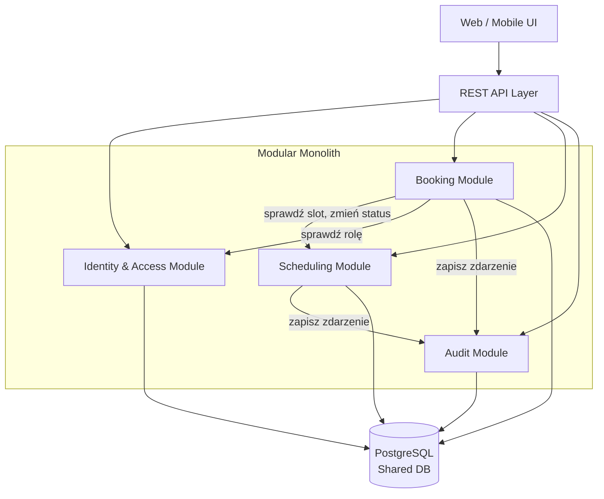

# 1. Analiza Domen i Encji

# Analiza Domenowa (DDD) — System Rezerwacji Wizyt u Specjalistów

## Cel systemu

System umożliwia użytkownikom przeglądanie dostępnych terminów, rezerwowanie i anulowanie wizyt u specjalistów. Specjaliści zarządzają własnym grafikiem, a administratorzy konfigurują reguły biznesowe, role i wyjątki od standardowych zasad.

---

# Zidentyfikowane Bounded Contexts

## 1. Rezerwacje (Booking Context)

### Odpowiedzialność
Obsługa procesu rezerwacji i anulowania wizyt. To jest główna domena systemu — tu skupia się kluczowa logika biznesowa.

### Kluczowe przypadki użycia
- Utworzenie rezerwacji (z walidacją limitu, dostępności slotu i konfliktów czasowych)
- Anulowanie rezerwacji (z weryfikacją właściciela i warunku 24h)
- Sprawdzenie statusu rezerwacji
- Historia rezerwacji użytkownika

### Główne encje
- **Booking** (Aggregate Root)
- **BookingStatus** (BOOKED, CANCELLED)

### Inwarianty
- Jeden slot może mieć tylko jedną aktywną rezerwację.
- Użytkownik może mieć maksymalnie 3 aktywne rezerwacje.
- Anulowanie jest możliwe tylko do 24h przed wizytą.
- Nowa wizyta nie może nakładać się czasowo na istniejące rezerwacje użytkownika.
- Anulowanie zwalnia slot (przywraca status AVAILABLE lub BLOCKED jeśli był zablokowany).

---

## 2. Kalendarz i Dostępność (Scheduling Context)

### Odpowiedzialność
Zarządzanie grafikiem specjalistów i dostępnością slotów. Schedule Context odpowiada za tworzenie, usuwanie i blokowanie slotów oraz udostępnianie dostępnych terminów.

### Kluczowe przypadki użycia
- Dodanie slotu przez specjalistę
- Usunięcie wolnego slotu
- Zablokowanie slotu (status BLOCKED)
- Wyszukiwanie wolnych terminów

### Główne encje
- **Slot** / **AppointmentSlot** (Aggregate Root)

### Atrybuty Slot
- id
- specialistId
- startTime
- endTime
- status (AVAILABLE, BOOKED, BLOCKED, COMPLETED)
- version (Optimistic Locking)

### Inwarianty
- Zablokowany slot nie może być zarezerwowany.
- Tylko specjalista lub admin może zablokować/odblokować slot.
- Można usunąć tylko slot w statusie AVAILABLE.

---

## 3. Zarządzanie Użytkownikami i Uprawnieniami (Identity & Access Context)

### Odpowiedzialność
Obsługa użytkowników, ról i uprawnień. Specjalista to użytkownik z rolą SPECIALIST i dodatkowym profilem (specjalizacja).

### Kluczowe przypadki użycia
- Zarządzanie użytkownikami
- Przypisanie roli
- Autoryzacja operacji

### Główne encje
- **User** (Aggregate Root)
- **Specialist** (rozszerzenie profilu User)

### Atrybuty User
- id
- name
- email
- role (USER, SPECIALIST, ADMIN)

### Inwarianty
- Uprawnienia wynikają z przypisanej roli.
- Specjalista jest użytkownikiem z rolą SPECIALIST, a nie osobną encją tożsamości.

---

## 4. Audyt i Historia Zdarzeń (Audit Context)

### Odpowiedzialność
Rejestrowanie operacji wykonywanych w systemie — zarówno udanych, jak i odrzuconych. Audit Context subskrybuje zdarzenia z Booking i Scheduling.

### Kluczowe przypadki użycia
- Rejestracja utworzenia rezerwacji
- Rejestracja anulowania
- Rejestracja blokady slotu
- Rejestracja odrzuconych operacji (np. przekroczony limit)
- Udostępnianie logów dla administratora

### Główne encje
- **AuditLog** (Aggregate Root)

### Atrybuty AuditLog
- id
- eventType (BOOKING_CREATED, BOOKING_CANCELLED, BOOKING_REJECTED, SLOT_BLOCKED, SLOT_RELEASED)
- userId
- slotId
- timestamp
- details

### Inwarianty
- Logi są niemodyfikowalne (append-only).
- Każda operacja ma znacznik czasu, typ zdarzenia, id użytkownika i id slotu.

---

# Najważniejsze Encje Domenowe

| Encja | Opis |
|------|------|
| Booking | Rezerwacja slotu przez użytkownika (BOOKED lub CANCELLED) |
| Slot | Termin wizyty zarządzany przez specjalistę |
| User | Konto systemowe z rolą |
| Specialist | Profil specjalisty powiązany z User |
| AuditLog | Niemodyfikowalny rejestr zdarzeń |

---

# Domain Events

- BookingCreated
- BookingCancelled
- BookingRejected (limit, konflikt, niedostępny slot)
- SlotBlocked
- SlotReleased
- SlotStatusChanged

---

# Relacje Między Kontekstami

## Booking Context
Korzysta synchronicznie z:
- Scheduling Context (sprawdzenie dostępności slotu, zmiana statusu)
- Identity & Access Context (weryfikacja roli i uprawnień)

Zapisuje do:
- Audit Context (po każdej operacji, w tym odrzuconej)

## Scheduling Context
Korzysta synchronicznie z:
- Identity & Access Context (weryfikacja roli specjalisty)

Zapisuje do:
- Audit Context (po blokadzie/odblokadzie slotu)

## Audit Context
Odbiera zdarzenia z Booking i Scheduling (in-process).

---

# Context Map (uproszczony)

```text
Identity & Access
        |
        v
Booking <------ Scheduling
   |               |
   v               v
      Audit Context
```

---

# Priorytet Implementacyjny

## Etap 1 (Core Domain)
1. Booking Context
2. Scheduling Context

## Etap 2 (Supporting Subdomains)
3. Identity & Access Context
4. Audit Context

---

# Core Domain

Największą wartość biznesową dostarczają:

- **Booking Context** — rezerwacje, limity, konflikty czasowe
- **Scheduling Context** — sloty, blokady, dostępność

Audyt i zarządzanie użytkownikami to konteksty wspierające.

---

# Propozycja Struktury Modułów

```text
src/
 ├── booking/
 ├── scheduling/
 ├── identity-access/
 └── audit/
```

---

# Podsumowanie

Na podstawie analizy wymagań zidentyfikowano **4 główne Bounded Contexts**:

1. Rezerwacje (Booking)
2. Kalendarz i Dostępność (Scheduling)
3. Użytkownicy i Uprawnienia (Identity & Access)
4. Audyt i Historia Zdarzeń (Audit)

Zrezygnowano z osobnego Conflict Management Context — wykrywanie konfliktów czasowych to logika wewnętrzna Booking Context (sprawdzanie nakładania się wizyt przed zapisem). Policy Configuration nie jest osobnym kontekstem — reguły anulowania i limit 3 rezerwacji są konfiguracją wewnętrzną Booking Service. Centralnym agregatem domenowym jest **Booking**, wspierany przez **Slot**, **User** i **AuditLog**.


# 2. Zaproponowana Architektura

# Proponowana Architektura Systemu Rezerwacji Wizyt

## 1. Cel architektoniczny

Celem architektury jest zapewnienie:

- spójności danych przy równoczesnych rezerwacjach (transakcyjna operacja),
- łatwej implementacji reguł biznesowych,
- modularności i łatwego rozwoju,
- możliwości późniejszej migracji wybranych modułów do mikroserwisów,
- prostego wdrożenia i utrzymania.

---

# 2. Rekomendowany styl architektoniczny

## Modular Monolith + CQRS + wspólna baza PostgreSQL

### Wybrane wzorce

| Wzorzec | Zastosowanie |
|------|------|
| Modular Monolith | Główna struktura systemu |
| Domain-Driven Design (DDD) | Modelowanie domen i bounded contexts |
| CQRS (selektywnie w Booking) | Oddzielenie operacji odczytu i zapisu |
| Optimistic Locking | Ochrona przed równoczesnymi rezerwacjami |
| REST API | Komunikacja z klientem |
| Domain Events (in-process) | Komunikacja z Audit Module |

---

# 3. Uzasadnienie wyboru

## Dlaczego Modular Monolith?

System ma:
- jasno wydzielone domeny biznesowe (Booking, Scheduling, Identity, Audit),
- wysokie wymagania dotyczące spójności danych przy rezerwacjach,
- operacje wymagające transakcyjności cross-module (zapis Booking + zmiana statusu Slot).

### Zalety
- prostszy deployment (jedna aplikacja),
- wspólna baza PostgreSQL — transakcyjne operacje między modułami,
- łatwiejsze transakcje ACID,
- mniejsze koszty utrzymania,
- naturalne granice pod przyszłe mikroserwisy.

## Dlaczego nie Microservices?

Mikroserwisy wymagałyby:
- distributed transactions (Saga Pattern) dla atomowej rezerwacji (Booking + Slot),
- złożoności DevOps,
- większych kosztów operacyjnych.

---

# 4. CQRS (selektywnie w Booking Module)

## Commands
- CreateBooking
- CancelBooking
- BlockSlot
- AddSlot
- DeleteSlot

## Queries
- GetAvailableSlots
- GetMyBookings
- GetAuditLog

CQRS stosowany selektywnie — oddzielenie klas do odczytu od klas do zapisu bez rozdzielania baz danych.

---

# 5. Proponowane Moduły

## Booking Module

### Odpowiedzialność
- tworzenie rezerwacji z pełną walidacją (dostępność, limit 3, konflikty czasowe),
- anulowanie rezerwacji (weryfikacja właściciela i warunku 24h),
- koordynacja z Scheduling Module (sprawdzenie slotu, zmiana statusu),
- koordynacja z Audit Module (zapis zdarzenia po każdej operacji).

### Wymagania
- FR2, FR3, FR4, FR7

---

## Scheduling Module

### Odpowiedzialność
- zarządzanie slotami specjalistów (dodawanie, usuwanie, blokowanie),
- blokowanie slotów (status BLOCKED) niezależnie od rezerwacji,
- udostępnianie dostępnych terminów.

### Wymagania
- FR1, FR5, FR6

---

## Identity & Access Module

### Odpowiedzialność
- użytkownicy z rolami (USER, SPECIALIST, ADMIN),
- profil specjalisty (specjalizacja),
- autoryzacja operacji.

### Wymagania
- FR9, NFR5

---

## Audit Module

### Odpowiedzialność
- odbieranie zdarzeń in-process z Booking i Scheduling,
- zapis logów audytowych (append-only),
- udostępnianie historii operacji dla admina.

### Wymagania
- NFR6

---

# 6. Komunikacja między modułami

Komunikacja synchroniczna — wywołania interfejsów aplikacyjnych (in-process):

```text
API Layer
    |
    ├── Booking Module
    |       |
    |       ├──► Scheduling Module (sprawdź slot, zmień status)
    |       ├──► Identity & Access Module (sprawdź rolę)
    |       └──► Audit Module (zapisz zdarzenie)
    |
    └── Scheduling Module (zarządzanie grafikiem)
            └──► Audit Module (zapisz zdarzenie)
```

Domain Events publikowane in-process po zakończeniu transakcji (bez zewnętrznego brokera wiadomości).

---

# 7. Baza danych

## Relacyjna baza danych (PostgreSQL)

### Uzasadnienie
- silna spójność danych,
- transakcje ACID — rezerwacja (INSERT booking + UPDATE slot.status) w jednej transakcji,
- Optimistic Locking (pole `version` w tabeli `slots`),
- indeksowanie po datach i statusach.

---

# 8. Mechanizmy spójności

## Optimistic Locking
Zapobiega równoczesnej rezerwacji tego samego slotu:

```sql
UPDATE slots SET status = 'BOOKED', version = version + 1
WHERE id = :slotId AND version = :currentVersion AND status = 'AVAILABLE'
```

Jeśli UPDATE zwróci 0 wierszy → HTTP 409 Conflict.

## Unique Constraint
```sql
UNIQUE (slot_id) ON bookings  -- tylko jedna aktywna rezerwacja per slot
```

## Transaction Boundaries
Operacja rezerwacji wykonywana w jednej transakcji ACID (INSERT booking + UPDATE slot.status).

---

# 9. Przepływ rezerwacji (kluczowy flow)

Użytkownik wysyła `POST /api/v1/bookings`:

1. API Layer waliduje JWT i rolę (USER),
2. Booking Module pobiera slot przez Scheduling Module,
3. Sprawdza status slotu (musi być AVAILABLE),
4. Sprawdza liczbę aktywnych rezerwacji użytkownika (max 3),
5. Sprawdza, czy nowa wizyta nie nakłada się czasowo na istniejące rezerwacje,
6. Uruchamia transakcję ACID:
   a. INSERT do `bookings` (status: BOOKED),
   b. UPDATE `slots.status = BOOKED` z Optimistic Locking,
7. Wywołuje Audit Module → zapis zdarzenia `BOOKING_CREATED`,
8. System zwraca 201 Created.

---

# 10. Skalowalność

## Poziom aplikacji
- stateless API (JWT),
- wiele instancji.

## Poziom danych
- Read Replica dla zapytań odczytowych (GET /slots, GET /bookings/my),
- indeksy na kluczowych kolumnach,
- paginacja wyników.

---

# 11. Mapowanie wymagań na komponenty

| Wymaganie | Komponent |
|------|------|
| Przeglądanie dostępnych terminów | Scheduling Module |
| Rezerwacja terminu | Booking Module |
| Anulowanie rezerwacji | Booking Module |
| Limit 3 aktywnych rezerwacji | Booking Module |
| Wykrywanie konfliktów czasowych | Booking Module |
| Zapobieganie double booking | Booking Module (Optimistic Locking + UNIQUE) |
| Zarządzanie grafikiem | Scheduling Module |
| Blokowanie slotów (BLOCKED) | Scheduling Module |
| Role i uprawnienia | Identity & Access Module |
| Audyt zmian | Audit Module |
| Historia operacji (admin) | Audit Module |

---

# 12. Diagram Architektury (Mermaid)



---

# 13. Uzasadnienie końcowe

Rekomendowana architektura to:

> **Modular Monolith oparty o DDD i CQRS ze wspólną bazą PostgreSQL.**

### Powody wyboru
- Najlepszy kompromis między prostotą a skalowalnością dla tej skali systemu.
- Łatwe zachowanie spójności transakcyjnej (rezerwacja + zmiana statusu slotu w jednej transakcji).
- Wyraźne granice domenowe (Booking, Scheduling, Identity, Audit).
- Możliwość bezpiecznej ewolucji do mikroserwisów.
- Niskie koszty operacyjne.

---

# 14. Podsumowanie

Architektura:
- 4 główne moduły domenowe (Booking, Scheduling, Identity & Access, Audit),
- REST API,
- PostgreSQL (wspólna baza),
- CQRS (selektywnie),
- Optimistic Locking.

Centralny przepływ biznesowy:
1. Użytkownik wybiera slot.
2. Booking sprawdza dostępność, limit 3 rezerwacji i konflikty czasowe.
3. Rezerwacja zapisywana transakcyjnie (Booking + zmiana statusu Slot).
4. Audit Module otrzymuje zdarzenie i zapisuje log.


# 3. API i Modele Danych

# API i Model Danych — System Rezerwacji Wizyt

## 1. Cel dokumentu

Dokument przedstawia:
- kluczowe endpointy REST API,
- przykładowe payloady,
- ogólne struktury tabel bazodanowych,
- mechanizmy wspierające wydajność i spójność.

---

# 2. Założenia projektowe API

## Standard REST
- JSON over HTTPS
- JWT Bearer Authentication
- Wersjonowanie: `/api/v1`
- Pagination dla list

---

# 3. Endpointy API

## 3.1 Endpointy dla Użytkownika (USER)

### GET /api/v1/slots?specialist_id=&date=
Przeglądanie dostępnych terminów.

Response (200 OK):

```json
[
  {
    "slotId": "uuid",
    "specialistId": "uuid",
    "specialistName": "dr Jan Kowalski",
    "specialization": "Kardiolog",
    "startTime": "2026-06-15T09:00:00Z",
    "endTime": "2026-06-15T09:30:00Z",
    "status": "AVAILABLE"
  }
]
```

---

### POST /api/v1/bookings
Tworzenie rezerwacji.

Request:

```json
{
    "slotId": "uuid"
}
```

Response (201 Created):

```json
{
    "bookingId": "uuid",
    "slotId": "uuid",
    "status": "BOOKED",
    "createdAt": "2026-06-11T15:45:00Z"
}
```

Response (409 Conflict) — slot zajęty lub konflikt czasowy:
```json
{
    "code": "SLOT_CONFLICT",
    "message": "Wybrany termin nakłada się na istniejącą rezerwację."
}
```

Response (422) — limit 3 aktywnych rezerwacji:
```json
{
    "code": "BOOKING_LIMIT_EXCEEDED",
    "message": "Przekroczono limit 3 aktywnych rezerwacji."
}
```

---

### DELETE /api/v1/bookings/{bookingId}
Anulowanie rezerwacji (tylko własnej, min. 24h przed wizytą).

Response (200 OK):

```json
{
    "message": "Booking cancelled",
    "slotStatus": "AVAILABLE"
}
```

---

### GET /api/v1/bookings/my
Lista rezerwacji zalogowanego użytkownika.

Response:

```json
[
    {
        "bookingId": "uuid",
        "slotId": "uuid",
        "specialistName": "dr Jan Kowalski",
        "startTime": "2026-06-15T09:00:00Z",
        "status": "BOOKED",
        "createdAt": "2026-06-11T15:45:00Z"
    }
]
```

---

## 3.2 Endpointy dla Specjalisty (SPECIALIST)

### POST /api/v1/slots
Dodanie nowego slotu.

Request:

```json
{
    "startTime": "2026-06-20T10:00:00Z",
    "endTime": "2026-06-20T10:30:00Z"
}
```

---

### DELETE /api/v1/slots/{slotId}
Usunięcie slotu (tylko w statusie AVAILABLE).

---

### PATCH /api/v1/slots/{slotId}/block
Zablokowanie slotu (status → BLOCKED). Slot nie jest dostępny do rezerwacji.

---

### GET /api/v1/slots/my
Grafik specjalisty — wszystkie sloty, niezależnie od statusu.

---

## 3.3 Endpointy dla Administratora (ADMIN)

### GET /api/v1/admin/users
Lista wszystkich użytkowników z rolami.

### GET /api/v1/admin/bookings
Wszystkie rezerwacje w systemie.

### GET /api/v1/admin/audit-log
Historia operacji. Obsługuje filtry: `userId`, `eventType`, `dateFrom`, `dateTo`.

Response:

```json
[
    {
        "id": "uuid",
        "eventType": "BOOKING_CREATED",
        "userId": "uuid",
        "slotId": "uuid",
        "timestamp": "2026-06-11T15:45:00Z",
        "details": "Rezerwacja slotu 2026-06-15 09:00"
    }
]
```

---

# 4. Struktury baz danych

Wspólna baza PostgreSQL. Operacja rezerwacji (INSERT do `bookings` + UPDATE `slots.status`) jest wykonywana w jednej transakcji ACID.

## Tabela USERS

| Pole          | Typ                 |
| ------------- | ------------------- |
| id            | UUID (PK)           |
| name          | VARCHAR(200)        |
| email         | VARCHAR(255) UNIQUE |
| password_hash | VARCHAR(255)        |
| role          | VARCHAR(20)         |

Wartości role: USER, SPECIALIST, ADMIN

---

## Tabela SPECIALISTS

| Pole           | Typ               |
| -------------- | ----------------- |
| id             | UUID (PK)         |
| user_id        | UUID (FK → users) |
| specialization | VARCHAR(100)      |

---

## Tabela SLOTS

| Pole          | Typ               |
| ------------- | ----------------- |
| id            | UUID (PK)         |
| specialist_id | UUID (FK → users) |
| start_time    | TIMESTAMPTZ       |
| end_time      | TIMESTAMPTZ       |
| status        | VARCHAR(20)       |
| version       | INTEGER           |

Wartości status: AVAILABLE, BOOKED, BLOCKED, COMPLETED

Pole **version** służy do Optimistic Locking:
```sql
UPDATE slots SET status = 'BOOKED', version = version + 1
WHERE id = :slotId AND version = :currentVersion AND status = 'AVAILABLE'
```

*Indeksy:* `idx_slots_lookup (specialist_id, start_time, status)` — wydajne wyszukiwanie wolnych terminów.

---

## Tabela BOOKINGS

| Pole       | Typ                       |
| ---------- | ------------------------- |
| id         | UUID (PK)                 |
| user_id    | UUID (FK → users)         |
| slot_id    | UUID (FK → slots, UNIQUE) |
| status     | VARCHAR(20)               |
| created_at | TIMESTAMPTZ               |

Wartości status: BOOKED, CANCELLED

UNIQUE na `slot_id` zapobiega podwójnej rezerwacji na poziomie bazy danych.

*Indeksy:* `idx_bookings_user_status (user_id, status)` — sprawdzanie limitu aktywnych rezerwacji.

---

## Tabela AUDIT_LOG

| Pole       | Typ         |
| ---------- | ----------- |
| id         | UUID (PK)   |
| event_type | VARCHAR(50) |
| user_id    | UUID        |
| slot_id    | UUID        |
| timestamp  | TIMESTAMPTZ |
| details    | TEXT        |

Wartości event_type: BOOKING_CREATED, BOOKING_CANCELLED, BOOKING_REJECTED, SLOT_BLOCKED, SLOT_RELEASED

Tabela append-only.

*Indeksy:* `idx_audit_timestamp (timestamp DESC)`, `idx_audit_user (user_id, timestamp DESC)`.

---

# 5. Realizacja wymagań wydajnościowych (NFR)

## NFR – Spójność przy współbieżnych rezerwacjach

Mechanizmy:

* transakcje ACID (INSERT booking + UPDATE slot w jednej transakcji),
* Optimistic Locking (pole `version` w tabeli `slots`),
* UNIQUE constraint na `slot_id` w tabeli `bookings`,
* atomowa zmiana statusu AVAILABLE → BOOKED.

---

## NFR – Limit 3 aktywnych rezerwacji

Przed zapisem rezerwacji:

```sql
SELECT COUNT(*) FROM bookings WHERE user_id = :userId AND status = 'BOOKED'
```

Jeśli wynik ≥ 3 → HTTP 422.

---

## NFR – Wykrywanie konfliktów czasowych

Przed zapisem rezerwacji:

```sql
SELECT b.id FROM bookings b
JOIN slots s ON b.slot_id = s.id
WHERE b.user_id = :userId AND b.status = 'BOOKED'
  AND (s.start_time < :newEndTime AND s.end_time > :newStartTime)
```

Jeśli zapytanie zwróci wiersze → HTTP 409 (konflikt czasowy).

---

## NFR – Skalowalność

Proponowane rozwiązania:

* Read Replica dla zapytań odczytowych (GET /slots, GET /bookings/my),
* indeksy na kluczowych kolumnach,
* paginacja wyników.

---

## NFR – Audyt

Każda operacja (w tym odrzucona) powoduje zapis rekordu do tabeli `audit_log`. Tabela jest append-only — konto aplikacyjne ma tylko uprawnienia INSERT.
